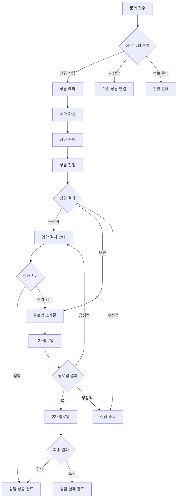

# 상담 관리 시스템 워크플로우 설계서

**작성일**: 2025-08-08  
**프로젝트**: EduCanvas v2.0 - 상담 관리 모듈  
**설계자**: AI Assistant  
**문서 버전**: v1.0

---

## 📋 개요

### 설계 목적
학원의 신규 학생 상담 프로세스를 체계화하고 자동화하여 **상담 → 입학 전환율 30% 향상**을 달성하는 워크플로우를 설계합니다.

### 핵심 목표
- **효율적인 상담 관리**: 예약부터 입학까지 전 과정 추적
- **자동화된 팔로업**: 체계적인 후속 관리로 전환율 극대화  
- **데이터 기반 개선**: 상담 성과 분석을 통한 지속적 최적화
- **멀티 채널 지원**: 다양한 상담 채널의 통합 관리

---

## 🔄 전체 워크플로우 개요

### 상담 생명주기


---

## 📞 Phase 1: 문의 접수 및 분류

### 1.1 다중 채널 문의 접수

#### 온라인 채널
```yaml
웹사이트 문의 폼:
  필수 정보:
    - 학생명 (필수)
    - 학년 (필수) 
    - 학교명 (선택)
    - 보호자명 (필수)
    - 연락처 (필수)
    - 이메일 (선택)
  
  상담 관련 정보:
    - 관심 과목 (다중 선택)
    - 희망 상담 날짜/시간 (1지망, 2지망)
    - 상담 방식 (방문/전화/화상)
    - 문의 내용 (자유 기술)
    - 개인정보 수집 동의 (필수)

카카오톡 상담:
  자동 응답:
    - 인사말 및 상담 안내
    - 기본 정보 수집 (이름, 학년, 연락처)
    - 상담 예약 링크 제공
    - 담당자 연결 요청
  
  담당자 연결:
    - 실시간 채팅 상담  
    - 기본 정보 확인
    - 상담 예약 처리
    - 학원 위치/시간 안내

전화 문의:
  접수 프로세스:
    - 기본 인사 및 학원 소개
    - 문의 목적 확인
    - 학생/보호자 기본 정보 수집
    - 상담 가능 시간 확인
    - 예약 확정 및 안내
```

#### 오프라인 채널  
```yaml
방문 문의:
  즉시 상담:
    - 담당자 배정
    - 기본 정보 입력
    - 학원 시설 안내
    - 상담 진행
    - 후속 일정 협의

  예약 상담:
    - 방문 접수 처리
    - 희망 시간 확인
    - 예약 등록
    - 안내 자료 제공

기존 학부모 추천:
  추천인 정보:
    - 추천자 학생 정보
    - 추천 사유 기록
    - 특별 할인 적용
    - 우선 상담 배정
```

### 1.2 자동 분류 및 배정

#### 상담 유형 자동 분류
```typescript
interface ConsultationClassification {
  inquiryType: 'new_enrollment' | 'class_change' | 'subject_add' | 'general_info'
  urgencyLevel: 'urgent' | 'high' | 'normal' | 'low'
  studentGrade: number
  interestedSubjects: string[]
  preferredConsultant?: string
  estimatedDuration: number // minutes
}

// 자동 분류 로직
function classifyInquiry(inquiry: InquiryData): ConsultationClassification {
  let urgencyLevel: 'urgent' | 'high' | 'normal' | 'low' = 'normal'
  
  // 급한 상담 판별
  if (inquiry.keywords.includes('급함') || inquiry.keywords.includes('내일')) {
    urgencyLevel = 'urgent'
  }
  
  // 고급 과목 또는 특수한 요구사항
  if (inquiry.subjects.includes('특목고') || inquiry.subjects.includes('영재')) {
    urgencyLevel = 'high'
  }
  
  return {
    inquiryType: determineInquiryType(inquiry.content),
    urgencyLevel,
    studentGrade: inquiry.grade,
    interestedSubjects: inquiry.subjects,
    estimatedDuration: calculateEstimatedDuration(inquiry)
  }
}
```

#### 담당자 자동 배정
```yaml
배정 규칙:
  전문성 기반:
    - 과목별 전문 상담사 우선 배정
    - 학년별 담당자 지정
    - 특수 과정 (영재, 특목고) 전담자
  
  업무 균등성:
    - 담당자별 상담 건수 균등 배분
    - 당일 스케줄 고려
    - 과거 상담 성과 반영
  
  가용성 확인:
    - 실시간 스케줄 확인
    - 휴가/외출 상태 체크
    - 최대 동시 상담 건수 제한

자동 배정 알고리즘:
  1. 전문성 점수 계산 (40%)
  2. 가용성 점수 계산 (30%)  
  3. 업무 균등성 점수 계산 (20%)
  4. 과거 성과 점수 계산 (10%)
  5. 종합 점수 기반 최적 담당자 선정
```

---

## 📅 Phase 2: 상담 예약 및 준비

### 2.1 지능형 예약 시스템

#### 예약 가능 시간 자동 계산
```typescript
interface TimeSlot {
  date: Date
  startTime: string
  endTime: string
  consultantId: string
  consultantName: string
  availableSlots: number
  estimatedDuration: number
}

interface ConsultationScheduler {
  // 가용한 시간대 조회
  getAvailableSlots(
    consultantId?: string,
    preferredDates: Date[],
    duration: number,
    urgency: 'urgent' | 'high' | 'normal' | 'low'
  ): TimeSlot[]

  // 최적 시간 추천
  recommendBestSlots(
    requirements: SchedulingRequirements
  ): RecommendedSlot[]

  // 예약 확정
  confirmReservation(
    slotId: string,
    consultationData: ConsultationData
  ): Promise<Consultation>
}

// 스케줄링 로직
class SmartScheduler {
  calculateAvailableSlots(consultantId: string, targetDate: Date): TimeSlot[] {
    const workingHours = this.getWorkingHours(consultantId, targetDate)
    const existingBookings = this.getExistingBookings(consultantId, targetDate)
    const breakTimes = this.getBreakTimes(consultantId, targetDate)
    
    // 가용 시간 계산 알고리즘
    return this.findAvailableSlots(workingHours, existingBookings, breakTimes)
  }

  recommendOptimalTime(preference: TimePreference): RecommendedSlot[] {
    // 고객 선호도 + 담당자 효율성 + 학원 운영시간 종합 고려
    const slots = this.getAllAvailableSlots()
    return slots
      .map(slot => ({
        ...slot,
        score: this.calculateOptimalityScore(slot, preference)
      }))
      .sort((a, b) => b.score - a.score)
      .slice(0, 5)
  }
}
```

#### 자동 확인 및 알림
```yaml
예약 확정 프로세스:
  즉시 확인:
    - 예약 번호 생성
    - 확인 문자/이메일 발송
    - 담당자에게 알림
    - 캘린더 일정 등록
    - 고객 정보 사전 준비

  예약 변경/취소:
    - 24시간 전까지 변경 가능
    - 자동 대체 시간 제안
    - 취소 시 대기자 자동 연결
    - 변경 이력 추적

알림 스케줄:
  즉시: 예약 확정 알림
  1일 전: 상담 리마인더
  2시간 전: 최종 확인 알림
  30분 전: 담당자 준비 알림 (내부)
```

### 2.2 상담 준비 자동화

#### 고객 정보 사전 분석
```typescript
interface CustomerAnalysis {
  basicInfo: {
    studentName: string
    grade: number
    school: string
    parentInfo: ContactInfo
  }
  
  academicBackground: {
    currentPerformance?: string
    targetGoals?: string
    weakSubjects?: string[]
    strongSubjects?: string[]
    previousAcademyExperience?: string
  }
  
  preferences: {
    learningStyle?: 'visual' | 'auditory' | 'kinesthetic' | 'mixed'
    schedulePreference?: 'morning' | 'afternoon' | 'evening'
    intensityPreference?: 'intensive' | 'moderate' | 'relaxed'
  }
  
  riskFactors: {
    pricesSensitive: boolean
    locationSensitive: boolean
    timeConstraints: string[]
    competitorConsideration: boolean
  }
  
  recommendedApproach: {
    consultationStrategy: string
    keySellingPoints: string[]
    potentialObjections: string[]
    suggestedPrograms: string[]
  }
}

// AI 기반 고객 분석
class CustomerAnalyzer {
  analyzeCustomer(inquiry: InquiryData): CustomerAnalysis {
    return {
      basicInfo: this.extractBasicInfo(inquiry),
      academicBackground: this.inferAcademicBackground(inquiry),
      preferences: this.identifyPreferences(inquiry),
      riskFactors: this.assessRiskFactors(inquiry),
      recommendedApproach: this.generateStrategy(inquiry)
    }
  }

  private generateStrategy(inquiry: InquiryData): RecommendedApproach {
    // 문의 내용 키워드 분석
    const keywords = this.extractKeywords(inquiry.content)
    
    // 성과 중시 vs 편의성 중시 vs 가격 민감도 분석
    const priorities = this.analyzePriorities(keywords)
    
    // 맞춤형 상담 전략 생성
    return this.createCustomStrategy(priorities, inquiry.studentGrade)
  }
}
```

#### 상담 자료 자동 준비
```yaml
맞춤형 자료 패키지:
  기본 자료:
    - 학원 소개 브로셔
    - 시설 안내 자료
    - 강사진 소개
    - 성과 사례 (동일 학교/학년)
  
  맞춤 자료:
    - 관심 과목별 커리큘럼
    - 해당 학년 시간표 샘플
    - 수강료 안내 (할인 혜택 포함)
    - 동일 학교 학생 성과 사례
  
  디지털 자료:
    - 온라인 강의 샘플
    - 학습 앱 체험판
    - 가상 캠퍼스 투어 링크
    - 학부모 앱 기능 소개

자동 생성 시스템:
  - 학년/과목별 템플릿 기반 자료 조합
  - 실시간 성과 데이터 반영
  - 계절별/이벤트별 프로모션 자동 포함
  - PDF 자동 생성 및 인쇄 대기열 추가
```

---

## 💬 Phase 3: 상담 진행 및 기록

### 3.1 실시간 상담 지원 시스템

#### 상담 진행 가이드
```typescript
interface ConsultationGuide {
  phase: 'opening' | 'discovery' | 'presentation' | 'handling_objections' | 'closing'
  timeElapsed: number
  suggestedQuestions: string[]
  keyPoints: string[]
  warningSignals: string[]
  nextSteps: string[]
}

class ConsultationAssistant {
  // 실시간 상담 가이드 제공
  getPhaseGuidance(currentPhase: string, timeElapsed: number): ConsultationGuide {
    switch (currentPhase) {
      case 'opening':
        return {
          phase: 'opening',
          timeElapsed,
          suggestedQuestions: [
            "안녕하세요. 오늘 상담 신청해 주셔서 감사합니다.",
            "혹시 저희 학원까지 오시는데 어려움은 없으셨나요?",
            "오늘 어떤 부분에 대해 상담받고 싶으신가요?"
          ],
          keyPoints: [
            "편안한 분위기 조성",
            "학원 첫인상 확인", 
            "상담 목적 파악"
          ],
          warningSignals: [
            "보호자가 시간을 자주 확인함",
            "짧게 끝내려는 의도 표현",
            "다른 학원과 비교 언급"
          ],
          nextSteps: ["학생 현재 상황 파악", "학습 목표 확인"]
        }
      
      case 'discovery':
        return {
          phase: 'discovery',
          timeElapsed,
          suggestedQuestions: [
            "현재 어떤 과목을 가장 어려워하시나요?",
            "학교 성적은 어느 정도인가요?",
            "이전에 다른 학원 경험이 있으신가요?",
            "하루 학습 시간은 보통 얼마나 되시나요?"
          ],
          keyPoints: [
            "현재 학습 상황 정확히 파악",
            "학습 스타일 및 선호도 확인",
            "목표 및 기대치 설정"
          ],
          warningSignals: [
            "구체적인 답변 회피",
            "과도한 경쟁사 언급",
            "가격에 대한 조기 질문"
          ],
          nextSteps: ["맞춤 솔루션 제안", "성과 사례 제시"]
        }
      
      // ... 기타 단계들
    }
  }

  // 상담 내용 실시간 분석
  analyzeConversation(transcript: string): ConversationInsight {
    return {
      sentiment: this.analyzeSentiment(transcript),
      interests: this.extractInterests(transcript),
      concerns: this.identifyConcerns(transcript),
      buyingSignals: this.detectBuyingSignals(transcript),
      objections: this.extractObjections(transcript)
    }
  }
}
```

#### 상담 기록 자동화
```yaml
실시간 기록 시스템:
  음성 인식:
    - 상담 내용 자동 전사
    - 핵심 키워드 실시간 추출  
    - 감정 분석 및 만족도 추정
    - 중요 구간 자동 마킹

  화면 기록:
    - 보여준 자료 자동 첨부
    - 작성한 메모 자동 저장
    - 계산기 사용 내역 기록
    - 시간대별 활동 로그

  구조화된 데이터 추출:
    - 학생 현재 상황
    - 학습 목표 및 기대치
    - 관심 과목 및 프로그램
    - 우려사항 및 반대 의견
    - 결정 영향 요인
```

### 3.2 상담 결과 처리

#### 결과 분류 및 후속 액션
```typescript
interface ConsultationResult {
  overallSentiment: 'very_positive' | 'positive' | 'neutral' | 'negative' | 'very_negative'
  enrollmentProbability: number // 0-100
  identifiedNeeds: string[]
  addressedConcerns: string[]
  remainingObjections: string[]
  suggestedPrograms: string[]
  agreedNextSteps: string[]
  followUpRequired: boolean
  followUpTiming: Date
  priority: 'high' | 'medium' | 'low'
}

class ConsultationProcessor {
  processResult(consultation: ConsultationRecord): ConsultationResult {
    const sentiment = this.analyzeSentiment(consultation.transcript)
    const probability = this.calculateEnrollmentProbability(consultation)
    
    return {
      overallSentiment: sentiment,
      enrollmentProbability: probability,
      identifiedNeeds: this.extractNeeds(consultation),
      addressedConcerns: this.extractAddressedConcerns(consultation),
      remainingObjections: this.extractRemainingObjections(consultation),
      suggestedPrograms: consultation.recommendedPrograms,
      agreedNextSteps: consultation.nextSteps,
      followUpRequired: probability > 30 && probability < 90,
      followUpTiming: this.calculateOptimalFollowUpTime(consultation),
      priority: this.determinePriority(probability, consultation.studentGrade)
    }
  }

  private calculateEnrollmentProbability(consultation: ConsultationRecord): number {
    let score = 50 // 기본 점수

    // 긍정적 신호들
    if (consultation.transcript.includes('좋네요') || 
        consultation.transcript.includes('만족')) score += 15
    if (consultation.askedAboutSchedule) score += 20
    if (consultation.askedAboutTuition) score += 10
    if (consultation.requestedTrialClass) score += 25
    
    // 부정적 신호들
    if (consultation.transcript.includes('비싸') || 
        consultation.transcript.includes('부담')) score -= 15
    if (consultation.mentionedCompetitors) score -= 10
    if (consultation.showedTimeConstraints) score -= 5

    return Math.max(0, Math.min(100, score))
  }
}
```

---

## 📈 Phase 4: 자동화된 팔로업 시스템

### 4.1 지능형 팔로업 스케줄링

#### 개인화된 팔로업 전략
```typescript
interface FollowUpStrategy {
  sequence: FollowUpStep[]
  totalDuration: number // days
  successTriggers: string[]
  failureExitConditions: string[]
}

interface FollowUpStep {
  day: number
  method: 'call' | 'message' | 'email' | 'visit'
  content: string
  expectedResponse: string[]
  nextAction: 'continue' | 'accelerate' | 'pause' | 'exit'
}

class FollowUpOrchestrator {
  createStrategy(consultationResult: ConsultationResult): FollowUpStrategy {
    const probability = consultationResult.enrollmentProbability
    
    if (probability >= 70) {
      // 높은 관심도 - 신속한 후속 조치
      return {
        sequence: [
          {
            day: 1,
            method: 'call',
            content: '상담 후 추가 궁금한 점 확인',
            expectedResponse: ['긍정적 반응', '추가 질문'],
            nextAction: 'accelerate'
          },
          {
            day: 3,
            method: 'message',
            content: '무료 체험 수업 안내',
            expectedResponse: ['체험 신청', '일정 문의'],
            nextAction: 'continue'
          }
        ],
        totalDuration: 7,
        successTriggers: ['체험 신청', '등록 문의'],
        failureExitConditions: ['명확한 거절', '연락 두절']
      }
    } else if (probability >= 40) {
      // 중간 관심도 - 점진적 관심 유도
      return {
        sequence: [
          {
            day: 2,
            method: 'message', 
            content: '상담 감사 인사 및 자료 추가 제공',
            expectedResponse: ['자료 확인', '추가 문의'],
            nextAction: 'continue'
          },
          {
            day: 7,
            method: 'call',
            content: '학습 고민 상담 및 맞춤 솔루션 제안',
            expectedResponse: ['관심 표현', '재상담 요청'],
            nextAction: 'continue'
          },
          {
            day: 14,
            method: 'email',
            content: '성공 사례 및 특별 프로모션 안내',
            expectedResponse: ['프로모션 문의', '재상담 신청'],
            nextAction: 'continue'
          }
        ],
        totalDuration: 21,
        successTriggers: ['재상담 신청', '프로모션 문의'],
        failureExitConditions: ['3회 연속 무응답']
      }
    } else {
      // 낮은 관심도 - 장기적 관계 유지
      return this.createLongTermNurturingStrategy()
    }
  }
}
```

#### 자동화된 컨텐츠 생성
```yaml
개인화 메시지 생성:
  변수 활용:
    - {student_name}: 학생 이름
    - {grade}: 학년  
    - {subject}: 관심 과목
    - {concern}: 주요 우려사항
    - {school}: 학교명
    - {consultant_name}: 담당 상담사

  메시지 템플릿:
    1차 팔로업 (감사):
      "안녕하세요, {student_name} 학부모님. 
       어제 {subject} 상담 진행한 {consultant_name}입니다.
       바쁘신 중에 시간 내어 상담받아 주셔서 감사했습니다.
       혹시 추가로 궁금한 점이 있으시면 언제든 연락 부탁드립니다."

    2차 팔로업 (가치 제공):
      "안녕하세요, {consultant_name}입니다.
       {grade} {subject} 관련해서 유용한 자료를 발견해서 공유드립니다.
       {school} 재학생들에게 특히 도움이 많이 되는 내용이에요.
       [자료 링크]"

    3차 팔로업 (기회 제공):
      "{student_name} 학부모님, 
       다음 주 {subject} 무료 특강이 있어서 안내드립니다.
       {concern} 관련 내용도 다룰 예정이니 도움이 되실 것 같아요.
       참여 원하시면 답장 부탁드립니다."

동적 컨텐츠 추가:
  실시간 정보:
    - 최신 성과 사례 (동일 학교/학년)
    - 계절별 특강/이벤트 정보
    - 학원 최신 소식 및 성과
    - 맞춤형 학습 자료 링크

  개인화 요소:
    - 상담 중 언급된 구체적 내용 참조
    - 학생의 학습 스타일에 맞는 솔루션
    - 관심 표현한 프로그램 관련 업데이트
    - 우려사항 해결 사례 제시
```

### 4.2 반응 분석 및 적응형 전략

#### 응답 패턴 분석
```typescript
interface ResponseAnalysis {
  responseRate: number
  responseTime: number // hours
  sentimentTrend: 'improving' | 'stable' | 'declining'
  engagementLevel: 'high' | 'medium' | 'low'
  contentPreference: 'informational' | 'promotional' | 'personal'
  optimalContactTiming: string // "weekday_morning" | "weekend_afternoon" etc.
}

class ResponseAnalyzer {
  analyzeFollowUpResponse(
    followUpHistory: FollowUpRecord[]
  ): ResponseAnalysis {
    const responses = followUpHistory.filter(f => f.response !== null)
    const responseRate = responses.length / followUpHistory.length
    
    const avgResponseTime = this.calculateAverageResponseTime(responses)
    const sentimentTrend = this.analyzeSentimentTrend(responses)
    const engagementLevel = this.calculateEngagementLevel(responses)
    
    return {
      responseRate,
      responseTime: avgResponseTime,
      sentimentTrend,
      engagementLevel,
      contentPreference: this.identifyContentPreference(responses),
      optimalContactTiming: this.findOptimalTiming(responses)
    }
  }

  adaptStrategy(
    currentStrategy: FollowUpStrategy,
    analysis: ResponseAnalysis
  ): FollowUpStrategy {
    let adaptedStrategy = { ...currentStrategy }

    // 응답률이 낮으면 접촉 빈도 줄이기
    if (analysis.responseRate < 0.3) {
      adaptedStrategy = this.reduceFrequency(adaptedStrategy)
    }

    // 감정이 악화되면 접근 방식 변경
    if (analysis.sentimentTrend === 'declining') {
      adaptedStrategy = this.switchToSoftApproach(adaptedStrategy)
    }

    // 참여도가 높으면 더 적극적 접근
    if (analysis.engagementLevel === 'high') {
      adaptedStrategy = this.accelerateTimeline(adaptedStrategy)
    }

    return adaptedStrategy
  }
}
```

---

## 📊 Phase 5: 성과 분석 및 최적화

### 5.1 실시간 대시보드 시스템

#### 핵심 지표 추적
```typescript
interface ConsultationMetrics {
  // 전환 관련 지표
  conversionRate: {
    overall: number
    byConsultant: Record<string, number>
    bySubject: Record<string, number>
    byGrade: Record<number, number>
    bySource: Record<string, number>
  }
  
  // 상담 품질 지표
  qualityMetrics: {
    averageConsultationDuration: number
    customerSatisfactionScore: number
    followUpResponseRate: number
    timeToDecision: number // days
  }
  
  // 운영 효율성
  operationalMetrics: {
    averageSchedulingLead: number // days
    noShowRate: number
    rescheduleRate: number
    consultantUtilization: Record<string, number>
  }
  
  // 비즈니스 임팩트
  businessMetrics: {
    totalNewEnrollments: number
    averageContractValue: number
    customerAcquisitionCost: number
    returnonInvestment: number
  }
}

class MetricsCalculator {
  calculateRealTimeMetrics(
    period: DateRange,
    organizationId: string
  ): ConsultationMetrics {
    const consultations = this.getConsultations(period, organizationId)
    const enrollments = this.getEnrollments(period, organizationId)
    
    return {
      conversionRate: this.calculateConversionRates(consultations, enrollments),
      qualityMetrics: this.calculateQualityMetrics(consultations),
      operationalMetrics: this.calculateOperationalMetrics(consultations),
      businessMetrics: this.calculateBusinessMetrics(consultations, enrollments)
    }
  }
  
  generateInsights(metrics: ConsultationMetrics): BusinessInsight[] {
    const insights: BusinessInsight[] = []
    
    // 성과가 우수한 상담사 식별
    const topPerformers = Object.entries(metrics.conversionRate.byConsultant)
      .sort(([,a], [,b]) => b - a)
      .slice(0, 3)
    
    insights.push({
      type: 'top_performer',
      message: `${topPerformers[0][0]} 상담사가 ${topPerformers[0][1]}% 전환율로 최고 성과를 기록했습니다.`,
      actionable: true,
      suggestions: ['우수 사례 분석 및 공유', '멘토링 프로그램 운영']
    })
    
    // 개선이 필요한 영역 식별  
    if (metrics.qualityMetrics.followUpResponseRate < 0.5) {
      insights.push({
        type: 'improvement_needed',
        message: '팔로업 응답률이 50% 미만입니다.',
        actionable: true,
        suggestions: ['팔로업 메시지 내용 개선', '접촉 타이밍 최적화']
      })
    }
    
    return insights
  }
}
```

### 5.2 A/B 테스트 시스템

#### 상담 전략 실험
```yaml
실험 가능한 요소들:
  상담 프로세스:
    - 상담 시간 (30분 vs 45분 vs 60분)
    - 상담 순서 (목표 우선 vs 현황 파악 우선)
    - 자료 제시 방식 (디지털 vs 물리적)
    - 가격 안내 타이밍 (초기 vs 중기 vs 후기)

  팔로업 전략:
    - 첫 연락 타이밍 (당일 vs 1일 후 vs 3일 후)
    - 연락 방법 (전화 우선 vs 메시지 우선)
    - 메시지 톤 (친근한 vs 전문적 vs 중간)
    - 콘텐츠 유형 (정보 중심 vs 감정 중심)

  프로모션 실험:
    - 할인 혜택 (무료 체험 vs 수강료 할인 vs 교재 무료)
    - 제한시간 (1주일 vs 2주일 vs 1개월)
    - 제시 방식 (즉시 제안 vs 고민 후 제안)

실험 설계:
  분할 방식: 무작위 50:50 분할
  실험 기간: 최소 4주 (통계적 유의성 확보)
  성공 지표: 전환율, 만족도, ROI
  중단 조건: 한쪽이 20% 이상 낮은 성과 시
```

### 5.3 예측 모델링

#### 입학 확률 예측
```typescript
interface EnrollmentPrediction {
  studentId: string
  consultationId: string
  enrollmentProbability: number
  predictedEnrollmentDate?: Date
  confidenceLevel: number
  keyFactors: PredictionFactor[]
  recommendedActions: string[]
}

interface PredictionFactor {
  factor: string
  impact: number // -1 to 1
  importance: number // 0 to 1
}

class EnrollmentPredictor {
  private model: MLModel

  predict(consultationData: ConsultationRecord): EnrollmentPrediction {
    // 특성 추출
    const features = this.extractFeatures(consultationData)
    
    // 모델 예측
    const probability = this.model.predict(features)
    const confidence = this.model.getConfidence()
    
    // 주요 요인 분석
    const keyFactors = this.identifyKeyFactors(features, probability)
    
    // 권장 액션 생성
    const recommendations = this.generateRecommendations(keyFactors, probability)
    
    return {
      studentId: consultationData.studentId,
      consultationId: consultationData.id,
      enrollmentProbability: probability,
      predictedEnrollmentDate: this.predictEnrollmentDate(probability),
      confidenceLevel: confidence,
      keyFactors,
      recommendedActions: recommendations
    }
  }

  private extractFeatures(consultation: ConsultationRecord): ModelFeatures {
    return {
      // 인구통계학적 특성
      studentGrade: consultation.studentGrade,
      parentAge: consultation.parentAge,
      householdIncome: consultation.estimatedIncome,
      
      // 상담 품질 특성  
      consultationDuration: consultation.duration,
      questionsAsked: consultation.questionsCount,
      materialsShown: consultation.materialsCount,
      satisfactionScore: consultation.satisfactionScore,
      
      // 행동 특성
      schedulingSpeed: consultation.schedulingLeadTime,
      punctuality: consultation.arrivalTime,
      engagement: consultation.engagementScore,
      
      // 경쟁 상황
      competitorMentioned: consultation.mentionedCompetitors,
      priceComparison: consultation.comparedPrices,
      urgency: consultation.urgencyLevel
    }
  }
}
```

---

## 🔄 통합 워크플로우 자동화

### 자동화 트리거 시스템
```typescript
interface AutomationTrigger {
  event: string
  condition: string
  action: AutomationAction
  delay?: number // minutes
  priority: 'high' | 'medium' | 'low'
}

interface AutomationAction {
  type: 'send_message' | 'schedule_call' | 'create_task' | 'send_email' | 'update_status'
  target: string
  template?: string
  data?: Record<string, any>
}

class WorkflowAutomator {
  private triggers: AutomationTrigger[] = [
    // 상담 예약 완료 시
    {
      event: 'consultation_scheduled',
      condition: 'always',
      action: {
        type: 'send_message',
        target: 'customer',
        template: 'consultation_confirmation'
      },
      delay: 0,
      priority: 'high'
    },
    
    // 상담 완료 후 고관심도 고객
    {
      event: 'consultation_completed', 
      condition: 'enrollment_probability > 0.7',
      action: {
        type: 'schedule_call',
        target: 'consultant',
        data: { timing: 'next_day', purpose: 'immediate_follow_up' }
      },
      delay: 60, // 1시간 후
      priority: 'high'
    },
    
    // 팔로업 무응답 시
    {
      event: 'followup_no_response',
      condition: 'attempt_count >= 2',
      action: {
        type: 'create_task',
        target: 'supervisor', 
        template: 'review_strategy',
        data: { reason: 'multiple_no_response' }
      },
      delay: 0,
      priority: 'medium'
    }
  ]

  processEvent(event: WorkflowEvent): void {
    const applicableTriggers = this.triggers.filter(trigger => 
      trigger.event === event.type && 
      this.evaluateCondition(trigger.condition, event.data)
    )

    applicableTriggers.forEach(trigger => {
      if (trigger.delay && trigger.delay > 0) {
        this.scheduleAction(trigger.action, trigger.delay)
      } else {
        this.executeAction(trigger.action, event.data)
      }
    })
  }
}
```

---

## 📋 구현 체크리스트

### Phase 1: 기본 인프라 (주 1-2)
- [ ] 데이터베이스 스키마 구현
- [ ] 기본 API 엔드포인트 개발
- [ ] 문의 접수 다중 채널 구현
- [ ] 상담 예약 시스템 기본 기능

### Phase 2: 상담 관리 (주 3-4)
- [ ] 상담 진행 가이드 시스템
- [ ] 실시간 상담 기록 기능
- [ ] 상담 결과 분류 자동화
- [ ] 기본 팔로업 스케줄링

### Phase 3: 자동화 고도화 (주 5-6)
- [ ] 지능형 팔로업 시스템
- [ ] 개인화 메시지 생성
- [ ] 반응 분석 및 적응형 전략
- [ ] 자동화 워크플로우 엔진

### Phase 4: 분석 및 최적화 (주 7-8)
- [ ] 실시간 대시보드 구현
- [ ] A/B 테스트 시스템
- [ ] 예측 모델링 기능
- [ ] 성과 리포트 자동 생성

### Phase 5: 통합 및 최적화 (주 9-10)
- [ ] 기존 시스템과 통합
- [ ] 성능 최적화
- [ ] 사용자 교육 자료 작성
- [ ] 프로덕션 배포

---

## 🎯 예상 성과 지표

### 정량적 목표
- **상담 → 입학 전환율**: 기존 대비 30% 향상 (25% → 35%)
- **상담 처리 시간**: 평균 20% 단축 (60분 → 48분)
- **팔로업 응답률**: 50% 이상 달성
- **상담 만족도**: 4.5/5.0 이상 유지

### 정성적 개선사항
- 체계화된 상담 프로세스로 일관된 서비스 품질
- 데이터 기반 의사결정으로 지속적 개선
- 자동화를 통한 담당자 업무 부담 감소
- 개인화된 팔로업으로 고객 만족도 향상

이 워크플로우 설계는 상담 관리의 전 과정을 체계화하고 자동화하여 효율성과 전환율을 동시에 향상시킬 수 있는 종합적인 솔루션을 제공합니다.