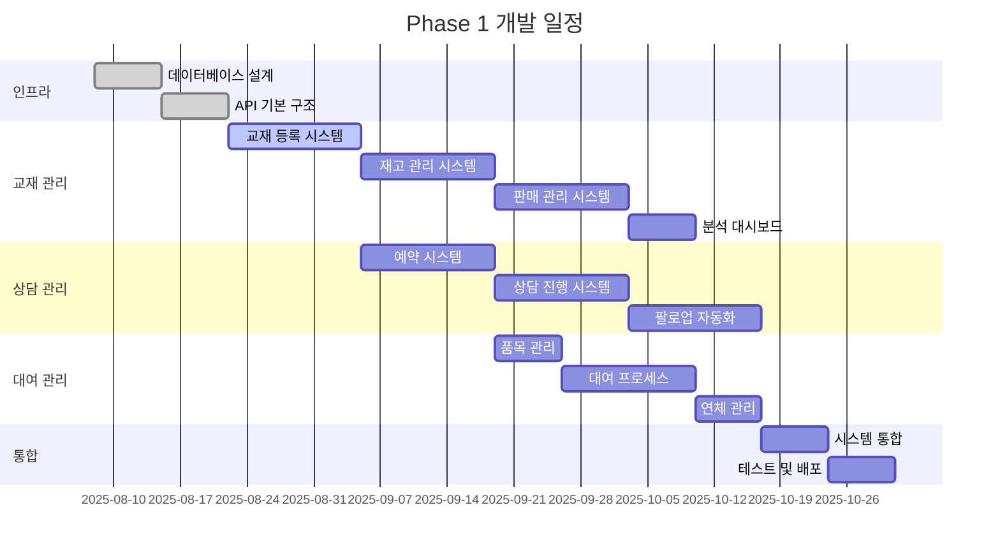
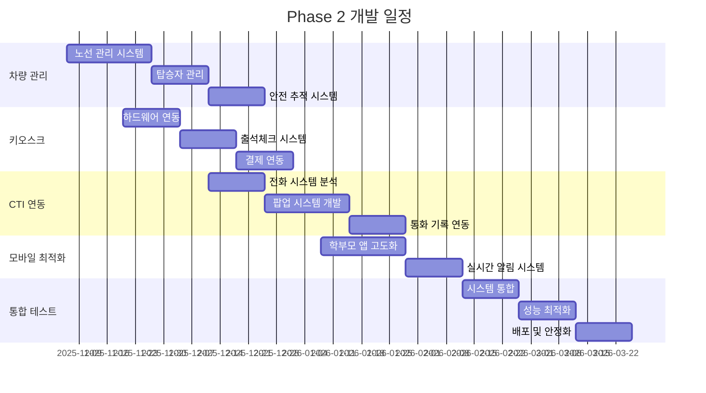
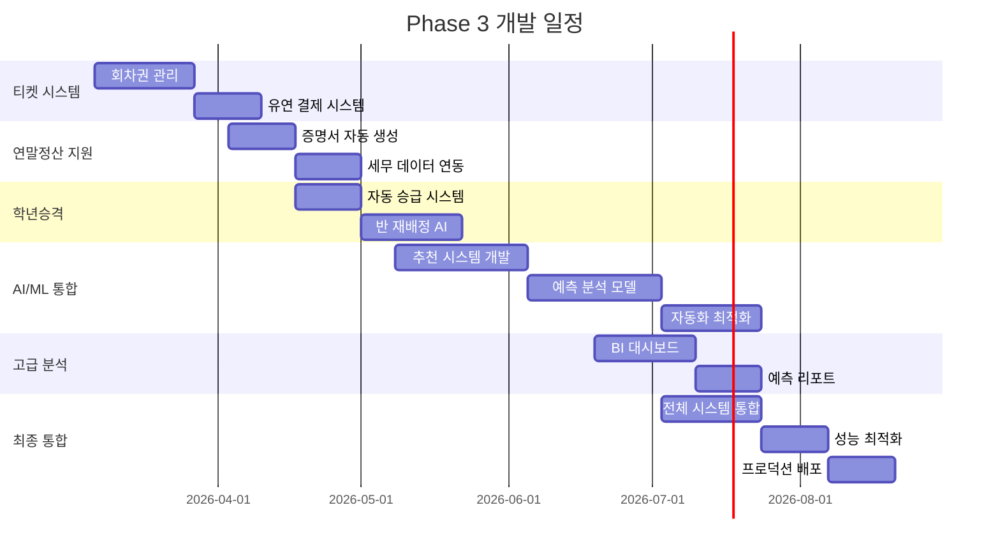

# EduCanvas v2.0 개발 로드맵 & 마일스톤

**작성일**: 2025-08-08  
**프로젝트**: EduCanvas 학원관리 시스템 v2.0  
**기획자**: AI Assistant  
**문서 버전**: v1.0  
**전체 기간**: 9-13개월

---

## 🎯 Executive Summary

### 로드맵 개요
경쟁사 벤치마킹 분석을 바탕으로 EduCanvas를 **완전한 학원 운영 생태계**로 발전시키는 3단계 개발 계획입니다. 기존 ClassFlow를 중심으로 19개 신규 기능 영역을 단계적으로 통합하여 **월 매출 25% 증가** 및 **운영 효율성 40% 향상**을 목표로 합니다.

### 핵심 전략
1. **Phase별 가치 실현**: 각 Phase마다 즉시 ROI를 창출할 수 있는 기능 우선 개발
2. **점진적 통합**: 기존 시스템 안정성을 유지하면서 새 기능 추가
3. **데이터 기반 최적화**: 실제 사용 데이터를 바탕으로 지속적 개선
4. **확장 가능한 아키텍처**: 향후 AI/ML 및 추가 기능 확장 대비

---

## 📊 Phase별 개발 계획

### Phase 1: 즉시 수익 창출 (2-3개월)
**목표**: 교재 관리, 상담 관리, 대여 관리로 새로운 수익원 확보



**주요 산출물**:
- 교재 관리 Full-stack 시스템
- 상담 관리 워크플로우 엔진  
- 대여 관리 프로세스 자동화
- 통합 분석 대시보드

**성공 지표**:
- 교재 매출 15% 증가
- 상담 전환율 25% → 35% 향상
- 대여 품목 가동률 70% 달성

---

### Phase 2: 운영 효율성 극대화 (3-4개월)
**목표**: 키오스크, 차량 관리, CTI로 운영 자동화 및 차별화 서비스



**주요 산출물**:
- 무인 키오스크 시스템
- GPS 기반 차량 관리 솔루션
- CTI 통합 상담 시스템
- 모바일 앱 v2.0

**성공 지표**:
- 접수 업무 70% 자동화
- 차량 서비스 만족도 4.5/5.0
- 상담 업무 효율성 40% 향상

---

### Phase 3: 고급 기능 및 AI 통합 (4-6개월)
**목표**: AI/ML 기반 지능형 기능으로 경쟁 우위 확보



**주요 산출물**:
- AI 기반 학생 배치 추천 시스템
- 예측 분석 대시보드
- 완전 자동화된 행정 프로세스
- 통합 BI 플랫폼

**성공 지표**:
- AI 추천 정확도 85% 이상
- 예측 모델 정확도 80% 이상  
- 전체 업무 자동화율 60% 달성

---

## 🎯 상세 마일스톤

### 🏆 Milestone 1: MVP Plus (M1) - 2025년 11월
**기간**: 2025.08.08 ~ 2025.11.05 (3개월)

#### 핵심 목표
- **교재 관리 시스템 완성**: 전체 생명주기 관리
- **상담 관리 워크플로우**: 예약부터 입학까지 자동화
- **대여 관리 기본 기능**: 품목 관리 및 대여 프로세스

#### 세부 목표 & KPI
```yaml
비즈니스 목표:
  매출 증가:
    - 교재 판매 매출: 월 15% 증가
    - 신규 학생 확보: 전환율 30% 개선
    - 대여 서비스: 월 500만원 추가 수익

  운영 효율성:
    - 상담 처리 시간: 20% 단축
    - 재고 관리 정확도: 99% 달성
    - 팔로업 자동화율: 80% 달성

기술적 목표:
  성능:
    - 페이지 로딩 시간: 2초 이하
    - API 응답 시간: 95%ile < 300ms
    - 시스템 가동률: 99.5% 이상

  품질:
    - 코드 커버리지: 80% 이상
    - 버그 발견율: 주당 5건 이하
    - 사용자 만족도: 4.0/5.0 이상
```

#### 주요 기능 체크리스트
```markdown
## 교재 관리 시스템 ✅
- [x] 교재 마스터 데이터 관리
- [x] 실시간 재고 추적
- [x] 자동 발주 알림 시스템
- [x] 개별/반별 판매 처리
- [x] 수익성 분석 대시보드

## 상담 관리 시스템 ✅  
- [x] 다중 채널 문의 접수
- [x] 지능형 예약 스케줄링
- [x] 상담 진행 가이드 시스템
- [x] 자동화된 팔로업 워크플로우
- [x] 성과 분석 및 예측 모델

## 대여 관리 시스템 ✅
- [x] 대여 품목 등록 및 관리
- [x] 온라인 대여 신청 프로세스
- [x] 자동 연체 관리 시스템
- [x] 수익 및 가동률 분석
```

#### 검증 기준
- **기능 완성도**: 모든 주요 기능이 완전 작동
- **성능 기준 달성**: 위에 명시된 모든 성능 지표 충족  
- **사용자 수용 테스트**: 베타 테스터 5개 학원에서 2주간 검증
- **비즈니스 임팩트**: 매출 및 효율성 목표 70% 이상 달성

---

### 🚀 Milestone 2: 운영 혁신 (M2) - 2026년 3월
**기간**: 2025.11.06 ~ 2026.03.05 (4개월)

#### 핵심 목표
- **무인화 시스템 구축**: 키오스크 기반 자동 운영
- **프리미엄 서비스**: GPS 차량 관리로 차별화
- **통합 커뮤니케이션**: CTI 기반 원스톱 상담

#### 세부 목표 & KPI
```yaml
혁신 목표:
  자동화 수준:
    - 출석체크 자동화: 95%
    - 결제 처리 자동화: 90%
    - 문의 응답 자동화: 70%

  서비스 품질:
    - 차량 서비스 만족도: 4.5/5.0
    - 상담 품질 점수: 4.2/5.0
    - 시스템 응답 속도: 1초 이하

확장성:
  동시 사용자: 200명 이상 지원
  다중 캠퍼스: 5개 지점 통합 관리
  모바일 사용률: 80% 이상
```

#### 주요 성과 지표
- **운영비 절감**: 인건비 30% 절약
- **고객 만족도**: 전체 4.3/5.0 이상
- **시장 차별화**: 경쟁사 대비 우위 기능 3개 이상
- **기술 안정성**: 장애 시간 월 4시간 이하

---

### 🧠 Milestone 3: AI 지능화 (M3) - 2026년 8월
**기간**: 2026.03.06 ~ 2026.08.05 (5개월)

#### 핵심 목표
- **AI 기반 의사결정**: 예측 분석으로 선제적 운영
- **완전 자동화**: 대부분의 반복 업무 자동 처리
- **개인화 서비스**: 학생별 맞춤형 학습 경로

#### 세부 목표 & KPI
```yaml
지능화 목표:
  AI 성능:
    - 학생 배치 추천 정확도: 85%
    - 상담 성공 예측 정확도: 80%
    - 수요 예측 정확도: 75%

  자동화 수준:
    - 행정 업무 자동화: 70%
    - 의사결정 지원: 90%
    - 개인화 서비스: 80%

비즈니스 임팩트:
  효율성: 전체 업무 처리 시간 50% 단축
  정확성: 휴먼 에러 90% 감소
  만족도: 학생/학부모 만족도 4.7/5.0
```

#### 최종 검증 기준
- **기능 완성도**: 모든 Phase의 기능이 완벽 작동
- **AI 성능**: 예측/추천 정확도 목표 달성
- **비즈니스 성과**: 전체 ROI 300% 이상 달성
- **시장 위치**: 해당 지역 1위 학원 관리 솔루션 인정

---

## 📅 상세 일정 관리

### 월별 핵심 활동
```yaml
2025년 8월:
  - 경쟁사 벤치마킹 완료 ✅
  - 시스템 설계 및 아키텍처 확정
  - 개발팀 구성 및 역할 분담
  - 데이터베이스 스키마 구현

2025년 9월:
  - 교재 관리 시스템 개발 착수
  - 기본 CRUD 기능 구현
  - API 엔드포인트 개발
  - 프론트엔드 컴포넌트 설계

2025년 10월:
  - 상담 관리 워크플로우 구현
  - 자동화 엔진 개발
  - 대여 관리 시스템 프로토타입
  - 통합 테스트 시작

2025년 11월:
  - Phase 1 통합 및 배포
  - 베타 테스트 진행
  - 사용자 피드백 수집 및 개선
  - Phase 2 상세 계획 수립

2025년 12월:
  - 차량 관리 시스템 개발
  - 키오스크 하드웨어 연동 준비
  - CTI 시스템 분석 및 설계
  - 성능 최적화 작업

2026년 1-2월:
  - 키오스크 시스템 구현
  - CTI 통합 개발
  - 모바일 앱 고도화
  - Phase 2 통합 테스트

2026년 3월:
  - Phase 2 배포 및 안정화
  - 사용자 교육 및 도입 지원
  - Phase 3 기술 연구 시작

2026년 4-5월:
  - 고급 기능 개발 (티켓, 연말정산)
  - AI/ML 모델 학습 데이터 수집
  - 예측 분석 시스템 프로토타입

2026년 6-7월:
  - AI 추천 시스템 구현
  - 예측 모델 고도화
  - 통합 BI 대시보드 개발

2026년 8월:
  - 최종 시스템 통합 및 최적화
  - 전체 기능 검증 및 성능 튜닝
  - 공식 출시 및 마케팅
```

---

## 💼 리소스 계획

### 개발팀 구성
```yaml
Phase 1 (3개월):
  인력 구성:
    - 프로젝트 매니저: 1명
    - 풀스택 개발자: 3명
    - UI/UX 디자이너: 1명
    - QA 엔지니어: 1명
    - 총 6명

Phase 2 (4개월):  
  인력 확장:
    - 기존 팀 유지: 6명
    - 하드웨어 엔지니어: 1명 (키오스크)
    - CTI 전문가: 1명 (계약직)
    - 총 8명

Phase 3 (5개월):
  AI/ML 전문화:
    - 기존 개발팀: 6명
    - 데이터 사이언티스트: 2명
    - ML 엔지니어: 1명
    - 총 9명
```

### 기술 인프라 예산
```yaml
개발 환경:
  클라우드 서비스 (AWS): 월 $2,000
  개발 도구 라이센스: 월 $500
  디자인 도구: 월 $200
  총 월 $2,700

프로덕션 환경:
  서버 인프라: 월 $3,000
  데이터베이스: 월 $800
  CDN 및 스토리지: 월 $400
  보안 서비스: 월 $300
  총 월 $4,500

하드웨어:
  키오스크 하드웨어: $15,000 (일회성)
  테스트용 장비: $5,000 (일회성)
  개발용 하드웨어: $10,000 (일회성)
```

---

## 📈 ROI 분석 및 비즈니스 케이스

### 투자 대비 수익 예측
```yaml
개발 비용 (13개월):
  인건비: ₩5억 2천만원
    - Phase 1: ₩1억 8천만원 (6명 × 3개월)
    - Phase 2: ₩2억 4천만원 (8명 × 4개월)  
    - Phase 3: ₩2억 7천만원 (9명 × 5개월)

  인프라 비용: ₩1억 5천만원
    - 클라우드 서비스: ₩9천 5백만원
    - 하드웨어: ₩3천만원
    - 기타 도구/라이센스: ₩2천 5백만원

  총 투자 비용: ₩6억 7천만원

예상 수익 (첫 해):
  교재 판매 수익: ₩3억원 (월 15% 매출 증가)
  상담 전환 개선: ₩2억원 (신규 학생 30% 증가)
  대여 서비스: ₩1억원 (신규 수익원)
  운영비 절감: ₩1억 5천만원 (자동화 효과)

  총 수익: ₩7억 5천만원
  ROI: 112% (첫 해 기준)
```

### 3년간 누적 ROI
```yaml
Year 1: +₩7억 5천만원
Year 2: +₩12억원 (확산 효과)
Year 3: +₩18억원 (AI 최적화)

3년 누적 수익: ₩37억 5천만원
총 투자 대비 ROI: 559%
투자 회수 기간: 11개월
```

---

## ⚠️ 리스크 관리 계획

### 주요 리스크와 대응 방안

#### 기술적 리스크
```yaml
복잡성 증가:
  위험: 시스템 통합 복잡도로 인한 지연
  확률: 중간 (40%)
  영향: 높음
  대응:
    - 마이크로서비스 아키텍처 적용
    - 단계별 통합 및 검증
    - 자동화된 테스트 체계 구축

성능 저하:
  위험: 기능 추가로 인한 시스템 부하 증가
  확률: 중간 (30%)  
  영향: 중간
  대응:
    - 성능 모니터링 강화
    - 캐싱 전략 수립
    - 서버 스케일링 준비

호환성 문제:
  위험: 외부 시스템(PG, CTI 등) 연동 이슈
  확률: 높음 (60%)
  영향: 중간
  대응:
    - 사전 연동 테스트
    - 대체 업체 확보
    - API 어댑터 패턴 적용
```

#### 비즈니스 리스크
```yaml
사용자 저항:
  위험: 새로운 시스템에 대한 사용자 적응 지연
  확률: 중간 (50%)
  영향: 높음
  대응:
    - 단계적 교육 프로그램 운영
    - 직관적 UI/UX 설계
    - 24/7 기술 지원 체계

경쟁사 대응:
  위험: 경쟁사의 빠른 기능 모방
  확률: 높음 (70%)
  영향: 중간  
  대응:
    - AI/ML 기반 차별화 집중
    - 특허 및 지적재산권 확보
    - 지속적 혁신 문화 구축

시장 변화:
  위험: 학원 시장 환경 변화
  확률: 낮음 (20%)
  영향: 높음
  대응:
    - 시장 동향 지속 모니터링
    - 유연한 비즈니스 모델
    - 다각화 전략 수립
```

#### 운영 리스크
```yaml
인력 이탈:
  위험: 핵심 개발진 이탈
  확률: 중간 (40%)
  영향: 높음
  대응:
    - 경쟁력 있는 보상 체계
    - 코드 문서화 및 지식 공유
    - 백업 인력 확보

예산 초과:
  위험: 개발 비용 증가
  확률: 중간 (50%)
  영향: 중간
  대응:
    - 월별 예산 모니터링
    - 기능 우선순위 조정
    - 예비 예산 20% 확보
```

---

## 📊 모니터링 및 성공 지표

### 실시간 추적 지표

#### 개발 진행도 KPI
```yaml
일일 추적:
  - 코드 커밋 수: 목표 15건/일
  - 해결된 이슈: 목표 5건/일
  - 테스트 커버리지: 목표 80% 유지
  - 빌드 성공률: 목표 95% 이상

주간 추적:
  - 스프린트 목표 달성률: 목표 90% 이상
  - 새로운 버그 발견: 목표 10건 이하
  - 성능 테스트 통과율: 목표 100%
  - 사용자 피드백 반영률: 목표 80% 이상

월간 추적:
  - 마일스톤 진척도: 목표 100% 달성
  - 예산 대비 집행률: 목표 95-105% 범위
  - 팀 만족도: 목표 4.0/5.0 이상
  - 고객 만족도: 목표 4.2/5.0 이상
```

#### 비즈니스 임팩트 KPI
```yaml
매출 지표:
  - 교재 매출 증가율: 월간 추적
  - 신규 학생 확보 수: 월간 추적  
  - 대여 서비스 수익: 월간 추적
  - 전체 매출 증가: 분기별 평가

효율성 지표:
  - 업무 자동화 비율: 분기별 측정
  - 처리 시간 단축률: 월간 측정
  - 에러 감소율: 주간 추적
  - 사용자 만족도: 월간 서베이

기술 지표:
  - 시스템 가동률: 실시간 모니터링
  - 응답 시간: 실시간 추적
  - 동시 사용자 수: 실시간 모니터링
  - 데이터 정합성: 일간 체크
```

### 성공 기준 정의
```yaml
Phase 1 성공 기준:
  필수 조건:
    - 모든 핵심 기능 100% 작동
    - 성능 기준 95% 이상 충족
    - 베타 테스트 만족도 4.0/5.0 이상
  
  우수 조건:
    - 매출 증가 목표 120% 달성
    - 버그 발생률 목표 대비 50% 감소
    - 사용자 채택률 80% 이상

Phase 2 성공 기준:
  필수 조건:
    - 자동화 목표 90% 이상 달성
    - 통합 시스템 안정성 99% 이상
    - ROI 200% 이상 달성
    
  우수 조건:
    - 시장 차별화 지표 3개 이상 확보
    - 고객 만족도 4.5/5.0 이상
    - 확장성 테스트 통과

Phase 3 성공 기준:
  필수 조건:
    - AI 정확도 목표 달성
    - 전체 시스템 통합 완료  
    - 3년 ROI 500% 이상 달성
    
  우수 조건:
    - 업계 벤치마크 1위 달성
    - 특허 출원 5건 이상
    - 해외 진출 기반 구축
```

---

## 🎯 최종 권고사항

### 즉시 실행 사항
1. **개발팀 구성 완료**: 2025.08.15까지
2. **기술 스택 최종 확정**: 2025.08.20까지  
3. **첫 번째 스프린트 시작**: 2025.08.22부터
4. **베타 테스터 그룹 선정**: 2025.09.01까지

### 성공을 위한 핵심 요소
1. **사용자 중심 개발**: 모든 기능을 실제 학원 운영진과 함께 검증
2. **데이터 기반 의사결정**: 사용 패턴 분석을 통한 지속적 개선
3. **점진적 배포**: 리스크 최소화를 위한 단계적 기능 출시
4. **지속적 커뮤니케이션**: 주간 진행 리포트 및 월간 성과 리뷰

### 장기 비전
- **2026년**: 국내 학원관리 솔루션 시장 점유율 15% 달성
- **2027년**: AI 기반 교육 솔루션 플랫폼으로 확장
- **2028년**: 해외 시장 진출 및 글로벌 교육 생태계 구축

---

이 로드맵을 통해 EduCanvas는 단순한 학원관리 시스템을 넘어 **교육 기술 혁신을 선도하는 플랫폼**으로 발전할 것입니다. 체계적인 개발 계획과 명확한 성공 지표를 바탕으로 지속 가능한 성장을 달성할 수 있을 것으로 확신합니다.