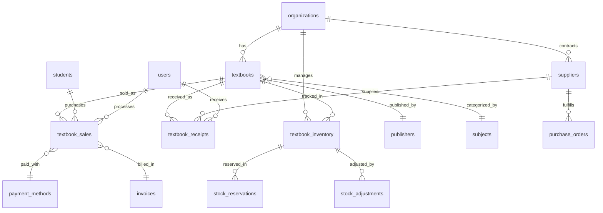

# 교재 관리 시스템 데이터모델 설계서

**작성일**: 2025-08-08  
**프로젝트**: EduCanvas v2.0 - 교재 관리 모듈  
**설계자**: AI Assistant  
**문서 버전**: v1.0

---

## 📋 개요

### 설계 목적
EduCanvas 교재 관리 시스템을 위한 완전한 데이터베이스 스키마 및 관련 모델을 정의합니다. 경쟁사 분석을 바탕으로 확장성과 성능을 고려한 엔터프라이즈급 설계를 제공합니다.

### 핵심 요구사항
- **완전한 교재 생명주기 관리**: 등록 → 입고 → 판매 → 재고 → 분석
- **다중 조직 지원**: 여러 학원/캠퍼스의 독립적 교재 관리
- **실시간 재고 추적**: 정확한 재고 수량 및 예약 관리
- **수익성 분석**: 교재별/카테고리별 상세 분석
- **자동화 지원**: 자동 발주, 알림, 분석 리포트

---

## 🏗️ 전체 아키텍처

### ERD 다이어그램


---

## 📊 핵심 데이터 모델

### 1. 교재 마스터 (Textbooks)

```sql
-- 교재 기본 정보
CREATE TABLE textbooks (
  id UUID PRIMARY KEY DEFAULT gen_random_uuid(),
  organization_id UUID NOT NULL REFERENCES organizations(id) ON DELETE CASCADE,
  
  -- 기본 식별 정보
  code VARCHAR(50) NOT NULL, -- 교재 코드 (조직별 유니크)
  barcode VARCHAR(20), -- ISBN 또는 내부 바코드
  title VARCHAR(200) NOT NULL,
  subtitle VARCHAR(200),
  edition VARCHAR(20), -- 판차 정보
  
  -- 출판 정보
  publisher_id UUID REFERENCES publishers(id),
  author_main VARCHAR(100), -- 주 저자
  author_sub VARCHAR(200), -- 공저자들
  publication_date DATE,
  
  -- 분류 정보
  subject_id UUID NOT NULL REFERENCES subjects(id),
  grade_levels INTEGER[] NOT NULL, -- 대상 학년 [1,2,3]
  difficulty_level VARCHAR(20) DEFAULT 'intermediate', -- basic/intermediate/advanced/expert
  textbook_type VARCHAR(30) DEFAULT 'workbook', -- textbook/workbook/reference/test/digital
  language VARCHAR(10) DEFAULT 'ko', -- ko/en/zh/ja
  
  -- 가격 정보
  list_price DECIMAL(10,2) NOT NULL CHECK (list_price > 0),
  cost_price DECIMAL(10,2), -- 원가 (매입가)
  sale_price DECIMAL(10,2) NOT NULL CHECK (sale_price > 0),
  discount_rate DECIMAL(5,2) GENERATED ALWAYS AS (
    CASE WHEN list_price > 0 
    THEN ROUND(((list_price - sale_price) / list_price * 100)::NUMERIC, 2)
    ELSE 0 END
  ) STORED,
  
  -- 물리적 정보
  page_count INTEGER,
  weight_grams INTEGER,
  dimensions JSONB, -- {"width": 190, "height": 260, "thickness": 15}
  
  -- 디지털 정보  
  has_digital_content BOOLEAN DEFAULT false,
  digital_access_code VARCHAR(100),
  qr_code_data TEXT,
  
  -- 메타데이터
  description TEXT,
  features TEXT[], -- 특징 태그들
  target_audience VARCHAR(100), -- 대상 독자
  prerequisites VARCHAR(200), -- 선수 지식
  
  -- 미디어
  cover_image_url VARCHAR(500),
  sample_pages_urls TEXT[], -- 샘플 페이지 이미지들
  video_preview_url VARCHAR(500),
  
  -- 상태 및 설정
  is_active BOOLEAN DEFAULT true,
  is_sellable BOOLEAN DEFAULT true,
  is_rentable BOOLEAN DEFAULT false,
  requires_approval BOOLEAN DEFAULT false, -- 판매 시 승인 필요
  
  -- 시스템 정보
  created_by UUID REFERENCES users(id),
  updated_by UUID REFERENCES users(id),
  created_at TIMESTAMPTZ DEFAULT now(),
  updated_at TIMESTAMPTZ DEFAULT now(),
  
  -- 제약 조건
  UNIQUE(organization_id, code),
  CHECK (sale_price <= list_price)
);

-- 인덱스
CREATE INDEX idx_textbooks_org_active ON textbooks(organization_id, is_active);
CREATE INDEX idx_textbooks_subject_grade ON textbooks(subject_id, grade_levels);
CREATE INDEX idx_textbooks_title_search ON textbooks USING gin(to_tsvector('korean', title));
CREATE INDEX idx_textbooks_code ON textbooks(organization_id, code);
```

### 2. 출판사 관리 (Publishers)

```sql
-- 출판사 정보
CREATE TABLE publishers (
  id UUID PRIMARY KEY DEFAULT gen_random_uuid(),
  
  -- 기본 정보
  name VARCHAR(100) NOT NULL UNIQUE,
  name_english VARCHAR(100),
  code VARCHAR(20) UNIQUE, -- 출판사 코드
  
  -- 연락처 정보
  business_number VARCHAR(20), -- 사업자등록번호
  address JSONB, -- {"street": "", "city": "", "zipcode": ""}
  phone VARCHAR(20),
  fax VARCHAR(20),
  email VARCHAR(100),
  website VARCHAR(200),
  
  -- 담당자 정보
  contact_person VARCHAR(50),
  contact_phone VARCHAR(20),
  contact_email VARCHAR(100),
  
  -- 거래 정보
  payment_terms VARCHAR(50), -- 결제 조건
  delivery_days INTEGER DEFAULT 7, -- 배송 소요일
  minimum_order_amount DECIMAL(10,2) DEFAULT 0,
  discount_rate DECIMAL(5,2) DEFAULT 0, -- 기본 할인율
  
  -- 상태
  is_active BOOLEAN DEFAULT true,
  rating INTEGER CHECK (rating >= 1 AND rating <= 5), -- 공급사 평가
  
  created_at TIMESTAMPTZ DEFAULT now(),
  updated_at TIMESTAMPTZ DEFAULT now()
);

CREATE INDEX idx_publishers_name ON publishers(name);
CREATE INDEX idx_publishers_active ON publishers(is_active);
```

### 3. 공급업체 관리 (Suppliers)

```sql
-- 교재 공급업체 (출판사와 별개의 유통업체)
CREATE TABLE suppliers (
  id UUID PRIMARY KEY DEFAULT gen_random_uuid(),
  organization_id UUID NOT NULL REFERENCES organizations(id) ON DELETE CASCADE,
  
  -- 기본 정보
  name VARCHAR(100) NOT NULL,
  type VARCHAR(20) DEFAULT 'distributor', -- publisher/distributor/bookstore
  business_number VARCHAR(20),
  
  -- 연락처
  address JSONB,
  phone VARCHAR(20) NOT NULL,
  email VARCHAR(100),
  website VARCHAR(200),
  
  -- 담당자
  primary_contact JSONB, -- {"name": "", "phone": "", "email": ""}
  secondary_contact JSONB,
  
  -- 거래 조건
  payment_terms VARCHAR(50) DEFAULT 'net30', -- net30/net15/prepaid/cod
  credit_limit DECIMAL(12,2) DEFAULT 0,
  delivery_method VARCHAR(30) DEFAULT 'delivery', -- pickup/delivery/shipping
  minimum_order_amount DECIMAL(10,2) DEFAULT 0,
  delivery_fee DECIMAL(8,2) DEFAULT 0,
  
  -- 성과 지표
  reliability_score DECIMAL(3,2) DEFAULT 5.0 CHECK (reliability_score >= 1 AND reliability_score <= 5),
  average_delivery_days DECIMAL(4,1) DEFAULT 7.0,
  return_policy TEXT,
  
  -- 상태
  is_active BOOLEAN DEFAULT true,
  is_preferred BOOLEAN DEFAULT false,
  
  -- 계약 정보
  contract_start_date DATE,
  contract_end_date DATE,
  notes TEXT,
  
  created_by UUID REFERENCES users(id),
  created_at TIMESTAMPTZ DEFAULT now(),
  updated_at TIMESTAMPTZ DEFAULT now(),
  
  UNIQUE(organization_id, name)
);

-- 공급업체별 교재 가격 정보
CREATE TABLE supplier_textbook_prices (
  id UUID PRIMARY KEY DEFAULT gen_random_uuid(),
  supplier_id UUID NOT NULL REFERENCES suppliers(id) ON DELETE CASCADE,
  textbook_id UUID NOT NULL REFERENCES textbooks(id) ON DELETE CASCADE,
  
  -- 가격 정보
  unit_price DECIMAL(10,2) NOT NULL,
  bulk_price DECIMAL(10,2), -- 대량 구매 시 단가
  bulk_minimum_quantity INTEGER DEFAULT 10,
  
  -- 재고 정보
  supplier_stock_quantity INTEGER DEFAULT 0,
  lead_time_days INTEGER DEFAULT 7,
  
  -- 할인 정보
  volume_discounts JSONB DEFAULT '[]', -- [{"min_qty": 50, "discount_rate": 5}]
  seasonal_discount DECIMAL(5,2) DEFAULT 0,
  
  -- 유효성
  is_available BOOLEAN DEFAULT true,
  effective_from DATE DEFAULT CURRENT_DATE,
  effective_until DATE,
  
  created_at TIMESTAMPTZ DEFAULT now(),
  updated_at TIMESTAMPTZ DEFAULT now(),
  
  UNIQUE(supplier_id, textbook_id, effective_from)
);
```

### 4. 재고 관리 (Inventory)

```sql
-- 교재 재고 현황
CREATE TABLE textbook_inventory (
  id UUID PRIMARY KEY DEFAULT gen_random_uuid(),
  textbook_id UUID NOT NULL REFERENCES textbooks(id) ON DELETE CASCADE,
  organization_id UUID NOT NULL REFERENCES organizations(id) ON DELETE CASCADE,
  
  -- 재고 수량
  current_stock INTEGER NOT NULL DEFAULT 0 CHECK (current_stock >= 0),
  reserved_stock INTEGER NOT NULL DEFAULT 0 CHECK (reserved_stock >= 0),
  available_stock INTEGER GENERATED ALWAYS AS (current_stock - reserved_stock) STORED,
  
  -- 재고 정책
  minimum_stock INTEGER NOT NULL DEFAULT 5, -- 안전 재고
  maximum_stock INTEGER NOT NULL DEFAULT 100, -- 최대 재고
  reorder_point INTEGER NOT NULL DEFAULT 10, -- 재주문 시점
  reorder_quantity INTEGER NOT NULL DEFAULT 20, -- 재주문 수량
  
  -- 위치 정보
  primary_location VARCHAR(50) DEFAULT 'main_storage', -- 주 보관 위치
  secondary_locations JSONB DEFAULT '[]', -- [{"location": "room1", "quantity": 5}]
  
  -- 재고 가치
  average_cost DECIMAL(10,2) DEFAULT 0, -- 평균 단가 (FIFO/LIFO/WAC)
  total_value DECIMAL(12,2) GENERATED ALWAYS AS (current_stock * average_cost) STORED,
  
  -- 통계 정보
  total_received INTEGER NOT NULL DEFAULT 0, -- 누적 입고량
  total_sold INTEGER NOT NULL DEFAULT 0, -- 누적 판매량
  total_adjusted INTEGER NOT NULL DEFAULT 0, -- 누적 조정량
  
  -- 재고 회전
  last_sold_date DATE,
  last_received_date DATE,
  days_since_last_movement INTEGER GENERATED ALWAYS AS (
    CURRENT_DATE - GREATEST(COALESCE(last_sold_date, '1900-01-01'), COALESCE(last_received_date, '1900-01-01'))
  ) STORED,
  
  -- 알림 설정
  low_stock_alert_sent BOOLEAN DEFAULT false,
  last_alert_sent_at TIMESTAMPTZ,
  
  -- 시스템 정보
  created_at TIMESTAMPTZ DEFAULT now(),
  updated_at TIMESTAMPTZ DEFAULT now(),
  
  UNIQUE(textbook_id, organization_id),
  CHECK (minimum_stock <= reorder_point),
  CHECK (reorder_point <= maximum_stock)
);

-- 재고 조정 이력
CREATE TABLE stock_adjustments (
  id UUID PRIMARY KEY DEFAULT gen_random_uuid(),
  inventory_id UUID NOT NULL REFERENCES textbook_inventory(id) ON DELETE CASCADE,
  
  -- 조정 정보
  adjustment_type VARCHAR(20) NOT NULL, -- received/sold/damaged/lost/found/correction
  quantity_change INTEGER NOT NULL, -- 양수면 증가, 음수면 감소
  
  -- 조정 전후 수량
  quantity_before INTEGER NOT NULL,
  quantity_after INTEGER NOT NULL CHECK (quantity_after >= 0),
  
  -- 조정 사유
  reason_category VARCHAR(30) NOT NULL, -- purchase/sale/damage/theft/audit/transfer
  reason_detail TEXT,
  
  -- 관련 문서
  reference_type VARCHAR(20), -- purchase_order/sale/transfer/audit
  reference_id UUID,
  document_number VARCHAR(50),
  
  -- 승인 정보 (중요한 조정은 승인 필요)
  requires_approval BOOLEAN DEFAULT false,
  approved_by UUID REFERENCES users(id),
  approved_at TIMESTAMPTZ,
  
  -- 시스템 정보
  created_by UUID NOT NULL REFERENCES users(id),
  created_at TIMESTAMPTZ DEFAULT now(),
  
  CHECK (quantity_after = quantity_before + quantity_change)
);

-- 재고 예약 (판매 처리 중인 상태)
CREATE TABLE stock_reservations (
  id UUID PRIMARY KEY DEFAULT gen_random_uuid(),
  inventory_id UUID NOT NULL REFERENCES textbook_inventory(id) ON DELETE CASCADE,
  
  -- 예약 정보
  reserved_quantity INTEGER NOT NULL CHECK (reserved_quantity > 0),
  reservation_type VARCHAR(20) NOT NULL DEFAULT 'sale', -- sale/rental/hold
  
  -- 예약자 정보
  reserved_for_type VARCHAR(20) NOT NULL, -- student/class/order
  reserved_for_id UUID NOT NULL,
  
  -- 예약 기한
  reserved_until TIMESTAMPTZ NOT NULL,
  auto_release BOOLEAN DEFAULT true,
  
  -- 관련 정보
  order_id UUID,
  notes TEXT,
  
  -- 상태
  status VARCHAR(20) DEFAULT 'active', -- active/fulfilled/cancelled/expired
  
  created_by UUID NOT NULL REFERENCES users(id),
  created_at TIMESTAMPTZ DEFAULT now(),
  fulfilled_at TIMESTAMPTZ,
  cancelled_at TIMESTAMPTZ
);
```

### 5. 구매 및 입고 관리

```sql
-- 구매 주문서
CREATE TABLE purchase_orders (
  id UUID PRIMARY KEY DEFAULT gen_random_uuid(),
  organization_id UUID NOT NULL REFERENCES organizations(id) ON DELETE CASCADE,
  supplier_id UUID NOT NULL REFERENCES suppliers(id),
  
  -- 주문 정보
  order_number VARCHAR(50) NOT NULL, -- 자동 생성 또는 수동 입력
  order_date DATE NOT NULL DEFAULT CURRENT_DATE,
  expected_delivery_date DATE,
  
  -- 상태
  status VARCHAR(20) DEFAULT 'pending', -- pending/confirmed/shipped/delivered/cancelled
  priority VARCHAR(10) DEFAULT 'normal', -- urgent/high/normal/low
  
  -- 배송 정보
  delivery_address JSONB,
  delivery_method VARCHAR(30) DEFAULT 'delivery',
  delivery_fee DECIMAL(8,2) DEFAULT 0,
  
  -- 금액 정보
  subtotal DECIMAL(12,2) NOT NULL DEFAULT 0,
  tax_amount DECIMAL(10,2) DEFAULT 0,
  shipping_amount DECIMAL(8,2) DEFAULT 0,
  discount_amount DECIMAL(10,2) DEFAULT 0,
  total_amount DECIMAL(12,2) GENERATED ALWAYS AS (
    subtotal + tax_amount + shipping_amount - discount_amount
  ) STORED,
  
  -- 결제 정보
  payment_terms VARCHAR(50),
  payment_due_date DATE,
  payment_status VARCHAR(20) DEFAULT 'pending', -- pending/paid/overdue
  
  -- 특이사항
  special_instructions TEXT,
  internal_notes TEXT,
  
  -- 승인 프로세스
  requires_approval BOOLEAN DEFAULT false,
  approved_by UUID REFERENCES users(id),
  approved_at TIMESTAMPTZ,
  
  -- 시스템 정보
  created_by UUID NOT NULL REFERENCES users(id),
  created_at TIMESTAMPTZ DEFAULT now(),
  updated_at TIMESTAMPTZ DEFAULT now(),
  
  UNIQUE(organization_id, order_number)
);

-- 구매 주문 상세
CREATE TABLE purchase_order_items (
  id UUID PRIMARY KEY DEFAULT gen_random_uuid(),
  purchase_order_id UUID NOT NULL REFERENCES purchase_orders(id) ON DELETE CASCADE,
  textbook_id UUID NOT NULL REFERENCES textbooks(id),
  
  -- 주문 정보
  quantity INTEGER NOT NULL CHECK (quantity > 0),
  unit_price DECIMAL(10,2) NOT NULL CHECK (unit_price > 0),
  discount_rate DECIMAL(5,2) DEFAULT 0,
  discount_amount DECIMAL(8,2) DEFAULT 0,
  line_total DECIMAL(10,2) GENERATED ALWAYS AS (
    quantity * unit_price - discount_amount
  ) STORED,
  
  -- 받은 수량
  received_quantity INTEGER DEFAULT 0 CHECK (received_quantity >= 0),
  remaining_quantity INTEGER GENERATED ALWAYS AS (quantity - received_quantity) STORED,
  
  -- 상태
  status VARCHAR(20) DEFAULT 'pending', -- pending/partial/completed/cancelled
  
  created_at TIMESTAMPTZ DEFAULT now()
);

-- 입고 처리
CREATE TABLE textbook_receipts (
  id UUID PRIMARY KEY DEFAULT gen_random_uuid(),
  organization_id UUID NOT NULL REFERENCES organizations(id) ON DELETE CASCADE,
  textbook_id UUID NOT NULL REFERENCES textbooks(id),
  supplier_id UUID REFERENCES suppliers(id),
  purchase_order_id UUID REFERENCES purchase_orders(id),
  
  -- 입고 정보
  receipt_number VARCHAR(50) NOT NULL,
  received_date DATE NOT NULL DEFAULT CURRENT_DATE,
  received_quantity INTEGER NOT NULL CHECK (received_quantity > 0),
  
  -- 가격 정보
  unit_cost DECIMAL(10,2) NOT NULL CHECK (unit_cost > 0),
  total_cost DECIMAL(10,2) GENERATED ALWAYS AS (received_quantity * unit_cost) STORED,
  
  -- 품질 검사
  quality_check_passed BOOLEAN DEFAULT true,
  damaged_quantity INTEGER DEFAULT 0 CHECK (damaged_quantity >= 0),
  defect_notes TEXT,
  
  -- 보관 정보
  storage_location VARCHAR(50) DEFAULT 'main_storage',
  expiration_date DATE, -- 일부 교재의 경우
  
  -- 문서 정보
  supplier_invoice_number VARCHAR(50),
  supplier_delivery_note VARCHAR(50),
  
  -- 처리 정보
  received_by UUID NOT NULL REFERENCES users(id),
  verified_by UUID REFERENCES users(id),
  verified_at TIMESTAMPTZ,
  
  created_at TIMESTAMPTZ DEFAULT now(),
  
  UNIQUE(organization_id, receipt_number),
  CHECK (damaged_quantity <= received_quantity)
);
```

### 6. 판매 관리

```sql
-- 교재 판매 주문
CREATE TABLE textbook_orders (
  id UUID PRIMARY KEY DEFAULT gen_random_uuid(),
  organization_id UUID NOT NULL REFERENCES organizations(id) ON DELETE CASCADE,
  
  -- 주문 정보
  order_number VARCHAR(50) NOT NULL,
  order_date DATE NOT NULL DEFAULT CURRENT_DATE,
  order_type VARCHAR(20) DEFAULT 'individual', -- individual/class_bulk/rental
  
  -- 고객 정보 (학생 또는 반)
  customer_type VARCHAR(20) NOT NULL, -- student/class/external
  student_id UUID REFERENCES students(id),
  class_id UUID REFERENCES classes(id),
  customer_name VARCHAR(100), -- 외부 구매자의 경우
  customer_phone VARCHAR(20),
  
  -- 배송 정보 (필요시)
  delivery_required BOOLEAN DEFAULT false,
  delivery_address JSONB,
  delivery_date DATE,
  delivery_fee DECIMAL(8,2) DEFAULT 0,
  
  -- 금액 정보
  subtotal DECIMAL(10,2) NOT NULL DEFAULT 0,
  discount_amount DECIMAL(8,2) DEFAULT 0,
  tax_amount DECIMAL(8,2) DEFAULT 0,
  delivery_amount DECIMAL(8,2) DEFAULT 0,
  total_amount DECIMAL(10,2) GENERATED ALWAYS AS (
    subtotal - discount_amount + tax_amount + delivery_amount
  ) STORED,
  
  -- 결제 정보
  payment_method VARCHAR(20) DEFAULT 'cash', -- cash/card/transfer/tuition_linked
  payment_status VARCHAR(20) DEFAULT 'pending', -- pending/paid/partial/refunded
  payment_due_date DATE,
  
  -- 상태
  order_status VARCHAR(20) DEFAULT 'pending', -- pending/confirmed/fulfilled/cancelled
  fulfillment_status VARCHAR(20) DEFAULT 'pending', -- pending/picking/packed/shipped/delivered
  
  -- 특이사항
  notes TEXT,
  special_instructions TEXT,
  
  -- 시스템 정보
  created_by UUID NOT NULL REFERENCES users(id),
  processed_by UUID REFERENCES users(id),
  created_at TIMESTAMPTZ DEFAULT now(),
  updated_at TIMESTAMPTZ DEFAULT now(),
  
  UNIQUE(organization_id, order_number),
  CHECK (
    (customer_type = 'student' AND student_id IS NOT NULL) OR
    (customer_type = 'class' AND class_id IS NOT NULL) OR
    (customer_type = 'external' AND customer_name IS NOT NULL)
  )
);

-- 주문 상세 항목
CREATE TABLE textbook_order_items (
  id UUID PRIMARY KEY DEFAULT gen_random_uuid(),
  order_id UUID NOT NULL REFERENCES textbook_orders(id) ON DELETE CASCADE,
  textbook_id UUID NOT NULL REFERENCES textbooks(id),
  
  -- 수량 및 가격
  quantity INTEGER NOT NULL CHECK (quantity > 0),
  unit_price DECIMAL(8,2) NOT NULL CHECK (unit_price > 0),
  discount_rate DECIMAL(5,2) DEFAULT 0,
  discount_amount DECIMAL(8,2) DEFAULT 0,
  line_total DECIMAL(10,2) GENERATED ALWAYS AS (
    quantity * unit_price - discount_amount
  ) STORED,
  
  -- 처리 상태
  reserved_quantity INTEGER DEFAULT 0,
  fulfilled_quantity INTEGER DEFAULT 0,
  remaining_quantity INTEGER GENERATED ALWAYS AS (quantity - fulfilled_quantity) STORED,
  
  -- 개별 할인 사유
  discount_reason VARCHAR(100),
  
  created_at TIMESTAMPTZ DEFAULT now()
);

-- 실제 판매 기록 (재고 출고 시점)
CREATE TABLE textbook_sales (
  id UUID PRIMARY KEY DEFAULT gen_random_uuid(),
  order_item_id UUID NOT NULL REFERENCES textbook_order_items(id),
  textbook_id UUID NOT NULL REFERENCES textbooks(id),
  organization_id UUID NOT NULL REFERENCES organizations(id),
  
  -- 판매 정보
  sale_date DATE NOT NULL DEFAULT CURRENT_DATE,
  quantity INTEGER NOT NULL CHECK (quantity > 0),
  unit_price DECIMAL(8,2) NOT NULL,
  cost_price DECIMAL(8,2), -- 판매 시점의 원가
  
  -- 수익 계산
  revenue DECIMAL(10,2) GENERATED ALWAYS AS (quantity * unit_price) STORED,
  cost DECIMAL(10,2) GENERATED ALWAYS AS (quantity * COALESCE(cost_price, 0)) STORED,
  gross_profit DECIMAL(10,2) GENERATED ALWAYS AS (
    quantity * unit_price - quantity * COALESCE(cost_price, 0)
  ) STORED,
  margin_rate DECIMAL(5,2) GENERATED ALWAYS AS (
    CASE WHEN unit_price > 0 AND cost_price > 0
    THEN ROUND(((unit_price - cost_price) / unit_price * 100)::NUMERIC, 2)
    ELSE 0 END
  ) STORED,
  
  -- 연결된 수강료 (수강료에 포함된 경우)
  linked_to_tuition BOOLEAN DEFAULT false,
  invoice_id UUID REFERENCES invoices(id),
  
  -- 처리 정보
  processed_by UUID NOT NULL REFERENCES users(id),
  created_at TIMESTAMPTZ DEFAULT now()
);
```

### 7. 분석 및 리포팅을 위한 뷰

```sql
-- 교재별 종합 현황 뷰
CREATE VIEW textbook_overview AS
SELECT 
  t.id,
  t.organization_id,
  t.code,
  t.title,
  t.publisher_id,
  p.name as publisher_name,
  t.subject_id,
  s.name as subject_name,
  t.grade_levels,
  t.list_price,
  t.sale_price,
  t.discount_rate,
  
  -- 재고 정보
  inv.current_stock,
  inv.reserved_stock,
  inv.available_stock,
  inv.minimum_stock,
  inv.days_since_last_movement,
  
  -- 판매 통계 (최근 30일)
  COALESCE(sales_30d.total_quantity, 0) as sales_quantity_30d,
  COALESCE(sales_30d.total_revenue, 0) as sales_revenue_30d,
  COALESCE(sales_30d.total_profit, 0) as sales_profit_30d,
  
  -- 전체 판매 통계
  COALESCE(sales_all.total_quantity, 0) as total_sales_quantity,
  COALESCE(sales_all.total_revenue, 0) as total_sales_revenue,
  COALESCE(sales_all.total_profit, 0) as total_sales_profit,
  
  -- 재고 회전율 (연간 기준)
  CASE 
    WHEN inv.current_stock > 0 AND sales_365d.total_quantity > 0
    THEN ROUND((sales_365d.total_quantity::DECIMAL / inv.current_stock), 2)
    ELSE 0 
  END as inventory_turnover_rate,
  
  t.is_active,
  t.created_at,
  t.updated_at

FROM textbooks t
LEFT JOIN publishers p ON t.publisher_id = p.id
LEFT JOIN subjects s ON t.subject_id = s.id
LEFT JOIN textbook_inventory inv ON t.id = inv.textbook_id
LEFT JOIN (
  SELECT 
    textbook_id,
    SUM(quantity) as total_quantity,
    SUM(revenue) as total_revenue,
    SUM(gross_profit) as total_profit
  FROM textbook_sales 
  WHERE sale_date >= CURRENT_DATE - INTERVAL '30 days'
  GROUP BY textbook_id
) sales_30d ON t.id = sales_30d.textbook_id
LEFT JOIN (
  SELECT 
    textbook_id,
    SUM(quantity) as total_quantity,
    SUM(revenue) as total_revenue,
    SUM(gross_profit) as total_profit
  FROM textbook_sales 
  GROUP BY textbook_id
) sales_all ON t.id = sales_all.textbook_id
LEFT JOIN (
  SELECT 
    textbook_id,
    SUM(quantity) as total_quantity
  FROM textbook_sales 
  WHERE sale_date >= CURRENT_DATE - INTERVAL '365 days'
  GROUP BY textbook_id
) sales_365d ON t.id = sales_365d.textbook_id;

-- 일별 판매 통계 뷰
CREATE VIEW daily_sales_summary AS
SELECT 
  organization_id,
  sale_date,
  COUNT(DISTINCT textbook_id) as unique_textbooks_sold,
  SUM(quantity) as total_quantity,
  SUM(revenue) as total_revenue,
  SUM(cost) as total_cost,
  SUM(gross_profit) as total_profit,
  ROUND(AVG(margin_rate), 2) as average_margin_rate
FROM textbook_sales
GROUP BY organization_id, sale_date
ORDER BY organization_id, sale_date DESC;

-- 재고 알림 대상 뷰
CREATE VIEW inventory_alerts AS
SELECT 
  inv.id as inventory_id,
  inv.organization_id,
  t.id as textbook_id,
  t.code,
  t.title,
  inv.current_stock,
  inv.minimum_stock,
  inv.reorder_point,
  inv.reorder_quantity,
  inv.days_since_last_movement,
  
  CASE 
    WHEN inv.current_stock <= inv.minimum_stock THEN 'low_stock'
    WHEN inv.current_stock <= inv.reorder_point THEN 'reorder_needed'
    WHEN inv.days_since_last_movement > 90 THEN 'slow_moving'
    WHEN inv.days_since_last_movement > 180 THEN 'dead_stock'
    ELSE 'normal'
  END as alert_type,
  
  inv.last_alert_sent_at
FROM textbook_inventory inv
JOIN textbooks t ON inv.textbook_id = t.id
WHERE 
  t.is_active = true AND
  (
    inv.current_stock <= inv.reorder_point OR
    inv.days_since_last_movement > 90
  );
```

---

## 🔧 TypeScript 타입 정의

```typescript
// 교재 관련 타입들
export interface Textbook {
  id: string
  organizationId: string
  code: string
  barcode?: string
  title: string
  subtitle?: string
  edition?: string
  
  publisherId?: string
  publisher?: Publisher
  authorMain?: string
  authorSub?: string
  publicationDate?: Date
  
  subjectId: string
  subject?: Subject
  gradeLevels: number[]
  difficultyLevel: 'basic' | 'intermediate' | 'advanced' | 'expert'
  textbookType: 'textbook' | 'workbook' | 'reference' | 'test' | 'digital'
  language: string
  
  listPrice: number
  costPrice?: number
  salePrice: number
  discountRate: number
  
  pageCount?: number
  weightGrams?: number
  dimensions?: {
    width: number
    height: number
    thickness: number
  }
  
  hasDigitalContent: boolean
  digitalAccessCode?: string
  qrCodeData?: string
  
  description?: string
  features: string[]
  targetAudience?: string
  prerequisites?: string
  
  coverImageUrl?: string
  samplePagesUrls: string[]
  videoPreviewUrl?: string
  
  isActive: boolean
  isSellable: boolean
  isRentable: boolean
  requiresApproval: boolean
  
  createdBy?: string
  updatedBy?: string
  createdAt: Date
  updatedAt: Date
}

export interface TextbookInventory {
  id: string
  textbookId: string
  organizationId: string
  
  currentStock: number
  reservedStock: number
  availableStock: number
  
  minimumStock: number
  maximumStock: number
  reorderPoint: number
  reorderQuantity: number
  
  primaryLocation: string
  secondaryLocations: Array<{
    location: string
    quantity: number
  }>
  
  averageCost: number
  totalValue: number
  
  totalReceived: number
  totalSold: number
  totalAdjusted: number
  
  lastSoldDate?: Date
  lastReceivedDate?: Date
  daysSinceLastMovement: number
  
  lowStockAlertSent: boolean
  lastAlertSentAt?: Date
  
  createdAt: Date
  updatedAt: Date
  
  // 조인된 데이터
  textbook?: Textbook
}

export interface TextbookOrder {
  id: string
  organizationId: string
  orderNumber: string
  orderDate: Date
  orderType: 'individual' | 'class_bulk' | 'rental'
  
  customerType: 'student' | 'class' | 'external'
  studentId?: string
  classId?: string
  customerName?: string
  customerPhone?: string
  
  deliveryRequired: boolean
  deliveryAddress?: any
  deliveryDate?: Date
  deliveryFee: number
  
  subtotal: number
  discountAmount: number
  taxAmount: number
  deliveryAmount: number
  totalAmount: number
  
  paymentMethod: 'cash' | 'card' | 'transfer' | 'tuition_linked'
  paymentStatus: 'pending' | 'paid' | 'partial' | 'refunded'
  paymentDueDate?: Date
  
  orderStatus: 'pending' | 'confirmed' | 'fulfilled' | 'cancelled'
  fulfillmentStatus: 'pending' | 'picking' | 'packed' | 'shipped' | 'delivered'
  
  notes?: string
  specialInstructions?: string
  
  createdBy: string
  processedBy?: string
  createdAt: Date
  updatedAt: Date
  
  // 관계 데이터
  items?: TextbookOrderItem[]
  student?: Student
  class?: Class
}

export interface TextbookOrderItem {
  id: string
  orderId: string
  textbookId: string
  
  quantity: number
  unitPrice: number
  discountRate: number
  discountAmount: number
  lineTotal: number
  
  reservedQuantity: number
  fulfilledQuantity: number
  remainingQuantity: number
  
  discountReason?: string
  
  createdAt: Date
  
  // 관계 데이터
  textbook?: Textbook
}

// API 요청/응답 타입들
export interface CreateTextbookRequest {
  code?: string
  title: string
  subtitle?: string
  publisherId?: string
  subjectId: string
  gradeLevels: number[]
  listPrice: number
  salePrice: number
  // ... 기타 필드들
}

export interface UpdateTextbookRequest extends Partial<CreateTextbookRequest> {
  id: string
}

export interface TextbookFilters {
  search?: string
  subjectId?: string
  gradeLevels?: number[]
  publisherId?: string
  priceRange?: [number, number]
  isActive?: boolean
  inStock?: boolean
  page?: number
  limit?: number
  sortBy?: 'title' | 'price' | 'stock' | 'sales' | 'created'
  sortOrder?: 'asc' | 'desc'
}

export interface SalesAnalytics {
  period: {
    start: Date
    end: Date
  }
  totalRevenue: number
  totalProfit: number
  totalQuantity: number
  averageMargin: number
  topSellingBooks: Array<{
    textbookId: string
    title: string
    quantity: number
    revenue: number
  }>
  salesBySubject: Array<{
    subjectId: string
    subjectName: string
    revenue: number
    quantity: number
  }>
  dailySales: Array<{
    date: Date
    revenue: number
    quantity: number
  }>
}
```

---

## 📈 성능 최적화 전략

### 인덱스 전략
```sql
-- 검색 성능 최적화
CREATE INDEX CONCURRENTLY idx_textbooks_search 
ON textbooks USING gin(to_tsvector('korean', title || ' ' || COALESCE(author_main, '')));

-- 필터링 성능 최적화  
CREATE INDEX CONCURRENTLY idx_textbooks_filters
ON textbooks(organization_id, subject_id, is_active) 
INCLUDE (grade_levels, sale_price);

-- 재고 조회 최적화
CREATE INDEX CONCURRENTLY idx_inventory_org_stock
ON textbook_inventory(organization_id, current_stock)
WHERE current_stock > 0;

-- 판매 분석 최적화
CREATE INDEX CONCURRENTLY idx_sales_analytics
ON textbook_sales(organization_id, sale_date DESC, textbook_id);

-- 재고 이동 추적 최적화
CREATE INDEX CONCURRENTLY idx_stock_adjustments_timeline
ON stock_adjustments(inventory_id, created_at DESC);
```

### 파티셔닝 전략
```sql
-- 판매 데이터 월별 파티셔닝 (대용량 데이터 대비)
CREATE TABLE textbook_sales_2025 PARTITION OF textbook_sales
FOR VALUES FROM ('2025-01-01') TO ('2026-01-01');

CREATE TABLE textbook_sales_2026 PARTITION OF textbook_sales  
FOR VALUES FROM ('2026-01-01') TO ('2027-01-01');
```

---

## 🔐 보안 및 권한 관리

### RLS (Row Level Security) 정책
```sql
-- 조직별 데이터 격리
ALTER TABLE textbooks ENABLE ROW LEVEL SECURITY;
CREATE POLICY textbooks_org_policy ON textbooks
USING (organization_id = current_setting('app.current_organization_id')::UUID);

ALTER TABLE textbook_inventory ENABLE ROW LEVEL SECURITY;
CREATE POLICY inventory_org_policy ON textbook_inventory
USING (organization_id = current_setting('app.current_organization_id')::UUID);
```

### 감사 로그
```sql
-- 중요 테이블의 변경 사항 추적
CREATE TRIGGER textbook_audit_trigger
AFTER INSERT OR UPDATE OR DELETE ON textbooks
FOR EACH ROW EXECUTE FUNCTION audit_trigger_function();

CREATE TRIGGER inventory_audit_trigger  
AFTER UPDATE ON textbook_inventory
FOR EACH ROW EXECUTE FUNCTION audit_trigger_function();
```

---

## 🚀 마이그레이션 및 초기 데이터

### 기본 설정 데이터
```sql
-- 기본 과목 데이터
INSERT INTO subjects (name, code, description) VALUES
('국어', 'KOR', '국어 과목'),
('영어', 'ENG', '영어 과목'),  
('수학', 'MATH', '수학 과목'),
('과학', 'SCI', '과학 과목'),
('사회', 'SOC', '사회 과목'),
('한국사', 'HIST', '한국사 과목');

-- 주요 출판사 데이터
INSERT INTO publishers (name, code) VALUES
('천재교육', 'CHUNJAE'),
('비상교육', 'VISANG'),
('금성출판사', 'KUMSUNG'),
('교학사', 'KYOHAK'),
('EBS', 'EBS');
```

### 데이터 마이그레이션 스크립트
```sql
-- 기존 교재 데이터가 있다면 변환 로직
-- 예: CSV 임포트 함수
CREATE OR REPLACE FUNCTION import_textbooks_from_csv(file_path TEXT)
RETURNS INTEGER AS $$
DECLARE
  record_count INTEGER;
BEGIN
  -- CSV 데이터를 임시 테이블로 로드
  CREATE TEMP TABLE temp_textbooks (
    title TEXT,
    publisher TEXT,
    subject TEXT,
    grade TEXT,
    price TEXT
  );
  
  -- COPY 명령으로 CSV 로드
  EXECUTE format('COPY temp_textbooks FROM %L WITH CSV HEADER', file_path);
  
  -- 정규화된 테이블로 변환
  INSERT INTO textbooks (
    organization_id, 
    title, 
    publisher_id, 
    subject_id, 
    grade_levels, 
    list_price, 
    sale_price,
    code
  )
  SELECT 
    current_setting('app.current_organization_id')::UUID,
    t.title,
    p.id,
    s.id,
    ARRAY[t.grade::INTEGER],
    t.price::DECIMAL,
    t.price::DECIMAL,
    generate_textbook_code()
  FROM temp_textbooks t
  LEFT JOIN publishers p ON p.name = t.publisher
  LEFT JOIN subjects s ON s.name = t.subject;
  
  GET DIAGNOSTICS record_count = ROW_COUNT;
  DROP TABLE temp_textbooks;
  
  RETURN record_count;
END;
$$ LANGUAGE plpgsql;
```

이 데이터모델 설계는 교재 관리의 전체 생명주기를 포괄하며, 확장성과 성능을 고려한 엔터프라이즈급 설계입니다. 다음 단계에서는 이를 바탕으로 API 설계와 UI 컴포넌트 개발을 진행할 수 있습니다.