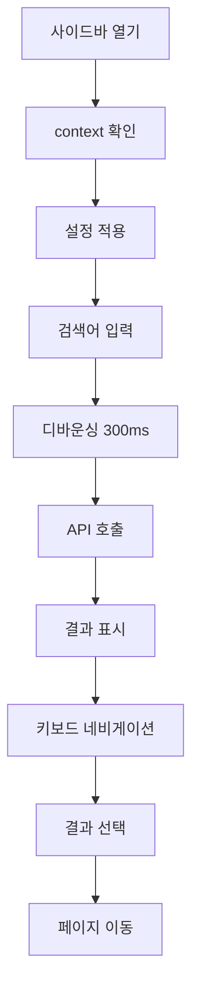

# SearchSidebar 컴포넌트 기능 개요

**작성일**: 2025-08-28  
**버전**: T-V2-004 완료  
**상태**: ✅ 완성  
**담당**: Search System Core Components

## 📋 개요

EduCanvas v2 통합 검색 시스템의 핵심 컴포넌트로, 컨텍스트 어댑터 패턴을 적용하여 각 기능별로 다른 사용자 경험을 제공하는 사이드바 검색 인터페이스입니다.

## 🏗️ 아키텍처

### 3계층 구조

```
┌─────────────────────────────┐
│      공통 기반 레이어        │ ← SearchInput, 키보드 네비게이션, 애니메이션
├─────────────────────────────┤
│      컨텍스트 어댑터        │ ← context prop 기반 동적 설정
├─────────────────────────────┤
│      확장 콘텐츠 영역       │ ← children prop으로 커스텀 콘텐츠 주입
└─────────────────────────────┘
```

## 🎯 핵심 기능

### 1. 컨텍스트 어댑터 패턴
- **context prop** 기반으로 UI/기능 자동 변경
- 제목, 설명, 플레이스홀더 동적 설정
- 필터 표시 여부 조건부 제어

### 2. 확장 가능한 콘텐츠 시스템
- **children prop**으로 커스텀 콘텐츠 주입
- 기본 검색 기능과 커스텀 기능 선택적 사용
- 컴포넌트 재사용성 극대화

### 3. 통합 상태 관리
- Zustand 기반 `useSearchStore` 통합 관리
- 검색어, 결과, 로딩 상태, 필터 상태
- 키보드 네비게이션 상태 (selectedIndex)

## 📱 컨텍스트별 동작 방식

| Context | 제목 | 필터 표시 | 주요 용도 | 콘텐츠 패턴 |
|---------|------|-----------|-----------|-------------|
| `students` | 학생 검색 | ❌ | 인적사항 표시 | Detail Panel |
| `staff` | 직원 검색 | ❌ | 인적사항 표시 | Detail Panel |
| `classes` | 수업 필터 | ✅ | 필터링 중심 | Filter Results |
| `schedule` | 일정 검색 | ✅ | 날짜/시간 네비게이션 | Calendar Nav |
| `dashboard` | 통합 검색 | ✅ | 전체 데이터 검색 | Default Search |

## 🔧 주요 Props

```typescript
interface SearchSidebarProps {
  className?: string           // 추가 CSS 클래스
  title?: string              // 커스텀 제목 (기본값: context 기반 자동 설정)
  subtitle?: string           // 커스텀 설명 (기본값: context 기반 자동 설정)
  context?: 'students' | 'classes' | 'staff' | 'schedule' | 'dashboard'
  children?: React.ReactNode  // 커스텀 콘텐츠 (없으면 기본 검색 UI)
}
```

## 💻 사용법 예시

### 1. 기본 사용법 (Default Search)
```tsx
<SearchSidebar context="dashboard" />
```

### 2. 커스텀 콘텐츠 주입
```tsx
<SearchSidebar context="students">
  <PersonDetailPanel />
</SearchSidebar>
```

### 3. 제목/설명 오버라이드
```tsx
<SearchSidebar 
  context="classes"
  title="커스텀 수업 검색"
  subtitle="특별한 설명"
/>
```

## ⌨️ 키보드 단축키

| 키 조합 | 동작 | 범위 |
|---------|------|------|
| `ESC` | 사이드바 닫기 | 전역 |
| `↑` / `↓` | 검색 결과 탐색 | 사이드바 열림시 |
| `Enter` | 선택한 결과로 이동 | 검색 결과 존재시 |

## 🎨 UI 구성 요소

### 1. 헤더 영역
- **제목**: context 기반 자동 설정 또는 커스텀
- **설명**: 부가 정보 표시
- **닫기 버튼**: X 아이콘으로 사이드바 닫기

### 2. 검색 입력 영역
- **SearchInput 컴포넌트**: 실시간 검색 (300ms 디바운싱)
- **플레이스홀더**: context별 맞춤형 안내 텍스트

### 3. 필터 영역 (조건부)
- **SearchFilters 컴포넌트**: context에 따라 표시/숨김
- **상시 노출**: 드롭다운 제거, 필터 옵션 바로 표시

### 4. 콘텐츠 영역 (동적)
- **children 우선**: 커스텀 콘텐츠가 있으면 표시
- **기본 콘텐츠**: SearchResults 또는 RecentSearches

### 5. 푸터 영역
- **키보드 단축키 안내**: 사용법 힌트 표시

### 6. 로딩 오버레이
- **전체 화면 로딩**: 검색 진행 중 표시
- **스피너 + 텍스트**: 시각적 피드백

## 🔄 상태 흐름



## 🎭 애니메이션

### 슬라이드 인/아웃
- **방향**: 왼쪽에서 오른쪽으로 슬라이드
- **시간**: 300ms
- **이징**: Spring (stiffness: 300, damping: 30)
- **초기값**: `x: -320px` → `x: 0`

### 백드롭 페이드
- **모바일 전용**: lg 미만 화면에서 배경 어둡게
- **투명도**: 0 → 0.5
- **시간**: 200ms

## 📱 반응형 동작

| 화면 크기 | 동작 방식 | 백드롭 | 플로팅 버튼 |
|-----------|-----------|--------|-------------|
| `lg+` (1024px+) | 사이드바 오버레이 | ❌ | ❌ |
| `< lg` (모바일/태블릿) | 전체화면 모달 | ✅ | ✅ |

## 🔌 확장 패턴

### 1. Detail Panel 패턴 (학생/직원)
```tsx
function PersonDetailPanel() {
  const { selectedPerson } = useSearchStore()
  
  return selectedPerson ? (
    <PersonDetails person={selectedPerson} />
  ) : (
    <SearchResultsList onSelect={setSelectedPerson} />
  )
}
```

### 2. Filter 패턴 (수업/일정)
```tsx
// children을 전달하지 않으면 자동으로 기본 필터 + 검색결과 표시
<SearchSidebar context="classes" />
```

### 3. Custom Navigation 패턴 (일정)
```tsx
function CalendarNavigation() {
  return (
    <div>
      <MiniCalendar />
      <QuickDateSelection />
      <SelectedDatePreview />
    </div>
  )
}
```

## 🚀 성능 최적화

### 1. 검색 최적화
- **디바운싱**: 300ms 지연으로 API 호출 최적화
- **캐시 전략**: 동일 검색어 결과 재사용
- **무한 스크롤**: 대량 데이터 처리

### 2. 렌더링 최적화
- **useCallback**: 이벤트 핸들러 메모이제이션
- **조건부 렌더링**: 필요한 컴포넌트만 렌더링
- **lazy loading**: 커스텀 콘텐츠 지연 로딩

## 🔗 관련 컴포넌트

### 핵심 의존성
- `SearchInput`: 검색 입력 컴포넌트
- `SearchFilters`: 필터링 컴포넌트  
- `SearchResults`: 검색 결과 표시
- `RecentSearches`: 최근 검색어 표시

### 상태 관리
- `useSearchStore`: Zustand 기반 통합 상태
- `useSearchIsOpen`: 사이드바 열림/닫힘 상태
- `useSearchContext`: 현재 컨텍스트
- `useSearchFilters`: 필터 상태

## 🎯 향후 확장 계획

### Phase 1 완료 ✅
- [x] 공통 기반 레이어 구현
- [x] 컨텍스트 어댑터 패턴 구현
- [x] 확장 가능한 콘텐츠 시스템

### Phase 2 계획 🔄
- [ ] PersonDetailPanel 컴포넌트 구현 (학생/직원)
- [ ] CalendarNavigation 컴포넌트 구현 (일정)
- [ ] 고급 필터 옵션 확장
- [ ] 검색 결과 캐싱 최적화

### Phase 3 계획 📋
- [ ] 모바일 제스처 지원
- [ ] 음성 검색 기능
- [ ] AI 기반 스마트 검색
- [ ] 실시간 협업 기능

## 🔍 참고 링크

- **테스트 페이지**: `/test/search-sidebar`
- **컨텍스트 컴포넌트**: `src/components/search/context/SearchSidebarContexts.tsx`
- **상태 관리**: `src/lib/stores/searchStore.ts`
- **API 엔드포인트**: `src/app/api/search/route.ts`

---

**마지막 업데이트**: 2025-08-28  
**문서 상태**: 최신  
**리뷰 필요**: 각 기능 구현 완료 후 업데이트 예정