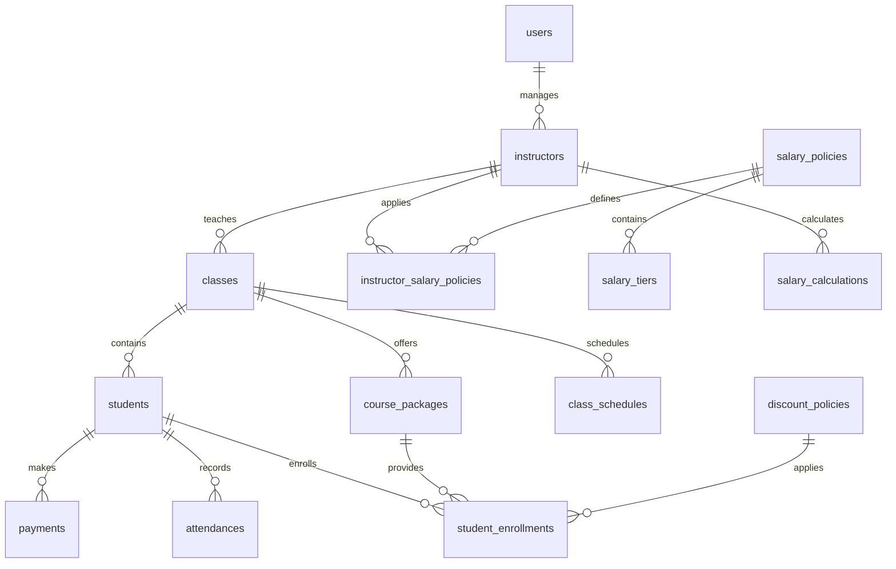

# EduCanvas 데이터베이스 설계 문서 v3.0

**작성일**: 2025-08-09  
**데이터베이스**: Supabase (PostgreSQL 15+)  
**스키마 버전**: v3.0  
**기반**: database_schema_v3.sql

---

## 📋 목차

1. [개요](#1-개요)
2. [v2.0 주요 변경사항](#2-v20-주요-변경사항)
3. [데이터베이스 아키텍처](#3-데이터베이스-아키텍처)
4. [핵심 테이블 설명](#4-핵심-테이블-설명)
5. [요금제 시스템](#5-요금제-시스템)
6. [급여 정책 시스템](#6-급여-정책-시스템)
7. [자동화 및 트리거](#7-자동화-및-트리거)
8. [보안 정책](#8-보안-정책)
9. [성능 최적화](#9-성능-최적화)
10. [API 연동 가이드](#10-api-연동-가이드)

---

## 1. 개요

### 1.1 설계 목표
- **유연한 요금 정책**: 월정액, 회차제, 시간제, 패키지 등 다양한 청구 방식 지원
- **복잡한 급여 시스템**: 고정급, 시급, 비율제, 누진제 등 모든 급여 정책 대응
- **확장성**: 멀티 학원, 대용량 데이터 처리 대비
- **무결성**: 복잡한 비즈니스 로직의 데이터 정합성 보장
- **자동화**: 반복 업무의 최대한 자동화
- **통합 관리**: 교실, 시간표, 성적, 문서, 히스토리의 통합 관리
- **AI 준비**: 학습 분석 및 예측을 위한 데이터 구조
- **확장성**: Phase 4-10 기능까지 완전 지원

### 1.2 기술 스택
- **데이터베이스**: PostgreSQL 15+ (Supabase)
- **보안**: Row Level Security (RLS)
- **실시간**: Supabase Realtime
- **언어**: TypeScript with Supabase Client

---

## 2. v3.0 주요 변경사항

### 2.1 MVP 기반 (v2.0) 유지
- 5가지 billing types 완전 지원
- 7가지 급여 정책 시스템
- 완전한 수강권 등록 및 추적
- 할인 정책 관리 시스템

### 2.2 v3.0 확장 기능 추가
| 테이블 | 용도 | Phase |
|--------|------|-------|
| **교실 관리** | | |
| `classrooms` | 교실 정보 및 시설 관리 | 4 |
| `classroom_usage_logs` | 교실 사용 이력 추적 | 4 |
| **타임테이블 시스템** | | |
| `time_slots` | 기본 시간 슬롯 정의 | 4 |
| `recurring_schedules` | 정규 시간표 관리 | 4 |
| `schedule_overrides` | 일회성/변경 스케줄 | 4 |
| **성적 관리** | | |
| `exams` | 시험 정보 및 설정 | 5 |
| `exam_questions` | 시험 문제 관리 (선택적) | 5 |
| `student_scores` | 학생 성적 및 분석 | 5 |
| **문서 관리** | | |
| `document_folders` | 폴더 구조 관리 | 5 |
| `documents` | 파일 저장 및 버전 관리 | 5 |
| `document_access_logs` | 문서 접근 로그 | 5 |
| **히스토리 추적** | | |
| `student_histories` | 통합 학생 이벤트 추적 | 5 |
| `academic_progress` | 학습 진도 및 AI 분석 | 5 |
| **상담 관리** | | |
| `consultations` | 상담 예약 및 관리 | 5 |
| `consultation_records` | 상담 기록 및 효과 분석 | 5 |
| `salary_tiers` | 누진제 구간 관리 |
| `instructor_salary_policies` | 강사별 급여 정책 적용 |
| `salary_calculations` | 월별 급여 계산 결과 |

### 2.2 ENUM 타입 확장
```sql
-- 수강권 청구 유형
CREATE TYPE billing_type AS ENUM (
    'monthly',      -- 월 정액제
    'sessions',     -- 회차제 (10회권, 20회권)
    'hours',        -- 시간제
    'package',      -- 패키지 (3개월, 6개월)
    'drop_in'       -- 드롭인 (매회 결제)
);

-- 할인 유형
CREATE TYPE discount_type AS ENUM (
    'sibling',          -- 형제 할인
    'early_payment',    -- 조기 납부 할인
    'loyalty',          -- 장기 수강 할인
    'scholarship',      -- 장학금
    'promotion',        -- 프로모션
    'volume'           -- 다과목 할인
);

-- 급여 정책 유형
CREATE TYPE salary_policy_type AS ENUM (
    'fixed_monthly',     -- 고정 월급
    'fixed_hourly',      -- 고정 시급
    'commission',        -- 단순 비율제
    'tiered_commission', -- 누진 비율제
    'student_based',     -- 학생 수 기준
    'hybrid',           -- 혼합형 (기본급 + 성과급)
    'guaranteed_minimum' -- 최소 보장형
);
```

---

## 3. 데이터베이스 아키텍처

### 3.1 전체 구조 (ERD)


### 3.2 계층 구조
```
┌─────────────────────────────────────────┐
│             보안 계층 (RLS)              │
├─────────────────────────────────────────┤
│             비즈니스 로직 계층            │
│  • 자동화 함수 (트리거)                  │
│  • 계산 로직 (급여, 할인)                │
│  • 유효성 검증                          │
├─────────────────────────────────────────┤
│             데이터 계층                  │
│  • 핵심 테이블                          │
│  • 관계형 구조                          │
│  • ENUM 타입                           │
└─────────────────────────────────────────┘
```

---

## 4. 핵심 테이블 설명

### 4.1 MVP 핵심 테이블 (v2.0 기반)

[기존 v2.0 테이블들은 그대로 유지 - students, classes, course_packages, student_enrollments, payments, salary_policies 등]

### 4.2 확장 기능 테이블 (v3.0)

#### 교실 관리 시스템
**classrooms**: 물리적 교실 정보 및 시설 관리
- 수용 인원, 시설 정보, 적합 과목 등 관리
- 예약 가능 여부, 사용료 등 운영 정보
- QR 코드를 통한 체크인 시스템 준비

**classroom_usage_logs**: 교실 사용 이력 추적
- 계획된 사용량 vs 실제 사용량 비교
- 교실 사용률 분석 데이터 수집

#### 타임테이블 시스템
**time_slots**: 기본 시간 슬롯 정의
- 요일별 운영 여부 설정
- 유연한 시간 설정 (90분, 120분 등)

**recurring_schedules**: 정규 시간표 관리
- 반복되는 수업 스케줄
- 교실 자동 배정 기능

**schedule_overrides**: 일회성/변경 스케줄
- 보강, 휴강, 교실 변경 등 관리
- 알림 시스템 연동

#### 성적 관리 시스템
**exams**: 유연한 시험 구조
- 다양한 시험 유형 지원 (중간, 기말, 모의고사 등)
- 유연한 설정 (계산기 허용, 오픈북 등)

**student_scores**: 성적 및 분석 데이터
- 자동 등급 계산 및 순위 산정
- 강점/약점 분석 및 개선 제안

#### 문서 저장 시스템
**document_folders**: 계층적 폴더 구조
- 권한별 접근 제어
- 체계적 분류 시스템

**documents**: 완전한 파일 관리
- 버전 관리 및 변경 이력
- OCR 텍스트 추출 및 검색
- 사용 통계 추적

#### 학생 히스토리 시스템
**student_histories**: 통합 이벤트 추적
- 모든 학생 관련 활동 기록
- 감사 로그 및 변경 이력

**academic_progress**: AI 기반 학습 분석
- 성취도 예측 및 학습 패턴 분석
- 개인별 맞춤 개선 방안 제시

#### 상담 관리 시스템
**consultations**: 체계적 상담 예약
- 다양한 상담 유형 지원
- 참석자 관리 및 알림 시스템

**consultation_records**: 상담 효과 추적
- 상담 내용 및 결과 기록
- 만족도 및 효과성 분석

### 4.1 users (사용자)
```sql
CREATE TABLE users (
    id UUID PRIMARY KEY DEFAULT gen_random_uuid(),
    email VARCHAR(255) UNIQUE NOT NULL,
    name VARCHAR(100) NOT NULL,
    avatar_url TEXT,
    role user_role DEFAULT 'staff',    -- admin, instructor, staff, viewer
    is_active BOOLEAN DEFAULT true,
    last_login TIMESTAMP WITH TIME ZONE,
    created_at TIMESTAMP WITH TIME ZONE DEFAULT NOW(),
    updated_at TIMESTAMP WITH TIME ZONE DEFAULT NOW()
);
```

**특징**:
- Supabase Auth와 완전 연동
- 역할 기반 접근 제어 (RBAC)
- 소프트 삭제 지원

### 4.2 instructors (강사)
```sql
CREATE TABLE instructors (
    id UUID PRIMARY KEY DEFAULT gen_random_uuid(),
    user_id UUID REFERENCES users(id) ON DELETE SET NULL,
    name VARCHAR(100) NOT NULL,
    phone VARCHAR(20),
    email VARCHAR(255),
    specialization VARCHAR(100),     -- 전문 분야
    qualification TEXT,              -- 자격증 정보
    bank_account VARCHAR(50),        -- 급여 계좌
    status student_status DEFAULT 'active',
    hire_date DATE DEFAULT CURRENT_DATE,
    memo TEXT,
    created_at TIMESTAMP WITH TIME ZONE DEFAULT NOW(),
    updated_at TIMESTAMP WITH TIME ZONE DEFAULT NOW()
);
```

**v2.0 변화**:
- user_id 연결로 로그인 계정과 연동 가능
- bank_account 추가로 급여 지급 정보 관리
- qualification 필드로 강사 자격 관리

### 4.3 classes (클래스/반)
```sql
CREATE TABLE classes (
    id UUID PRIMARY KEY DEFAULT gen_random_uuid(),
    name VARCHAR(100) NOT NULL,
    subject VARCHAR(50),
    grade_level VARCHAR(20),         -- 초1, 중2, 고3 등
    max_students INTEGER DEFAULT 20,
    current_students INTEGER DEFAULT 0, -- 자동 계산
    instructor_id UUID REFERENCES instructors(id),
    classroom VARCHAR(50),
    color VARCHAR(7) DEFAULT '#3B82F6',
    status student_status DEFAULT 'active',
    order_index INTEGER DEFAULT 0,
    start_date DATE,
    end_date DATE,
    memo TEXT,
    created_at TIMESTAMP WITH TIME ZONE DEFAULT NOW(),
    updated_at TIMESTAMP WITH TIME ZONE DEFAULT NOW()
);
```

**개선사항**:
- grade_level로 더 상세한 학년 분류
- start_date, end_date로 개강/종료 관리
- order_index로 UI 정렬 순서 제어

### 4.4 students (학생)
```sql
CREATE TABLE students (
    id UUID PRIMARY KEY DEFAULT gen_random_uuid(),
    name VARCHAR(100) NOT NULL,
    phone VARCHAR(20),
    parent_name VARCHAR(100),
    parent_phone VARCHAR(20) NOT NULL,
    grade VARCHAR(20),
    class_id UUID REFERENCES classes(id),
    status student_status DEFAULT 'active',
    enrollment_date DATE DEFAULT CURRENT_DATE,
    graduation_date DATE,
    position_in_class INTEGER DEFAULT 0,
    display_color VARCHAR(7),
    memo TEXT,
    created_at TIMESTAMP WITH TIME ZONE DEFAULT NOW(),
    updated_at TIMESTAMP WITH TIME ZONE DEFAULT NOW(),
    
    CONSTRAINT unique_position_per_class UNIQUE(class_id, position_in_class)
);
```

**핵심 기능**:
- **드래그앤드롭**: position_in_class로 반 내 순서 관리
- **개별 컬러**: display_color로 학생별 시각적 구분
- **상태 추적**: 재학/대기/휴학/졸업 상태 관리

---

## 5. 요금제 시스템

### 5.1 course_packages (수강권 옵션)
```sql
CREATE TABLE course_packages (
    id UUID PRIMARY KEY DEFAULT gen_random_uuid(),
    class_id UUID REFERENCES classes(id) ON DELETE CASCADE,
    name VARCHAR(100) NOT NULL,           -- "10회권", "3개월 패키지"
    billing_type billing_type NOT NULL,
    
    -- 가격 정보
    base_price INTEGER NOT NULL,
    
    -- 수량/기간 정보 (billing_type에 따라 다르게 사용)
    sessions_count INTEGER,               -- 회차제: 총 수업 횟수
    hours_count DECIMAL(5,2),            -- 시간제: 총 수업 시간
    duration_months INTEGER,              -- 패키지: 유효 개월 수
    duration_days INTEGER,                -- 패키지: 유효 일 수
    
    -- 할인 정보
    discount_rate DECIMAL(5,2) DEFAULT 0,
    
    -- 정책 설정
    is_active BOOLEAN DEFAULT true,
    auto_renewal BOOLEAN DEFAULT false,
    sort_order INTEGER DEFAULT 0,
    
    created_at TIMESTAMP WITH TIME ZONE DEFAULT NOW(),
    updated_at TIMESTAMP WITH TIME ZONE DEFAULT NOW()
);
```

**사용 예시**:
```sql
-- 월정액 수강권
INSERT INTO course_packages (class_id, name, billing_type, base_price, duration_months) 
VALUES (class_id, '월 정액권', 'monthly', 180000, 1);

-- 10회권
INSERT INTO course_packages (class_id, name, billing_type, base_price, sessions_count) 
VALUES (class_id, '10회 수업권', 'sessions', 200000, 10);

-- 시간제
INSERT INTO course_packages (class_id, name, billing_type, base_price, hours_count) 
VALUES (class_id, '20시간 패키지', 'hours', 300000, 20.0);
```

### 5.2 student_enrollments (수강권 등록)
```sql
CREATE TABLE student_enrollments (
    id UUID PRIMARY KEY DEFAULT gen_random_uuid(),
    student_id UUID REFERENCES students(id) ON DELETE CASCADE,
    course_package_id UUID REFERENCES course_packages(id),
    
    -- 등록 정보
    enrolled_at TIMESTAMP WITH TIME ZONE DEFAULT NOW(),
    start_date DATE NOT NULL,
    end_date DATE,
    
    -- 가격 정보 (할인 적용 후)
    original_price INTEGER NOT NULL,
    final_price INTEGER NOT NULL,
    applied_discounts JSONB,
    
    -- 사용량 추적 (자동 계산)
    total_sessions INTEGER DEFAULT 0,
    used_sessions INTEGER DEFAULT 0,
    remaining_sessions INTEGER GENERATED ALWAYS AS (total_sessions - used_sessions) STORED,
    
    total_hours DECIMAL(5,2) DEFAULT 0,
    used_hours DECIMAL(5,2) DEFAULT 0,
    remaining_hours DECIMAL(5,2) GENERATED ALWAYS AS (total_hours - used_hours) STORED,
    
    status student_status DEFAULT 'active',
    auto_renewal BOOLEAN DEFAULT false,
    
    memo TEXT,
    created_at TIMESTAMP WITH TIME ZONE DEFAULT NOW(),
    updated_at TIMESTAMP WITH TIME ZONE DEFAULT NOW()
);
```

**자동 사용량 차감**:
- 출석 체크 시 자동으로 used_sessions 또는 used_hours 증가
- remaining_* 필드는 자동 계산되는 Generated Column

### 5.3 discount_policies (할인 정책)
```sql
CREATE TABLE discount_policies (
    id UUID PRIMARY KEY DEFAULT gen_random_uuid(),
    name VARCHAR(100) NOT NULL,
    discount_type discount_type NOT NULL,
    
    -- 할인 조건 (JSON으로 유연하게)
    conditions JSONB,                     -- {"sibling_order": 2, "min_months": 3}
    
    -- 할인 혜택
    discount_rate DECIMAL(5,2),          -- 할인율 (%)
    discount_amount INTEGER,             -- 고정 할인 금액
    max_discount_amount INTEGER,         -- 최대 할인 한도
    
    -- 적용 기간
    valid_from DATE,
    valid_until DATE,
    
    -- 적용 조건
    min_purchase_amount INTEGER DEFAULT 0,
    applicable_billing_types billing_type[],
    
    is_active BOOLEAN DEFAULT true,
    created_at TIMESTAMP WITH TIME ZONE DEFAULT NOW(),
    updated_at TIMESTAMP WITH TIME ZONE DEFAULT NOW()
);
```

**할인 정책 예시**:
```sql
-- 형제 할인 (둘째부터 10% 할인)
INSERT INTO discount_policies (name, discount_type, conditions, discount_rate) 
VALUES ('형제할인', 'sibling', '{"sibling_order": 2}', 10.0);

-- 조기 납부 할인 (매월 25일 이전 납부시 5% 할인)
INSERT INTO discount_policies (name, discount_type, conditions, discount_rate) 
VALUES ('조기납부할인', 'early_payment', '{"before_day": 25}', 5.0);
```

---

## 6. 급여 정책 시스템

### 6.1 salary_policies (급여 정책)
```sql
CREATE TABLE salary_policies (
    id UUID PRIMARY KEY DEFAULT gen_random_uuid(),
    name VARCHAR(100) NOT NULL,
    policy_type salary_policy_type NOT NULL,
    
    -- 기본 설정
    base_amount INTEGER DEFAULT 0,                 -- 기본급
    hourly_rate INTEGER,                          -- 시급
    commission_rate DECIMAL(5,2),                -- 기본 비율
    
    -- 최소 보장
    minimum_guaranteed INTEGER DEFAULT 0,
    
    -- 계산 기준
    calculation_basis VARCHAR(20) DEFAULT 'revenue', -- revenue, students, hours
    
    -- 정책별 세부 설정 (유연한 JSON)
    policy_config JSONB,
    
    description TEXT,
    is_active BOOLEAN DEFAULT true,
    created_at TIMESTAMP WITH TIME ZONE DEFAULT NOW(),
    updated_at TIMESTAMP WITH TIME ZONE DEFAULT NOW()
);
```

### 6.2 급여 정책 유형별 설명

#### 6.2.1 고정 월급 (fixed_monthly)
```sql
INSERT INTO salary_policies (name, policy_type, base_amount) 
VALUES ('신입강사 기본급', 'fixed_monthly', 2500000);
```

#### 6.2.2 시급제 (fixed_hourly)
```sql
INSERT INTO salary_policies (name, policy_type, hourly_rate) 
VALUES ('시간강사', 'fixed_hourly', 35000);
```

#### 6.2.3 단순 비율제 (commission)
```sql
INSERT INTO salary_policies (name, policy_type, commission_rate, calculation_basis) 
VALUES ('매출 연동', 'commission', 15.0, 'revenue');
```

#### 6.2.4 누진 비율제 (tiered_commission)
```sql
-- 정책 생성
INSERT INTO salary_policies (name, policy_type, minimum_guaranteed) 
VALUES ('누진 비율제', 'tiered_commission', 2000000);

-- 구간별 비율 설정
INSERT INTO salary_tiers (policy_id, tier_order, min_amount, max_amount, commission_rate) 
VALUES 
    (policy_id, 1, 0, 5000000, 10.0),        -- 500만원까지 10%
    (policy_id, 2, 5000001, 10000000, 15.0), -- 500-1000만원 15%
    (policy_id, 3, 10000001, NULL, 20.0);    -- 1000만원 초과 20%
```

#### 6.2.5 혼합형 (hybrid)
```sql
INSERT INTO salary_policies (
    name, policy_type, base_amount, commission_rate, 
    calculation_basis, policy_config
) VALUES (
    '기본급+성과급', 'hybrid', 1800000, 8.0, 'revenue',
    '{"performance_threshold": 3000000}'
);
```

### 6.3 월별 급여 계산 (salary_calculations)
```sql
CREATE TABLE salary_calculations (
    id UUID PRIMARY KEY DEFAULT gen_random_uuid(),
    instructor_id UUID REFERENCES instructors(id),
    calculation_month DATE NOT NULL,               -- YYYY-MM-01 형태
    
    -- 계산 기초 데이터
    total_revenue INTEGER DEFAULT 0,
    total_students INTEGER DEFAULT 0,
    total_hours DECIMAL(5,2) DEFAULT 0,
    
    -- 급여 구성 요소
    base_salary INTEGER DEFAULT 0,               -- 기본급
    commission_salary INTEGER DEFAULT 0,         -- 성과급
    bonus_amount INTEGER DEFAULT 0,              -- 보너스
    deduction_amount INTEGER DEFAULT 0,          -- 공제액
    
    -- 계산 결과
    total_calculated INTEGER DEFAULT 0,
    minimum_guaranteed INTEGER DEFAULT 0,
    final_salary INTEGER DEFAULT 0,              -- 최종 급여
    
    -- 세부 내역
    calculation_details JSONB,                   -- 계산 과정 상세
    
    calculated_at TIMESTAMP WITH TIME ZONE DEFAULT NOW(),
    calculated_by UUID REFERENCES users(id),
    approved_at TIMESTAMP WITH TIME ZONE,
    approved_by UUID REFERENCES users(id),
    status VARCHAR(20) DEFAULT 'calculated',     -- calculated, approved, paid
    
    CONSTRAINT unique_instructor_month UNIQUE(instructor_id, calculation_month)
);
```

---

## 7. 자동화 및 트리거

### 7.1 클래스 학생 수 자동 업데이트
```sql
CREATE OR REPLACE FUNCTION update_class_student_count()
RETURNS TRIGGER AS $$
BEGIN
    -- 이전 클래스 학생 수 업데이트
    IF OLD.class_id IS NOT NULL THEN
        UPDATE classes 
        SET current_students = (
            SELECT COUNT(*) 
            FROM students 
            WHERE class_id = OLD.class_id AND status = 'active'
        )
        WHERE id = OLD.class_id;
    END IF;
    
    -- 새 클래스 학생 수 업데이트
    IF NEW.class_id IS NOT NULL THEN
        UPDATE classes 
        SET current_students = (
            SELECT COUNT(*) 
            FROM students 
            WHERE class_id = NEW.class_id AND status = 'active'
        )
        WHERE id = NEW.class_id;
    END IF;
    
    RETURN NEW;
END;
$$ language 'plpgsql';
```

### 7.2 출석 시 수강권 사용량 자동 차감
```sql
CREATE OR REPLACE FUNCTION update_enrollment_usage()
RETURNS TRIGGER AS $$
DECLARE
    enrollment_record RECORD;
BEGIN
    IF NEW.status IN ('present', 'late') AND NEW.enrollment_id IS NOT NULL THEN
        SELECT * INTO enrollment_record 
        FROM student_enrollments 
        WHERE id = NEW.enrollment_id;
        
        -- 회차제 수강권 차감
        IF enrollment_record.total_sessions > 0 THEN
            UPDATE student_enrollments
            SET used_sessions = used_sessions + 1
            WHERE id = NEW.enrollment_id;
        END IF;
        
        -- 시간제 수강권 차감
        IF enrollment_record.total_hours > 0 AND NEW.actual_hours IS NOT NULL THEN
            UPDATE student_enrollments
            SET used_hours = used_hours + NEW.actual_hours
            WHERE id = NEW.enrollment_id;
        END IF;
    END IF;
    
    RETURN NEW;
END;
$$ language 'plpgsql';
```

### 7.3 updated_at 자동 업데이트
```sql
-- 모든 주요 테이블에 자동 적용
CREATE TRIGGER update_students_updated_at BEFORE UPDATE ON students
    FOR EACH ROW EXECUTE FUNCTION update_updated_at_column();
```

---

## 8. 보안 정책

### 8.1 Row Level Security (RLS)
```sql
-- 모든 핵심 테이블에 RLS 활성화
ALTER TABLE users ENABLE ROW LEVEL SECURITY;
ALTER TABLE instructors ENABLE ROW LEVEL SECURITY;
ALTER TABLE classes ENABLE ROW LEVEL SECURITY;
ALTER TABLE students ENABLE ROW LEVEL SECURITY;
-- ... 기타 테이블들

-- 기본 정책: 인증된 사용자만 접근
CREATE POLICY "Enable all for authenticated users" ON students
    FOR ALL USING (auth.role() = 'authenticated');
```

### 8.2 향후 확장 가능한 권한 정책
```sql
-- 강사는 담당 클래스의 학생만 조회/수정
CREATE POLICY "Instructors can only access their students" ON students
    FOR ALL USING (
        auth.uid() IN (
            SELECT user_id FROM instructors i 
            JOIN classes c ON i.id = c.instructor_id 
            WHERE c.id = class_id
        )
    );
```

---

## 9. 성능 최적화

### 9.1 인덱스 전략
```sql
-- 기본 외래키 인덱스
CREATE INDEX idx_students_class_id ON students(class_id);
CREATE INDEX idx_classes_instructor_id ON classes(instructor_id);

-- 필터링 조건 인덱스
CREATE INDEX idx_students_status ON students(status);
CREATE INDEX idx_student_enrollments_student_status ON student_enrollments(student_id, status);

-- 요금제 시스템 전용 인덱스
CREATE INDEX idx_course_packages_class_billing ON course_packages(class_id, billing_type);
CREATE INDEX idx_student_enrollments_dates ON student_enrollments(start_date, end_date);

-- 급여 시스템 전용 인덱스
CREATE INDEX idx_salary_calculations_instructor_month ON salary_calculations(instructor_id, calculation_month);
CREATE INDEX idx_payments_enrollment_status ON payments(enrollment_id, status);
```

### 9.2 유용한 뷰들
```sql
-- 학생 상세 정보 (현재 수강권 포함)
CREATE VIEW student_details AS
SELECT 
    s.*,
    c.name AS class_name,
    i.name AS instructor_name,
    se.id AS current_enrollment_id,
    cp.name AS package_name,
    cp.billing_type,
    se.remaining_sessions,
    se.remaining_hours,
    se.end_date AS package_end_date
FROM students s
LEFT JOIN classes c ON s.class_id = c.id
LEFT JOIN instructors i ON c.instructor_id = i.id
LEFT JOIN student_enrollments se ON s.id = se.student_id AND se.status = 'active'
LEFT JOIN course_packages cp ON se.course_package_id = cp.id;

-- 클래스 통계 (수강권별 매출 포함)
CREATE VIEW class_stats AS
SELECT 
    c.*,
    ROUND((c.current_students::DECIMAL / c.max_students) * 100, 2) AS occupancy_rate,
    COALESCE(SUM(se.final_price), 0) AS total_revenue,
    COUNT(se.id) AS total_enrollments
FROM classes c
LEFT JOIN students s ON c.id = s.class_id AND s.status = 'active'
LEFT JOIN student_enrollments se ON s.id = se.student_id AND se.status = 'active'
GROUP BY c.id;

-- 미납 현황
CREATE VIEW payment_overdue AS
SELECT 
    s.name AS student_name,
    s.parent_phone,
    c.name AS class_name,
    p.amount,
    p.due_date,
    CURRENT_DATE - p.due_date AS overdue_days
FROM payments p
JOIN students s ON p.student_id = s.id
JOIN classes c ON s.class_id = c.id
WHERE p.status IN ('pending', 'overdue')
    AND p.due_date < CURRENT_DATE
ORDER BY overdue_days DESC;
```

---

## 10. API 연동 가이드

### 10.1 TypeScript 타입 생성
```bash
# Supabase CLI로 자동 생성
supabase gen types typescript --project-id your-project-ref > types/database.ts
```

### 10.2 주요 쿼리 예시

#### 10.2.1 학생 목록 조회 (수강권 정보 포함)
```typescript
const { data: students } = await supabase
  .from('student_details')
  .select('*')
  .eq('status', 'active')
  .order('position_in_class');
```

#### 10.2.2 수강권 등록
```typescript
const { data: enrollment } = await supabase
  .from('student_enrollments')
  .insert({
    student_id: 'student-uuid',
    course_package_id: 'package-uuid',
    start_date: '2025-01-01',
    original_price: 200000,
    final_price: 180000, // 할인 적용 후
    total_sessions: 10
  })
  .select()
  .single();
```

#### 10.2.3 출석 체크 (사용량 자동 차감)
```typescript
const { data: attendance } = await supabase
  .from('attendances')
  .insert({
    student_id: 'student-uuid',
    class_id: 'class-uuid',
    enrollment_id: 'enrollment-uuid',
    status: 'present',
    actual_hours: 1.5
  });
// 트리거에 의해 수강권 사용량 자동 차감됨
```

#### 10.2.4 급여 계산
```typescript
const { data: calculation } = await supabase
  .from('salary_calculations')
  .insert({
    instructor_id: 'instructor-uuid',
    calculation_month: '2025-01-01',
    total_revenue: 5000000,
    total_students: 25,
    total_hours: 80
  });
// 별도 함수에서 정책에 따른 급여 계산 수행
```

---

## 11. 마이그레이션 가이드

### 11.1 v1.0에서 v2.0 업그레이드
```sql
-- 1. 새로운 ENUM 타입들 생성
-- 2. 새로운 테이블들 생성  
-- 3. 기존 데이터 마이그레이션
-- 4. 트리거 및 함수 적용
-- 5. RLS 정책 적용
```

### 11.2 스키마 버전 관리
```sql
CREATE TABLE schema_versions (
    version VARCHAR(10) PRIMARY KEY,
    description TEXT,
    applied_at TIMESTAMP WITH TIME ZONE DEFAULT NOW()
);

INSERT INTO schema_versions (version, description) VALUES 
    ('2.0.0', 'v2.0 - 복잡한 요금제 및 급여 정책 지원');
```

---

## 결론

EduCanvas 데이터베이스 v2.0은 학원 운영의 모든 복잡한 요구사항을 지원할 수 있는 완전한 시스템입니다:

- ✅ **유연한 요금제**: 모든 형태의 수강권 지원
- ✅ **정교한 급여 시스템**: 복잡한 급여 정책 완벽 대응  
- ✅ **자동화**: 반복 업무의 최대한 자동화
- ✅ **확장성**: 대용량 데이터 및 멀티 학원 대비
- ✅ **보안**: RLS 기반 완벽한 데이터 보호

**다음 단계**: TypeScript 타입 정의 및 API 엔드포인트 구현