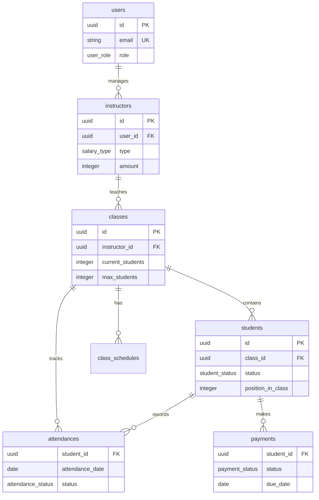

# EduCanvas 데이터베이스 설계 문서

**작성일**: 2025-08-08  
**데이터베이스**: Supabase (PostgreSQL 15+)  
**스키마 버전**: 1.0.0

---

## 📋 목차

1. [개요](#1-개요)
2. [데이터베이스 구조](#2-데이터베이스-구조)
3. [핵심 테이블 설명](#3-핵심-테이블-설명)
4. [관계도](#4-관계도)
5. [주요 기능 및 제약조건](#5-주요-기능-및-제약조건)
6. [성능 최적화](#6-성능-최적화)
7. [보안 설정](#7-보안-설정)
8. [샘플 데이터](#8-샘플-데이터)

---

## 1. 개요

### 설계 목표
- **확장성**: 멀티 학원 지원 준비
- **성능**: 대용량 데이터 처리 (10k+ 학생)
- **무결성**: 데이터 정합성 보장
- **보안**: 행 단위 보안 정책 적용
- **유지보수성**: 명확한 명명 규칙과 문서화

### 기술 스택
- **데이터베이스**: PostgreSQL 15+ (Supabase)
- **ORM**: Supabase Client (TypeScript)
- **보안**: Row Level Security (RLS)
- **실시간**: Supabase Realtime

---

## 2. 데이터베이스 구조

### 2.1 핵심 엔티티 (7개)

| 테이블 | 용도 | 관계 |
|--------|------|------|
| `users` | 시스템 사용자 인증/권한 | 1:N → instructors |
| `instructors` | 강사 정보 관리 | 1:N → classes |
| `classes` | 반(클래스) 관리 | 1:N → students |
| `students` | 학생 정보 및 등록 관리 | 1:N → attendances, payments |
| `attendances` | 출결 기록 | N:1 → students, classes |
| `payments` | 수강료 결제 관리 | N:1 → students |
| `class_schedules` | 수업 시간표 | N:1 → classes |

### 2.2 지원 구조

| 구분 | 개수 | 설명 |
|------|------|------|
| **ENUMS** | 6개 | 상태값 타입 정의 |
| **INDEXES** | 11개 | 성능 최적화 |
| **FUNCTIONS** | 3개 | 자동화 로직 |
| **TRIGGERS** | 8개 | 데이터 무결성 |
| **VIEWS** | 4개 | 자주 사용하는 조회 |
| **RLS POLICIES** | 7개 | 보안 정책 |

---

## 3. 핵심 테이블 설명

### 3.1 users (사용자)
```sql
CREATE TABLE users (
    id UUID PRIMARY KEY DEFAULT gen_random_uuid(),
    email VARCHAR(255) UNIQUE NOT NULL,
    name VARCHAR(100) NOT NULL,
    role user_role DEFAULT 'staff', -- admin, instructor, staff, viewer
    -- ...
);
```

**특징**:
- Supabase Auth와 연동
- 역할 기반 접근 제어 (RBAC)
- 소프트 삭제 (is_active)

### 3.2 students (학생)
```sql
CREATE TABLE students (
    id UUID PRIMARY KEY,
    name VARCHAR(100) NOT NULL,
    class_id UUID REFERENCES classes(id),
    status student_status DEFAULT 'active', -- active, waiting, inactive, graduated
    position_in_class INTEGER DEFAULT 0,    -- 드래그앤드롭용 정렬
    -- ...
);
```

**핵심 기능**:
- **드래그앤드롭**: `position_in_class`로 반 내 순서 관리
- **상태 관리**: 수강중/대기/휴학/졸업 상태
- **개별 설정**: 학생별 수강료, 색상 지정 가능

### 3.3 classes (클래스/반)
```sql
CREATE TABLE classes (
    id UUID PRIMARY KEY,
    name VARCHAR(100) NOT NULL,
    current_students INTEGER DEFAULT 0,  -- 자동 계산
    max_students INTEGER DEFAULT 20,
    instructor_id UUID REFERENCES instructors(id),
    color VARCHAR(7) DEFAULT '#3B82F6',  -- UI 색상
    -- ...
);
```

**자동 기능**:
- `current_students`: 트리거로 자동 업데이트
- `order_index`: UI 정렬 순서 관리

### 3.4 attendances (출결)
```sql
CREATE TABLE attendances (
    student_id UUID REFERENCES students(id),
    attendance_date DATE NOT NULL DEFAULT CURRENT_DATE,
    status attendance_status DEFAULT 'present',
    temperature DECIMAL(3,1), -- 체온 측정
    -- ...
    CONSTRAINT unique_student_date UNIQUE(student_id, attendance_date)
);
```

**특징**:
- **일별 유일성**: 학생별 하루 한 번만 기록
- **다양한 상태**: 출석/지각/결석/사유결석
- **추가 정보**: 체온, 메모 지원

### 3.5 payments (결제)
```sql
CREATE TABLE payments (
    student_id UUID REFERENCES students(id),
    amount INTEGER NOT NULL,
    due_date DATE NOT NULL,
    status payment_status DEFAULT 'pending',
    -- ...
);
```

**관리 기능**:
- **미납 관리**: 만료일 기반 미납자 자동 감지
- **다양한 결제방식**: 현금/카드/이체/간편결제
- **외부 연동**: transaction_id로 결제 시스템 연동

---

## 4. 관계도



---

## 5. 주요 기능 및 제약조건

### 5.1 데이터 무결성 제약조건

```sql
-- 반 내 위치 유일성 (드래그앤드롭)
CONSTRAINT unique_position_per_class UNIQUE(class_id, position_in_class)

-- 학생별 일별 출석 유일성
CONSTRAINT unique_student_date UNIQUE(student_id, attendance_date)

-- 금액 양수 검증
CONSTRAINT valid_amount CHECK (amount > 0)
CONSTRAINT valid_monthly_fee CHECK (monthly_fee >= 0)

-- 시간 유효성 검증
CONSTRAINT valid_time_range CHECK (end_time > start_time)
```

### 5.2 자동화 기능

#### 5.2.1 클래스 학생 수 자동 업데이트
```sql
-- 학생 상태/클래스 변경 시 자동으로 current_students 업데이트
CREATE TRIGGER update_class_count_on_student_change
    AFTER UPDATE OF class_id, status ON students
    FOR EACH ROW EXECUTE FUNCTION update_class_student_count();
```

#### 5.2.2 position_in_class 자동 할당
```sql
-- 새 학생 등록 시 반 끝에 자동 배치
CREATE TRIGGER assign_position_on_student_insert
    BEFORE INSERT ON students
    FOR EACH ROW EXECUTE FUNCTION assign_position_in_class();
```

#### 5.2.3 updated_at 자동 업데이트
```sql
-- 모든 테이블의 수정 시간 자동 갱신
CREATE TRIGGER update_students_updated_at BEFORE UPDATE ON students
    FOR EACH ROW EXECUTE FUNCTION update_updated_at_column();
```

---

## 6. 성능 최적화

### 6.1 인덱스 전략

```sql
-- 자주 조회되는 외래키
CREATE INDEX idx_students_class_id ON students(class_id);
CREATE INDEX idx_attendances_student_date ON attendances(student_id, attendance_date);

-- 필터링 조건
CREATE INDEX idx_students_status ON students(status);
CREATE INDEX idx_payments_status ON payments(status);

-- 범위 조회
CREATE INDEX idx_payments_due_date ON payments(due_date);
CREATE INDEX idx_attendances_class_date ON attendances(class_id, attendance_date);
```

### 6.2 조회 최적화 뷰

#### 6.2.1 학생 상세 정보 (JOIN 최적화)
```sql
CREATE VIEW student_details AS
SELECT 
    s.*,
    c.name AS class_name,
    i.name AS instructor_name
FROM students s
LEFT JOIN classes c ON s.class_id = c.id
LEFT JOIN instructors i ON c.instructor_id = i.id;
```

#### 6.2.2 실시간 통계 (집계 최적화)
```sql
CREATE VIEW class_stats AS
SELECT 
    c.id,
    c.name,
    c.current_students,
    c.current_students * c.monthly_fee AS monthly_revenue
FROM classes c;
```

---

## 7. 보안 설정

### 7.1 Row Level Security (RLS)

```sql
-- 모든 테이블에 RLS 활성화
ALTER TABLE students ENABLE ROW LEVEL SECURITY;

-- 인증된 사용자만 접근 허용
CREATE POLICY "Enable all for authenticated users" ON students
    FOR ALL USING (auth.role() = 'authenticated');
```

### 7.2 권한 기반 정책 (추후 확장)

```sql
-- 관리자: 모든 접근
-- 강사: 담당 클래스 학생만 조회/수정
-- 직원: 학생 조회/등록만
-- 조회자: 읽기 전용
```

---

## 8. 샘플 데이터

### 8.1 기본 설정 데이터
```sql
-- 시스템 사용자
INSERT INTO users (email, name, role) VALUES
    ('admin@educanvas.com', '관리자', 'admin'),
    ('teacher@educanvas.com', '김선생', 'instructor');

-- 강사
INSERT INTO instructors (name, specialization, salary_type) VALUES
    ('김영희 선생님', '수학', 'monthly'),
    ('이철수 선생님', '영어', 'per_class');

-- 클래스
INSERT INTO classes (name, subject, monthly_fee) VALUES
    ('중1 수학 A반', '수학', 180000),
    ('중2 영어 심화반', '영어', 200000);
```

### 8.2 학생 및 출결 데이터
```sql
-- 학생 (자동으로 position_in_class 할당됨)
INSERT INTO students (name, parent_phone, class_id) VALUES
    ('김민수', '010-1234-5678', class_id_1),
    ('이지영', '010-2345-6789', class_id_1);
```

---

## 9. 마이그레이션 및 버전 관리

### 9.1 스키마 버전 관리
```sql
CREATE TABLE schema_versions (
    version VARCHAR(10) PRIMARY KEY,
    description TEXT,
    applied_at TIMESTAMP WITH TIME ZONE DEFAULT NOW()
);

-- 현재 버전
INSERT INTO schema_versions VALUES ('1.0.0', '초기 스키마');
```

### 9.2 향후 확장 계획
- **v1.1**: 멀티 학원 지원 (academies 테이블)
- **v1.2**: 상담 관리 (consultations 테이블)
- **v1.3**: 시험 성적 관리 (exams, scores 테이블)
- **v1.4**: 알림 시스템 (notifications 테이블)

---

## 10. API 연동 가이드

### 10.1 Supabase 클라이언트 설정
```typescript
// lib/supabase.ts
import { createClient } from '@supabase/supabase-js'

const supabase = createClient(
  process.env.NEXT_PUBLIC_SUPABASE_URL!,
  process.env.NEXT_PUBLIC_SUPABASE_ANON_KEY!
)
```

### 10.2 타입 정의 생성
```bash
# 데이터베이스 타입 자동 생성
npx supabase gen types typescript --project-id your-project-ref > types/database.ts
```

### 10.3 주요 쿼리 예시
```typescript
// 학생 목록 조회 (클래스 정보 포함)
const { data: students } = await supabase
  .from('student_details')
  .select('*')
  .eq('status', 'active')
  .order('position_in_class');

// 학생 반 이동 (트랜잭션)
const { error } = await supabase.rpc('move_student', {
  student_id: 'uuid',
  target_class_id: 'uuid',
  new_position: 5
});
```

---

**이 스키마는 EduCanvas 학원 관리 시스템의 핵심 데이터 구조를 정의하며, 확장성과 성능을 고려하여 설계되었습니다.**

**다음 단계**: TypeScript 타입 정의 및 Supabase 클라이언트 설정