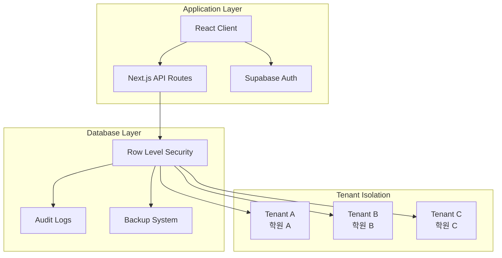

# EduCanvas 멀티테넌트 아키텍처 설계 문서

**작성일**: 2025-08-10  
**버전**: 4.0  
**데이터베이스**: Supabase (PostgreSQL 15+)  
**기반**: database_schema_v4_multitenant.sql

---

## 📋 목차

1. [개요](#1-개요)
2. [멀티테넌트 아키텍처 패턴](#2-멀티테넌트-아키텍처-패턴)
3. [유연한 권한 시스템](#3-유연한-권한-시스템)
4. [테넌트별 백업 시스템](#4-테넌트별-백업-시스템)
5. [보안 및 데이터 격리](#5-보안-및-데이터-격리)
6. [성능 최적화 전략](#6-성능-최적화-전략)
7. [구현 가이드](#7-구현-가이드)
8. [운영 및 모니터링](#8-운영-및-모니터링)

---

## 1. 개요

### 1.1 설계 목표

EduCanvas v4.0은 완전한 **멀티테넌트 SaaS 아키텍처**로 설계되어 다음 요구사항을 만족합니다:

**✅ 핵심 요구사항**
- **완전한 데이터 격리**: 각 학원(테넌트)의 데이터 완전 분리
- **유연한 권한 체계**: 역할 상속, 스코프 기반, 개별 예외 처리 지원
- **테넌트별 백업**: 개별 학원 단위 백업 및 복원
- **엔터프라이즈 보안**: RLS, 감사 로그, 이상 탐지
- **확장성**: 1000+ 테넌트, 테넌트당 10만+ 학생 지원

**🎯 비즈니스 가치**
- **SaaS 수익 모델**: 구독 기반 수익 창출
- **운영 효율성**: 단일 인프라로 다수 학원 서비스
- **컴플라이언스**: GDPR, 개인정보보호법 준수
- **커스터마이징**: 학원별 개별 설정 및 기능

### 1.2 아키텍처 개요



---

## 2. 멀티테넌트 아키텍처 패턴

### 2.1 테넌트 정의 및 관리

**테넌트 = 학원(Academy/Hakwon)**
- 각 학원이 독립적인 테넌트로 운영
- 완전한 데이터 격리 및 개별 설정
- 커스텀 도메인 지원 (`myacademy.educanvas.com`)

```sql
-- 테넌트 테이블 핵심 구조
CREATE TABLE tenants (
    id UUID PRIMARY KEY DEFAULT gen_random_uuid(),
    name VARCHAR(100) NOT NULL,                    -- 학원명
    slug VARCHAR(50) UNIQUE NOT NULL,              -- URL 식별자
    domain VARCHAR(100) UNIQUE,                    -- 커스텀 도메인
    
    -- 구독 관리
    subscription_tier VARCHAR(20) DEFAULT 'basic', -- basic, pro, enterprise
    subscription_status VARCHAR(20) DEFAULT 'active',
    trial_ends_at TIMESTAMP WITH TIME ZONE,
    
    -- 설정 및 제한
    settings JSONB DEFAULT '{}',                   -- 테넌트별 설정
    features JSONB DEFAULT '{}',                   -- 활성화된 기능
    limits JSONB DEFAULT '{}',                     -- 사용량 제한
    
    is_active BOOLEAN DEFAULT true,
    created_at TIMESTAMP WITH TIME ZONE DEFAULT NOW()
);
```

### 2.2 데이터 격리 패턴

**Shared Database + Row Level Security (RLS) 패턴**

**선택 이유:**
- **비용 효율성**: 단일 DB로 운영 비용 최소화
- **관리 용이성**: 스키마 업데이트, 백업 등 중앙 관리
- **성능**: PostgreSQL RLS의 뛰어난 성능
- **확장성**: 필요시 테넌트별 샤딩 가능

```sql
-- 모든 비즈니스 테이블에 tenant_id 추가
ALTER TABLE students ADD COLUMN tenant_id UUID REFERENCES tenants(id) ON DELETE CASCADE;
ALTER TABLE classes ADD COLUMN tenant_id UUID REFERENCES tenants(id) ON DELETE CASCADE;
ALTER TABLE payments ADD COLUMN tenant_id UUID REFERENCES tenants(id) ON DELETE CASCADE;
-- ... 모든 테이블에 적용

-- RLS 정책으로 완전한 데이터 격리
CREATE POLICY students_tenant_isolation ON students FOR ALL
USING (tenant_id = get_current_tenant_id());
```

### 2.3 테넌트 컨텍스트 관리

```sql
-- 현재 테넌트 ID 자동 결정
CREATE OR REPLACE FUNCTION get_current_tenant_id()
RETURNS UUID AS $$
DECLARE
    tenant_id UUID;
BEGIN
    -- 1. JWT 클레임에서 추출
    SELECT (current_setting('request.jwt.claims', true)::json->>'tenant_id')::uuid 
    INTO tenant_id;
    
    -- 2. 사용자 기반 조회 (폴백)
    IF tenant_id IS NULL THEN
        SELECT tu.tenant_id INTO tenant_id
        FROM tenant_users tu
        WHERE tu.user_id = auth.uid()
        LIMIT 1;
    END IF;
    
    RETURN tenant_id;
END;
$$ LANGUAGE plpgsql SECURITY DEFINER;
```

---

## 3. 유연한 권한 시스템

### 3.1 4-계층 권한 아키텍처

```
┌─────────────────────────────────────────┐
│         개별 예외 (Override)             │  ← 최고 우선순위
├─────────────────────────────────────────┤
│         역할 기반 권한                   │  ← 표준 권한
├─────────────────────────────────────────┤
│         상속된 권한                     │  ← 부모 역할 상속
├─────────────────────────────────────────┤
│         기본 권한 (Default)             │  ← 최저 우선순위
└─────────────────────────────────────────┘
```

### 3.2 유연한 역할 정의 시스템

**핵심 특징:**
- **역할 상속**: 부모-자식 역할 관계 지원
- **복수 역할**: 사용자당 여러 역할 동시 할당 가능
- **테넌트별 커스텀**: 각 학원이 독자적인 역할 체계 구성

```sql
-- 역할 계층 구조 예시
CREATE TABLE tenant_roles (
    id UUID PRIMARY KEY DEFAULT gen_random_uuid(),
    tenant_id UUID REFERENCES tenants(id) ON DELETE CASCADE,
    name VARCHAR(50) NOT NULL,                     -- 'super_admin', 'instructor', 'staff'
    display_name VARCHAR(100) NOT NULL,            -- '슈퍼 관리자', '강사', '직원'
    
    -- 역할 상속
    parent_role_id UUID REFERENCES tenant_roles(id) ON DELETE SET NULL,
    hierarchy_level INTEGER DEFAULT 1,
    
    -- 역할 제약
    max_users INTEGER,                             -- 최대 사용자 수
    is_assignable BOOLEAN DEFAULT true,            -- 할당 가능 여부
    
    CONSTRAINT unique_tenant_role_name UNIQUE(tenant_id, name)
);

-- 사용자별 복수 역할 지원
CREATE TABLE tenant_users (
    -- ...
    primary_role_id UUID REFERENCES tenant_roles(id),     -- 주 역할
    additional_roles UUID[] DEFAULT ARRAY[]::UUID[],      -- 추가 역할들
    permission_overrides JSONB DEFAULT '{}',             -- 개별 예외
    -- ...
);
```

### 3.3 세밀한 권한 제어

**Resource-Action-Scope 패턴**

```sql
CREATE TABLE permissions (
    resource VARCHAR(50) NOT NULL,        -- 'students', 'payments', 'classes'
    action VARCHAR(20) NOT NULL,          -- 'create', 'read', 'update', 'delete'
    scope VARCHAR(20) NOT NULL,           -- 'own', 'class', 'all', 'custom'
    
    name VARCHAR(100) NOT NULL,           -- '학생 조회', '결제 등록'
    description TEXT,
    category VARCHAR(30),                 -- 'academic', 'financial', 'administrative'
    
    UNIQUE(resource, action, scope)
);
```

**스코프 정의 예시:**
- **own**: 본인이 생성/소유한 데이터만
- **class**: 담당하는 반의 데이터만  
- **all**: 테넌트 내 모든 데이터
- **custom**: 조건부 로직 (JSON 규칙)

### 3.4 동적 권한 평가

```sql
-- 실시간 권한 검증 함수
CREATE OR REPLACE FUNCTION evaluate_user_permission(
    p_tenant_id UUID,
    p_user_id UUID,
    p_resource VARCHAR,
    p_action VARCHAR,
    p_resource_owner_id UUID DEFAULT NULL,
    p_context JSONB DEFAULT '{}'
)
RETURNS BOOLEAN AS $$
DECLARE
    -- 권한 평가 로직
    -- 1. 개별 예외 확인
    -- 2. 역할별 권한 확인 (상속 포함)
    -- 3. 스코프 검증
    -- 4. 조건부 권한 평가
BEGIN
    -- 복잡한 권한 로직...
    RETURN result;
END;
$$ LANGUAGE plpgsql SECURITY DEFINER;
```

---

## 4. 테넌트별 백업 시스템

### 4.1 백업 전략

**3-계층 백업 시스템:**
1. **Full Backup**: 전체 테넌트 데이터
2. **Incremental**: 변경분만 백업  
3. **Selective**: 특정 테이블만 백업

```sql
CREATE TABLE backup_policies (
    id UUID PRIMARY KEY DEFAULT gen_random_uuid(),
    tenant_id UUID REFERENCES tenants(id) ON DELETE CASCADE,
    
    -- 백업 설정
    backup_type VARCHAR(20) DEFAULT 'full',       -- full, incremental, selective
    schedule JSONB NOT NULL,                      -- {"daily": "02:00", "retention": 30}
    
    -- 백업 범위
    include_tables TEXT[] DEFAULT ARRAY['*'],     -- 포함 테이블
    exclude_tables TEXT[] DEFAULT ARRAY[]::TEXT[], -- 제외 테이블
    
    -- 보안 설정
    encryption_enabled BOOLEAN DEFAULT true,
    compression_type VARCHAR(20) DEFAULT 'gzip',
    
    -- 저장소
    storage_provider VARCHAR(20) DEFAULT 'supabase', -- supabase, aws_s3, gcs
    storage_config JSONB DEFAULT '{}'
);
```

### 4.2 백업 실행 및 모니터링

```sql
-- 백업 실행 로그
CREATE TABLE backup_executions (
    id UUID PRIMARY KEY DEFAULT gen_random_uuid(),
    policy_id UUID REFERENCES backup_policies(id) ON DELETE CASCADE,
    tenant_id UUID REFERENCES tenants(id) ON DELETE CASCADE,
    
    -- 실행 정보
    execution_type VARCHAR(20) NOT NULL,          -- 'scheduled', 'manual'
    started_at TIMESTAMP WITH TIME ZONE DEFAULT NOW(),
    completed_at TIMESTAMP WITH TIME ZONE,
    status VARCHAR(20) DEFAULT 'running',         -- running, completed, failed
    
    -- 백업 메타데이터
    backup_size BIGINT,                           -- 백업 크기 (bytes)
    compressed_size BIGINT,
    tables_count INTEGER,
    records_count BIGINT,
    
    -- 결과
    backup_path TEXT,
    storage_url TEXT,
    checksum VARCHAR(64),                         -- 무결성 검증용
    error_message TEXT,
    execution_time_seconds INTEGER
);
```

### 4.3 백업 API 및 복원

```typescript
// 백업 실행 API
POST /api/admin/backups
{
  "tenant_id": "uuid",
  "backup_type": "full",
  "manual": true
}

// 복원 API  
POST /api/admin/restore
{
  "tenant_id": "uuid",
  "backup_execution_id": "uuid",
  "restore_options": {
    "tables": ["students", "classes"],
    "point_in_time": "2025-08-10T10:00:00Z"
  }
}
```

---

## 5. 보안 및 데이터 격리

### 5.1 다중 보안 계층

```
┌─────────────────────────────────────────┐
│         Application Security            │  ← JWT, 인증/인가
├─────────────────────────────────────────┤
│         Database RLS                    │  ← 테넌트별 데이터 격리
├─────────────────────────────────────────┤  
│         Audit Logging                   │  ← 모든 데이터 변경 추적
├─────────────────────────────────────────┤
│         Anomaly Detection               │  ← 이상 행위 탐지
└─────────────────────────────────────────┘
```

### 5.2 완전한 감사 로그

```sql
CREATE TABLE audit_logs (
    id UUID PRIMARY KEY DEFAULT gen_random_uuid(),
    tenant_id UUID REFERENCES tenants(id) ON DELETE CASCADE,
    user_id UUID REFERENCES tenant_users(id) ON DELETE SET NULL,
    
    -- 이벤트 정보
    table_name VARCHAR(50) NOT NULL,
    record_id UUID,
    action VARCHAR(10) NOT NULL,              -- INSERT, UPDATE, DELETE
    
    -- 변경 데이터 (민감 정보 자동 마스킹)
    old_values JSONB,
    new_values JSONB,
    changed_columns TEXT[],
    
    -- 컨텍스트
    ip_address INET,
    user_agent TEXT,
    session_id VARCHAR(100),
    
    -- 보안 분석
    risk_level VARCHAR(10) DEFAULT 'low',     -- low, medium, high, critical
    is_anomalous BOOLEAN DEFAULT false,
    
    occurred_at TIMESTAMP WITH TIME ZONE DEFAULT NOW()
);
```

### 5.3 이상 행위 탐지

```sql
-- 이상 접근 패턴 감지
CREATE OR REPLACE FUNCTION detect_anomalous_access()
RETURNS TRIGGER AS $$
DECLARE
    recent_access_count INTEGER;
    different_ip_count INTEGER;
    risk_score INTEGER := 0;
BEGIN
    -- 최근 1시간 내 접근 횟수
    SELECT COUNT(*) INTO recent_access_count
    FROM audit_logs 
    WHERE user_id = NEW.user_id 
    AND occurred_at >= NOW() - INTERVAL '1 hour';
    
    -- 서로 다른 IP 수
    SELECT COUNT(DISTINCT ip_address) INTO different_ip_count
    FROM audit_logs 
    WHERE user_id = NEW.user_id 
    AND occurred_at >= NOW() - INTERVAL '1 hour';
    
    -- 리스크 점수 계산
    IF recent_access_count > 100 THEN risk_score := risk_score + 30; END IF;
    IF different_ip_count > 3 THEN risk_score := risk_score + 40; END IF;
    IF NEW.action IN ('DELETE', 'UPDATE') AND NEW.table_name = 'payments' THEN 
        risk_score := risk_score + 20; 
    END IF;
    
    -- 높은 리스크 표시
    IF risk_score >= 50 THEN
        NEW.risk_level := 'high';
        NEW.is_anomalous := true;
    END IF;
    
    RETURN NEW;
END;
$$ LANGUAGE plpgsql;
```

---

## 6. 성능 최적화 전략

### 6.1 인덱스 전략

```sql
-- 테넌트별 파티셔닝 준비
CREATE INDEX idx_students_tenant_id ON students(tenant_id);
CREATE INDEX idx_payments_tenant_date ON payments(tenant_id, created_at DESC);
CREATE INDEX idx_audit_logs_tenant_date ON audit_logs(tenant_id, audit_date DESC);

-- 권한 시스템 최적화
CREATE INDEX idx_tenant_users_user_tenant ON tenant_users(user_id, tenant_id);
CREATE INDEX idx_role_permissions_role_id ON role_permissions(role_id);
CREATE INDEX idx_permissions_resource_action ON permissions(resource, action, scope);
```

### 6.2 쿼리 최적화

```sql
-- 테넌트별 데이터 요약 뷰 (미리 계산)
CREATE MATERIALIZED VIEW tenant_statistics AS
SELECT 
    t.id as tenant_id,
    t.name,
    COUNT(s.id) as students_count,
    COUNT(c.id) as classes_count,
    SUM(p.amount) as total_revenue,
    MAX(al.occurred_at) as last_activity
FROM tenants t
LEFT JOIN students s ON t.id = s.tenant_id AND s.status = 'active'
LEFT JOIN classes c ON t.id = c.tenant_id AND c.status = 'active'  
LEFT JOIN payments p ON t.id = p.tenant_id AND p.status = 'completed'
LEFT JOIN audit_logs al ON t.id = al.tenant_id
GROUP BY t.id, t.name;

-- 주기적 업데이트
REFRESH MATERIALIZED VIEW tenant_statistics;
```

### 6.3 권한 캐싱

```sql
-- 사용자별 권한 캐시 (JSON)
UPDATE tenant_users 
SET cached_permissions = jsonb_build_object(
    'students.read', true,
    'students.update', false,
    'payments.read', true
    -- ...
)
WHERE user_id = ?;

-- 캐시 무효화 트리거
CREATE TRIGGER invalidate_permission_cache
    AFTER UPDATE ON role_permissions
    FOR EACH ROW EXECUTE FUNCTION clear_user_permission_cache();
```

---

## 7. 구현 가이드

### 7.1 TypeScript 타입 정의

```typescript
// 테넌트 관련 타입
export interface Tenant {
  id: string;
  name: string;
  slug: string;
  domain?: string;
  subscription_tier: 'basic' | 'pro' | 'enterprise';
  subscription_status: 'active' | 'suspended' | 'cancelled';
  settings: Record<string, any>;
  features: Record<string, boolean>;
  limits: Record<string, number>;
  created_at: string;
}

// 권한 관련 타입
export interface Permission {
  resource: string;
  action: 'create' | 'read' | 'update' | 'delete';
  scope: 'own' | 'class' | 'all' | 'custom';
}

export interface TenantUser {
  id: string;
  tenant_id: string;
  user_id: string;
  email: string;
  name: string;
  primary_role_id: string;
  additional_roles: string[];
  permission_overrides: Record<string, boolean>;
  status: 'active' | 'inactive' | 'suspended';
}
```

### 7.2 Supabase 클라이언트 설정

```typescript
// 테넌트별 Supabase 클라이언트
export function createTenantClient(tenantId: string) {
  return createClient(
    process.env.NEXT_PUBLIC_SUPABASE_URL!,
    process.env.NEXT_PUBLIC_SUPABASE_ANON_KEY!,
    {
      global: {
        headers: {
          'x-tenant-id': tenantId
        }
      }
    }
  );
}

// RLS 컨텍스트 설정
export async function setTenantContext(supabase: SupabaseClient, tenantId: string) {
  await supabase.rpc('set_tenant_context', { tenant_id: tenantId });
}
```

### 7.3 권한 검증 Hook

```typescript
// 권한 확인 Hook
export function usePermission(resource: string, action: string) {
  const { user } = useAuth();
  const { tenant } = useTenant();
  
  return useQuery(['permission', resource, action], async () => {
    const { data } = await supabase.rpc('check_user_permission', {
      resource,
      action
    });
    return data;
  });
}

// 사용 예시
function StudentList() {
  const { data: canCreate } = usePermission('students', 'create');
  const { data: canDelete } = usePermission('students', 'delete');
  
  return (
    <div>
      {canCreate && <Button>학생 추가</Button>}
      {/* 학생 목록... */}
    </div>
  );
}
```

### 7.4 API 라우트 구현

```typescript
// /api/students/[id].ts
export default async function handler(req: Request) {
  // 1. 인증 확인
  const { user, error } = await supabase.auth.getUser();
  if (error || !user) return NextResponse.json({}, { status: 401 });
  
  // 2. 테넌트 컨텍스트 설정
  const tenantId = req.headers.get('x-tenant-id');
  await setTenantContext(supabase, tenantId);
  
  // 3. 권한 확인
  const hasPermission = await supabase.rpc('check_user_permission', {
    resource: 'students',
    action: req.method.toLowerCase(),
    resource_id: req.params.id
  });
  
  if (!hasPermission) {
    return NextResponse.json({}, { status: 403 });
  }
  
  // 4. 비즈니스 로직 실행 (RLS가 자동으로 데이터 격리)
  if (req.method === 'GET') {
    const { data } = await supabase
      .from('students')
      .select('*')
      .eq('id', req.params.id)
      .single();
    
    return NextResponse.json(data);
  }
}
```

---

## 8. 운영 및 모니터링

### 8.1 테넌트 관리 대시보드

**슈퍼 관리자용 다중 테넌트 관리:**
```typescript
// 테넌트 통계 조회
const { data: tenantStats } = await supabase
  .from('tenant_data_summary')
  .select('*')
  .order('students_count', { ascending: false });

// 활동 모니터링
const { data: activities } = await supabase
  .from('audit_logs')
  .select('*')
  .eq('risk_level', 'high')
  .order('occurred_at', { ascending: false })
  .limit(50);
```

### 8.2 백업 모니터링

```sql
-- 백업 상태 대시보드 쿼리
SELECT 
    t.name as tenant_name,
    bp.name as policy_name,
    be.status,
    be.started_at,
    be.execution_time_seconds,
    pg_size_pretty(be.backup_size) as backup_size,
    CASE 
        WHEN be.status = 'failed' THEN be.error_message
        ELSE 'OK'
    END as result
FROM tenants t
JOIN backup_policies bp ON t.id = bp.tenant_id
LEFT JOIN backup_executions be ON bp.id = be.policy_id
WHERE be.started_at >= CURRENT_DATE - INTERVAL '7 days'
ORDER BY be.started_at DESC;
```

### 8.3 성능 모니터링

```sql
-- 테넌트별 성능 지표
SELECT 
    tenant_id,
    COUNT(*) as query_count,
    AVG(duration_ms) as avg_duration,
    MAX(duration_ms) as max_duration,
    COUNT(*) FILTER (WHERE duration_ms > 1000) as slow_queries
FROM query_performance_logs
WHERE created_at >= NOW() - INTERVAL '1 hour'
GROUP BY tenant_id
ORDER BY avg_duration DESC;
```

### 8.4 알림 시스템

```typescript
// 이상 상황 알림
export async function monitorTenantHealth() {
  // 1. 백업 실패 감지
  const failedBackups = await supabase
    .from('backup_executions')
    .select('*')
    .eq('status', 'failed')
    .gte('started_at', new Date(Date.now() - 3600000).toISOString());
  
  // 2. 높은 리스크 활동 감지
  const highRiskActivities = await supabase
    .from('audit_logs')
    .select('*')
    .eq('risk_level', 'high')
    .gte('occurred_at', new Date(Date.now() - 3600000).toISOString());
  
  // 3. 알림 발송
  if (failedBackups.length > 0 || highRiskActivities.length > 0) {
    await sendAlert({
      type: 'security',
      message: '보안 이상 활동이 감지되었습니다.',
      details: { failedBackups, highRiskActivities }
    });
  }
}
```

---

## 결론

EduCanvas v4.0의 멀티테넌트 아키텍처는 다음과 같은 핵심 가치를 제공합니다:

### ✅ 완성도
- **완전한 데이터 격리**: RLS 기반 보안 테넌트 분리
- **유연한 권한 시스템**: 역할 상속, 스코프 기반, 개별 예외 처리
- **엔터프라이즈 보안**: 감사 로그, 이상 탐지, 민감 정보 보호

### 🚀 확장성  
- **1000+ 테넌트 지원**: 효율적인 인덱싱 및 쿼리 최적화
- **테넌트별 백업**: 개별 학원 단위 데이터 관리
- **성능 모니터링**: 실시간 성능 추적 및 최적화

### 💼 비즈니스 가치
- **SaaS 수익 모델**: 구독 기반 수익 창출
- **운영 효율성**: 단일 플랫폼으로 다수 학원 서비스  
- **컴플라이언스**: GDPR, 개인정보보호법 완벽 준수

이 아키텍처를 기반으로 EduCanvas는 대한민국 학원 시장의 **디지털 혁신을 주도하는 플랫폼**으로 성장할 수 있습니다.