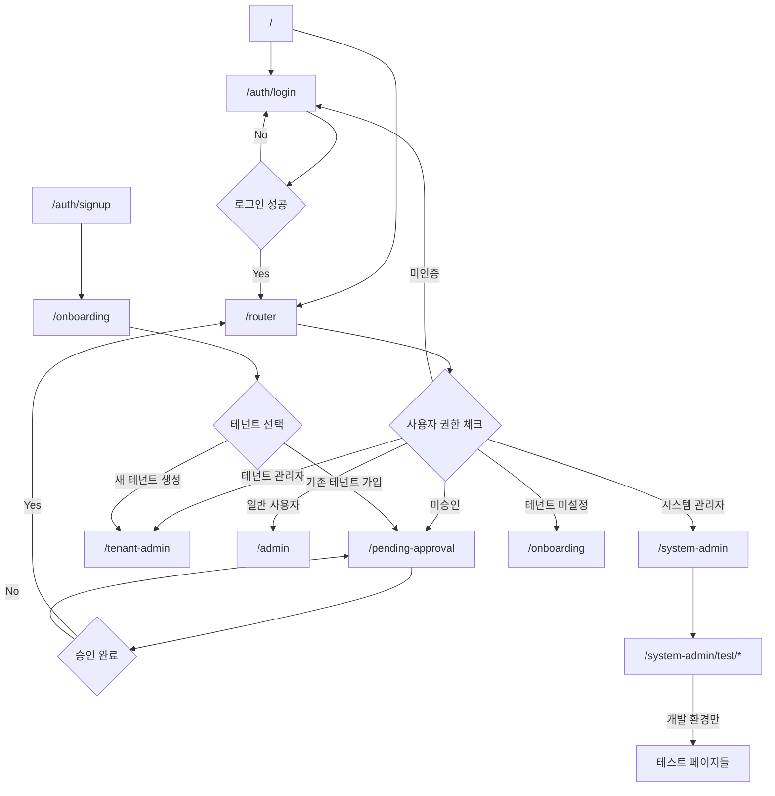

# EduCanvas 페이지 구조 및 라우팅 정리 (Updated)

## 🔄 주요 변경사항
- **라우터 페이지 신설**: `/router` - 사용자 권한에 따른 자동 리다이렉트
- **메인 대시보드 개선**: `/admin` - 실제 대시보드 UI로 변경
- **테스트 페이지 통합**: `/system-admin/test/*` - 모든 테스트 페이지 통합

## 📋 페이지 카테고리별 분류

### 1. 라우팅 시스템

| 경로 | 용도 | 리다이렉트 대상 |
|------|------|------------|
| `/router` | **중앙 라우터 페이지** | → `/system-admin` (시스템 관리자) → `/tenant-admin` (테넌트 관리자) → `/admin` (일반 사용자) → `/pending-approval` (미승인) → `/onboarding` (테넌트 미설정) → `/auth/login` (미인증) |

### 2. 인증 관련 페이지

| 경로 | 용도 | 리다이렉트 |
|------|------|------------|
| `/auth/login` | 로그인 페이지 | → `/router` (로그인 성공 시) |
| `/auth/signup` | 회원가입 페이지 | → `/onboarding` (가입 성공 시) |
| `/auth/reset-password` | 비밀번호 재설정 요청 | → `/auth/login` (메일 전송 후) |
| `/auth/update-password` | 비밀번호 재설정 진행 | → `/auth/login` (재설정 완료 시) |
| `/auth/callback` | OAuth/이메일 인증 콜백 | → 상황별 다른 페이지로 리다이렉트 |

### 3. 온보딩 및 승인 대기

| 경로 | 용도 | 리다이렉트 |
|------|------|------------|
| `/onboarding` | 신규 사용자 테넌트 선택/생성 | → `/pending-approval` (일반 멤버) → `/router` (승인된 사용자) |
| `/pending-approval` | 테넌트 승인 대기 화면 | → `/router` (승인 완료 시) → `/auth/login` (로그아웃 시) |

### 4. 관리자 페이지

| 경로 | 용도 | 특징 |
|------|------|------------|
| `/admin` | **메인 관리자 대시보드** | 실제 대시보드 UI (학생/클래스/강사 관리 메뉴) |
| `/system-admin` | 시스템 관리자 전용 페이지 | 테넌트 관리 + 개발 도구 메뉴 |
| `/tenant-admin` | 테넌트 관리자 전용 페이지 | 멤버 관리 + 승인 대기 관리 |

### 4. 학생 관리 페이지

| 경로 | 용도 | 리다이렉트 |
|------|------|------------|
| `/admin/students` | 학생 목록 (가상화 리스트) | → `/admin/students/[id]` (학생 선택 시) |
| `/admin/students/new` | 신규 학생 등록 | → `/admin/students/[id]` (등록 완료 시) |
| `/admin/students/[id]` | 학생 상세 정보 | → `/admin/students/[id]/edit` (수정 버튼) → `/admin/students` (삭제 완료 시) |
| `/admin/students/[id]/edit` | 학생 정보 수정 | → `/admin/students/[id]` (수정 완료 시) |
| `/admin/students/dashboard` | 학생 관리 대시보드 | - |
| `/admin/students/smart` | 스마트 검색 페이지 | - |

### 5. 테스트 및 개발 페이지 (통합됨)

| 경로 | 용도 | 접근 권한 |
|------|------|------------|
| `/system-admin/test/api-test` | API 테스트 대시보드 | 시스템 관리자 + Dev |
| `/system-admin/test/auth` | 인증 기능 테스트 | 시스템 관리자 + Dev |
| `/system-admin/test/auth-state` | 인증 상태 테스트 | 시스템 관리자 + Dev |
| `/system-admin/test/auth-utils` | 인증 유틸리티 테스트 | 시스템 관리자 + Dev |
| `/system-admin/test/db` | 데이터베이스 연결 테스트 | 시스템 관리자 + Dev |
| `/system-admin/test/supabase-tokens` | Supabase 토큰 테스트 | 시스템 관리자 + Dev |
| `/system-admin/test/debug-data` | 데이터 디버깅 페이지 | 시스템 관리자 + Dev |
| `/system-admin/test/design-system` | 디자인 시스템 테스트 | 시스템 관리자 + Dev |
| `/system-admin/test/sentry` | Sentry 통합 테스트 | 시스템 관리자 + Dev |
| `/system-admin/test/sentry-example` | Sentry 예제 페이지 | 시스템 관리자 + Dev |

### 6. 오류 페이지

| 경로 | 용도 | 리다이렉트 |
|------|------|------------|
| `/unauthorized` | 권한 없음 오류 페이지 | → `/auth/login` (로그인 버튼) |

## 🔄 리다이렉트 플로우 다이어그램 (Updated)

## 🗂️ API Routes 구조

### 인증 API
- `/api/auth/login` - 로그인
- `/api/auth/signup` - 회원가입
- `/api/auth/me` - 현재 사용자 정보
- `/api/auth/check-email` - 이메일 중복 확인
- `/api/auth/reset-password` - 비밀번호 재설정
- `/api/auth/search-tenants` - 테넌트 검색
- `/api/auth/onboarding` - 온보딩 처리

### 관리자 API
- `/api/system-admin/*` - 시스템 관리자 전용 API
- `/api/tenant-admin/*` - 테넌트 관리자 전용 API
- `/api/admin/*` - 일반 관리자 API

### 리소스 API (CRUD)
- `/api/students/*` - 학생 관리
- `/api/classes/*` - 클래스 관리
- `/api/classrooms/*` - 교실 관리
- `/api/instructors/*` - 강사 관리
- `/api/enrollments/*` - 수강 등록 관리
- `/api/course-packages/*` - 수강 패키지 관리
- `/api/salary-policies/*` - 급여 정책 관리
- `/api/class-schedules/*` - 수업 일정 관리

## 📝 페이지 정리 완료 사항

### ✅ 완료된 변경사항
1. **라우터 페이지 신설**: `/router` - 중앙 라우팅 허브 생성
2. **관리자 대시보드 개선**: `/admin` - 실제 대시보드 UI 구현
3. **테스트 페이지 통합**: 모든 테스트 페이지를 `/system-admin/test/*`로 이동
4. **접근 권한 강화**: 테스트 페이지는 시스템 관리자 + 개발 환경에서만 접근 가능

### 향후 개선 사항
- `/admin/students/dashboard`와 `/admin/students/smart`를 `/admin/students`에 통합 고려
- 오류 페이지들을 `/error/*` 경로로 그룹화 고려

## 🔒 보안 고려사항

1. **인증 체크**: 모든 `/admin/*` 경로는 인증 필수
2. **권한 체크**: 역할별 접근 제한 (system-admin, tenant-admin, admin, instructor, viewer)
3. **테넌트 격리**: 테넌트별 데이터 격리 보장
4. **개발/운영 분리**: 테스트 페이지는 개발 환경에서만 접근 가능

## 📅 마이그레이션 계획

1. **Phase 1**: 테스트 페이지 환경별 접근 제한
2. **Phase 2**: 중복 페이지 통합
3. **Phase 3**: 경로 재구성 및 리다이렉트 규칙 정리
4. **Phase 4**: 불필요한 페이지 제거