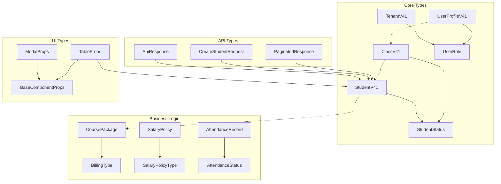

# EduCanvas TypeScript 타입 사전

**버전**: v4.1  
**최종 업데이트**: 2025-08-12  
**관리자**: Claude Code  

## 📋 개요

EduCanvas는 교육기관용 학생 관리 시스템으로, **Schema v4.1**을 기반으로 하는 포괄적인 TypeScript 타입 시스템을 보유합니다. 이 문서는 프로젝트에서 사용하는 모든 타입의 완전한 참조 사전입니다.

## 🗂️ 목차

- [1. 핵심 타입 파일 구조](#1-핵심-타입-파일-구조)
- [2. 데이터베이스 타입](#2-데이터베이스-타입)
- [3. API 타입](#3-api-타입)
- [4. UI 컴포넌트 타입](#4-ui-컴포넌트-타입)
- [5. 인증 및 권한 타입](#5-인증-및-권한-타입)
- [6. 비즈니스 로직 타입](#6-비즈니스-로직-타입)
- [7. 유틸리티 타입](#7-유틸리티-타입)
- [8. 타입 사용 가이드](#8-타입-사용-가이드)
- [9. 타입 관계도](#9-타입-관계도)
- [10. 개발 권장사항](#10-개발-권장사항)

## 1. 핵심 타입 파일 구조

### 📁 src/types/ 디렉토리 구조

```
src/types/
├── index.ts                 # 통합 export 및 공통 유틸리티 타입
├── database-v4.1.ts        # 최신 DB 스키마 타입 (v4.1)
├── database.types.ts       # Supabase 자동생성 타입
├── app.types.ts            # 애플리케이션 레벨 타입
├── api.ts                  # API 요청/응답 타입
├── auth.ts                 # 인증/권한 관련 타입
├── billing.ts              # 결제 시스템 타입
├── salary.ts               # 급여 정책 타입
├── students.ts             # 학생 관리 특화 타입
├── classes.ts              # 클래스 관리 특화 타입
└── supabase.ts             # Supabase 연동 타입
```

### 📊 타입 파일별 통계

| 파일명 | 타입 수 | 주요 용도 | 우선순위 |
|--------|---------|-----------|----------|
| `index.ts` | 100+ | 통합 관리, 공통 타입 | ⭐⭐⭐⭐⭐ |
| `database-v4.1.ts` | 80+ | 최신 DB 스키마 | ⭐⭐⭐⭐⭐ |
| `app.types.ts` | 150+ | 앱 레벨 타입 | ⭐⭐⭐⭐ |
| `api.ts` | 120+ | API 타입 | ⭐⭐⭐⭐ |
| `auth.ts` | 30+ | 인증 타입 | ⭐⭐⭐⭐ |
| `billing.ts` | 100+ | 결제 타입 | ⭐⭐⭐ |
| `salary.ts` | 90+ | 급여 타입 | ⭐⭐⭐ |

## 2. 데이터베이스 타입

### 2.1 핵심 엔티티 타입 (v4.1 Schema)

#### 🎓 StudentV41
```typescript
interface StudentV41 {
  id: string                    // UUID, 기본키
  tenant_id?: string           // 테넌트 ID (멀티테넌트 지원)
  name: string                 // 학생 이름 (필수)
  student_number: string       // 학번 (필수, NOT NULL)
  email?: string              // 학생 이메일 (v4.1 추가)
  phone?: string              // 학생 연락처
  parent_name?: string        // 학부모 이름
  parent_phone_1?: string     // 주 학부모 연락처 (v4.1 추가)
  parent_phone_2?: string     // 보조 학부모 연락처 (v4.1 추가)
  address?: string            // 주소
  grade?: string              // 학년
  status: StudentStatus       // 상태 (active/inactive/graduated/withdrawn/suspended)
  enrollment_date?: string    // 입학일
  graduation_date?: string    // 졸업일
  memo?: string               // 메모
  display_color?: string      // 표시 색상
  created_at?: string         // 생성일
  updated_at?: string         // 수정일
}
```

**사용처**: 학생 관리, ClassFlow, 출결 관리  
**관련 타입**: `StudentStatus`, `StudentInsert`, `StudentUpdate`

#### 🏫 ClassV41
```typescript
interface ClassV41 {
  id: string                    // UUID, 기본키
  tenant_id?: string           // 테넌트 ID
  name: string                 // 클래스 이름 (필수)
  description?: string         // 클래스 설명
  grade?: string              // 학년 (v4.1 추가)
  course?: string             // 과정 (v4.1 추가)
  subject?: string            // 과목
  instructor_id?: string      // 강사 ID (user_profiles.id 참조!)
  max_students: number        // 최대 학생 수
  current_students: number    // 현재 학생 수
  classroom?: string          // 교실
  color?: string              // 클래스 색상
  status: StudentStatus       // 상태
  start_date?: string         // 시작일
  end_date?: string           // 종료일
  memo?: string               // 메모
  order_index?: number        // 정렬 순서
  created_at?: string         // 생성일
  updated_at?: string         // 수정일
}
```

**중요**: `instructor_id`는 `instructors.id`가 아닌 `user_profiles.id`를 직접 참조합니다!  
**사용처**: 클래스 관리, ClassFlow, 스케줄 관리

#### 🏢 TenantV41
```typescript
interface TenantV41 {
  id: string                    // UUID, 기본키
  name: string                 // 학원명 (필수)
  slug: string                 // URL 슬러그 (고유)
  description?: string         // 설명
  logo_url?: string            // 로고 URL
  address?: string             // 주소
  phone?: string               // 연락처
  email?: string               // 이메일
  website?: string             // 웹사이트
  settings?: Record<string, unknown> // 설정 (JSON)
  is_active: boolean           // 활성 상태
  created_at?: string          // 생성일
  updated_at?: string          // 수정일
}
```

**사용처**: 멀티테넌트 관리, 권한 제어

### 2.2 Enum 타입들

```typescript
// 학생 상태
export type StudentStatus = 
  | 'active'      // 재학
  | 'inactive'    // 휴학
  | 'graduated'   // 졸업
  | 'withdrawn'   // 자퇴
  | 'suspended'   // 정학

// 사용자 역할
export type UserRole = 
  | 'admin'       // 관리자
  | 'instructor'  // 강사
  | 'staff'       // 직원
  | 'viewer'      // 조회자

// 출결 상태
export type AttendanceStatus = 
  | 'present'     // 출석
  | 'late'        // 지각
  | 'absent'      // 결석
  | 'excused'     // 공결

// 결제 상태
export type PaymentStatus = 
  | 'pending'     // 대기
  | 'completed'   // 완료
  | 'overdue'     // 연체
  | 'cancelled'   // 취소
  | 'refunded'    // 환불

// 결제 방법
export type PaymentMethod = 
  | 'cash'        // 현금
  | 'card'        // 카드
  | 'transfer'    // 계좌이체
  | 'mobile'      // 모바일결제

// 수강권 종류 (5가지)
export type BillingType = 
  | 'monthly'     // 월정액
  | 'sessions'    // 횟수권
  | 'hours'       // 시간권
  | 'package'     // 패키지
  | 'drop_in'     // 단발 수업

// 할인 종류
export type DiscountType = 
  | 'sibling'     // 형제할인
  | 'early_payment' // 조기결제할인
  | 'loyalty'     // 충성고객할인
  | 'scholarship' // 장학금
  | 'promotion'   // 프로모션
  | 'volume'      // 대량할인

// 급여 정책 (7가지)
export type SalaryPolicyType = 
  | 'fixed_monthly'     // 월급제
  | 'fixed_hourly'      // 시급제
  | 'commission'        // 수수료제
  | 'tiered_commission' // 단계별 수수료제
  | 'student_based'     // 학생수 기준제
  | 'hybrid'            // 혼합제
  | 'guaranteed_minimum' // 최저보장제
```

### 2.3 관계형 타입들

#### 👤 UserProfileV41
```typescript
interface UserProfileV41 {
  id: string                    // auth.users.id와 동일 (FK)
  tenant_id?: string           // 소속 테넌트
  email: string                // 이메일 (고유)
  full_name: string           // 전체 이름
  role: UserRole              // 역할
  phone?: string              // 연락처
  avatar_url?: string         // 프로필 이미지
  settings?: Record<string, unknown> // 개인 설정
  is_active: boolean          // 활성 상태
  last_login?: string         // 마지막 로그인
  created_at?: string         // 가입일
  updated_at?: string         // 수정일
}
```

**EduCanvas의 User-First Architecture**: 모든 사용자는 먼저 `user_profiles`에 등록되고, 추가 정보는 `instructors` 등 전문 테이블에 저장됩니다.

## 3. API 타입

### 3.1 표준 API 응답 구조

#### 🔄 ApiResponse
```typescript
interface ApiResponse<T = unknown> {
  success: boolean             // 성공 여부
  data?: T                    // 응답 데이터 (제네릭)
  error?: string              // 에러 메시지
  message?: string            // 상태 메시지
  timestamp?: string          // 응답 시간
  requestId?: string          // 요청 추적 ID
}
```

**사용 예시**:
```typescript
// 학생 조회 API 응답
type GetStudentResponse = ApiResponse<StudentV41>

// 학생 목록 API 응답
type GetStudentsResponse = ApiResponse<StudentV41[]>
```

#### 📄 PaginatedResponse
```typescript
interface PaginatedResponse<T = Record<string, unknown>> {
  data: T[]                   // 페이지 데이터
  total: number               // 전체 개수
  page: number                // 현재 페이지
  limit: number               // 페이지 크기
  hasNext: boolean            // 다음 페이지 존재 여부
  hasPrev: boolean            // 이전 페이지 존재 여부
  totalPages: number          // 전체 페이지 수
}
```

### 3.2 학생 관리 API 타입

#### 📝 CreateStudentRequest
```typescript
interface CreateStudentRequest {
  name: string                 // 학생 이름 (필수)
  student_number?: string     // 학번 (자동 생성 가능)
  phone?: string              // 학생 연락처
  email?: string              // 학생 이메일 (v4.1)
  parent_name?: string        // 학부모 이름
  parent_phone_1?: string     // 주 학부모 연락처 (v4.1)
  parent_phone_2?: string     // 보조 학부모 연락처 (v4.1)
  address?: string            // 주소
  grade?: string              // 학년
  class_id?: string           // 배정할 클래스 ID
  enrollment_date?: string    // 입학일
  memo?: string               // 메모
}
```

#### ✏️ UpdateStudentRequest
```typescript
interface UpdateStudentRequest extends Partial<CreateStudentRequest> {
  status?: StudentStatus       // 상태 변경
  graduation_date?: string     // 졸업일
  display_color?: string       // 표시 색상
  position_in_class?: number   // 클래스 내 위치 (ClassFlow용)
}
```

#### 🏃 MoveStudentRequest
```typescript
interface MoveStudentRequest {
  student_id: string           // 이동할 학생 ID
  target_class_id: string      // 목표 클래스 ID
  new_position: number         // 새 위치
  reason?: string              // 이동 사유
}
```

### 3.3 클래스 관리 API 타입

#### 🏫 CreateClassRequest
```typescript
interface CreateClassRequest {
  name: string                 // 클래스 이름 (필수)
  description?: string         // 설명
  grade?: string              // 학년 (v4.1)
  course?: string             // 과정 (v4.1)
  subject?: string            // 과목
  max_students: number        // 최대 학생 수
  instructor_id?: string      // 강사 ID (user_profiles.id 참조)
  classroom?: string          // 교실
  color?: string              // 클래스 색상
  start_date?: string         // 시작일
  end_date?: string           // 종료일
  memo?: string               // 메모
}
```

### 3.4 인증 API 타입

#### 🔐 LoginRequest
```typescript
interface LoginRequest {
  email: string                // 이메일
  password: string             // 비밀번호
  remember_me?: boolean        // 로그인 유지
}
```

#### 🎫 LoginResponse
```typescript
interface LoginResponse extends ApiResponse<{
  user: User                   // 사용자 정보
  access_token: string         // 액세스 토큰
  refresh_token: string        // 리프레시 토큰
  expires_in: number           // 만료 시간 (초)
}> {}
```

## 4. UI 컴포넌트 타입

### 4.1 기본 컴포넌트 타입

#### 🧩 BaseComponentProps
```typescript
interface BaseComponentProps {
  className?: string           // 추가 CSS 클래스
  children?: ReactNode         // 자식 컴포넌트
  'data-testid'?: string      // 테스트 식별자
}
```

#### ⚡ InteractiveProps
```typescript
interface InteractiveProps {
  disabled?: boolean           // 비활성화 상태
  loading?: boolean            // 로딩 상태
  onClick?: () => void         // 클릭 핸들러
}
```

#### ♿ AccessibilityProps
```typescript
interface AccessibilityProps {
  'aria-label'?: string       // 스크린 리더용 레이블
  'aria-describedby'?: string // 설명 요소 ID
  'aria-expanded'?: boolean   // 확장 상태
  role?: string               // ARIA 역할
  tabIndex?: number           // 탭 인덱스
}
```

### 4.2 테이블 컴포넌트 타입

#### 📊 TableColumn
```typescript
interface TableColumn<T = Record<string, unknown>> {
  key: keyof T | string        // 컬럼 식별자
  header: string               // 헤더 텍스트
  width?: number               // 컬럼 너비
  sortable?: boolean           // 정렬 가능 여부
  render?: (value: T[keyof T], row: T, index: number) => ReactNode // 렌더 함수
  cellClassName?: (value: T[keyof T], row: T) => string // 셀 CSS 클래스
  headerClassName?: string     // 헤더 CSS 클래스
  align?: ComponentAlignment   // 정렬 방향
}
```

#### 📋 TableProps
```typescript
interface TableProps<T = Record<string, unknown>> extends BaseComponentProps {
  data: T[]                    // 테이블 데이터
  columns: TableColumn<T>[]    // 컬럼 정의
  loading?: boolean            // 로딩 상태
  emptyMessage?: string        // 빈 상태 메시지
  virtualized?: boolean        // 가상화 사용 여부
  height?: number              // 테이블 높이 (가상화용)
  rowHeight?: number           // 행 높이 (가상화용)
  selectable?: boolean         // 행 선택 가능 여부
  selectedRows?: Set<number>   // 선택된 행 인덱스
  onSelectionChange?: (selectedRows: Set<number>) => void // 선택 변경 핸들러
  onRowClick?: (row: T, index: number) => void // 행 클릭 핸들러
}
```

### 4.3 모달 컴포넌트 타입

#### 🪟 ModalProps
```typescript
interface ModalProps extends BaseComponentProps {
  isOpen: boolean              // 모달 열림 상태
  onClose: () => void          // 닫기 핸들러
  title?: string               // 모달 제목
  size?: ComponentSize | 'full' // 모달 크기
  closeOnOverlayClick?: boolean // 배경 클릭으로 닫기
  closeOnEscape?: boolean      // ESC로 닫기
  showCloseButton?: boolean    // 닫기 버튼 표시
  header?: ReactNode           // 커스텀 헤더
  footer?: ReactNode           // 커스텀 푸터
}
```

### 4.4 ClassFlow 전용 타입

#### 🎯 ClassFlowContainerProps
```typescript
interface ClassFlowContainerProps extends BaseComponentProps {
  classData: ClassData         // 클래스 정보
  students: StudentData[]      // 클래스 학생들
  isDropTarget?: boolean       // 드롭 타겟 여부
  isOver?: boolean             // 드래그오버 상태
  variant?: 'grid' | 'list' | 'compact' // 레이아웃 변형
  onStudentClick?: (student: StudentData) => void // 학생 클릭 핸들러
  onContainerClick?: (classData: ClassData) => void // 컨테이너 클릭 핸들러
}
```

#### 🎓 StudentData
```typescript
interface StudentData {
  id: string                   // 학생 ID
  name: string                 // 학생 이름
  email?: string               // 이메일
  phone?: string               // 연락처
  status: StatusType           // 상태
  avatar?: string              // 프로필 이미지
  grade?: string               // 학년
  enrollmentDate?: string      // 입학일
  classId?: string             // 소속 클래스 ID
}
```

## 5. 인증 및 권한 타입

### 5.1 인증 상태 관리

#### 🔐 AuthState
```typescript
interface AuthState {
  user: User | null            // 현재 사용자
  profile: UserProfile | null  // 사용자 프로필
  session: Session | null      // 세션 정보
  loading: boolean             // 로딩 상태
  initialized: boolean         // 초기화 완료 여부
  
  // 보안 중심 메서드들
  clearSensitiveData: () => void     // 민감 데이터 정리
  isSessionValid: () => boolean      // 세션 유효성 검사
  refreshSession: () => Promise<void> // 세션 갱신
}
```

#### 🎭 RolePermissions
```typescript
interface RolePermissions {
  students: PermissionAction[]    // 학생 관리 권한
  classes: PermissionAction[]     // 클래스 관리 권한  
  payments: PermissionAction[]    // 결제 관리 권한
  reports: PermissionAction[]     // 보고서 권한
  settings: PermissionAction[]    // 설정 권한
  videos: PermissionAction[]      // 비디오 권한
  analytics: PermissionAction[]   // 분석 권한
}

type PermissionAction = 'read' | 'write' | 'delete' | 'admin'
```

### 5.2 보안 컨텍스트

#### 🛡️ SecurityContext
```typescript
interface SecurityContext {
  userId: string               // 사용자 ID
  tenantId: string            // 테넌트 ID
  roleId: string              // 역할 ID
  permissions: RolePermissions // 권한 정보
  sessionId: string           // 세션 ID
  ipAddress: string           // IP 주소
  userAgent: string           // 사용자 에이전트
  lastActivity: string        // 마지막 활동 시간
  mfaVerified: boolean        // MFA 인증 여부
}
```

## 6. 비즈니스 로직 타입

### 6.1 결제 시스템 타입

#### 💰 CoursePackage
```typescript
interface CoursePackage {
  id: string                   // 패키지 ID
  tenant_id: string           // 테넌트 ID
  class_id: string            // 클래스 ID
  name: string                // 패키지 이름
  description?: string        // 설명
  billing_type: BillingType   // 수강권 종류 (5가지)
  base_price: number          // 기본 가격
  sessions_count?: number     // 수업 횟수 (횟수권)
  hours_count?: number        // 수업 시간 (시간권)
  validity_days?: number      // 유효 기간 (일)
  transfer_limit?: number     // 이체 가능 횟수
  is_transferable: boolean    // 이체 가능 여부
  auto_renewal: boolean       // 자동 갱신 여부
  discount_policies: string[] // 적용 가능한 할인 정책 ID
  is_active: boolean          // 활성 상태
  created_at?: string         // 생성일
  updated_at?: string         // 수정일
}
```

#### 🧮 BillingCalculationResult
```typescript
interface BillingCalculationResult {
  original_price: number           // 원가
  discounts_applied: DiscountApplication[] // 적용된 할인들
  total_discount_amount: number    // 총 할인 금액
  final_price: number              // 최종 가격
  calculation_details: BillingCalculationDetails // 계산 세부사항
  payment_schedule?: PaymentSchedule[] // 분납 일정
  tax_details?: TaxCalculation     // 세금 계산
}

interface DiscountApplication {
  discount_id: string          // 할인 정책 ID
  discount_name: string        // 할인명
  discount_type: DiscountType  // 할인 종류
  discount_rate?: number       // 할인율 (%)
  discount_amount?: number     // 할인 금액
  applied_amount: number       // 적용된 할인 금액
  conditions_met: string[]     // 만족한 조건들
}
```

### 6.2 급여 시스템 타입

#### 💼 SalaryPolicy
```typescript
interface SalaryPolicy {
  id: string                   // 정책 ID
  tenant_id: string           // 테넌트 ID
  name: string                // 정책명
  description?: string        // 설명
  policy_type: SalaryPolicyType // 급여 정책 종류 (7가지)
  
  // 기본 급여 설정
  base_amount: number         // 기본 금액
  currency: string            // 통화 (KRW)
  
  // 수수료 설정 (commission, tiered_commission)
  commission_rate?: number    // 수수료율 (%)
  tier_brackets?: CommissionTier[] // 단계별 수수료
  
  // 학생수 기준 설정 (student_based)
  student_rate?: number       // 학생당 금액
  min_students?: number       // 최소 학생 수
  max_students?: number       // 최대 학생 수
  
  // 하이브리드 설정 (hybrid)
  fixed_component?: number    // 고정 급여 부분
  variable_component?: number // 변동 급여 부분
  
  // 최저 보장 설정 (guaranteed_minimum)
  guaranteed_minimum?: number // 최저 보장 금액
  
  // 적용 조건
  applicable_roles: UserRole[] // 적용 대상 역할
  effective_date: string      // 시행일
  expiry_date?: string        // 만료일
  is_active: boolean          // 활성 상태
  
  created_at?: string         // 생성일
  updated_at?: string         // 수정일
}

interface CommissionTier {
  min_amount: number          // 최소 금액
  max_amount?: number         // 최대 금액
  commission_rate: number     // 해당 구간 수수료율
}
```

#### 💵 SalaryCalculationResult
```typescript
interface SalaryCalculationResult {
  instructor_id: string            // 강사 ID
  calculation_period: {            // 계산 기간
    from: string
    to: string
  }
  
  // 급여 구성 요소들
  base_salary: number              // 기본 급여
  commission_breakdown: CommissionBreakdown[] // 수수료 내역
  bonus_breakdown: BonusBreakdown[] // 보너스 내역
  deductions: DeductionBreakdown[] // 공제 내역
  
  // 최종 계산 결과
  gross_salary: number             // 총 급여
  total_deductions: number         // 총 공제액
  net_salary: number               // 실수령액
  
  // 세부 정보
  calculation_details: SalaryCalculationDetails // 계산 세부사항
  payment_method?: string          // 지급 방법
  payment_date?: string            // 지급 예정일
  
  created_at?: string              // 계산일
}
```

### 6.3 출결 시스템 타입

#### 📅 AttendanceRecord
```typescript
interface AttendanceRecord {
  id: string                   // 출결 ID
  tenant_id: string           // 테넌트 ID
  student_id: string          // 학생 ID
  class_id: string            // 클래스 ID
  attendance_date: string     // 출결 날짜
  status: AttendanceStatus    // 출결 상태
  check_in_time?: string      // 입실 시간
  check_out_time?: string     // 퇴실 시간
  temperature?: number        // 체온 (코로나 대응)
  late_minutes?: number       // 지각 시간 (분)
  memo?: string               // 메모
  recorded_by: string         // 기록자 ID
  created_at?: string         // 기록 시간
  updated_at?: string         // 수정 시간
}
```

#### 📊 AttendanceStats
```typescript
interface AttendanceStats {
  student_id?: string         // 학생 ID (개별 통계)
  class_id?: string           // 클래스 ID (클래스 통계)
  period: {                   // 통계 기간
    from: string
    to: string
  }
  
  // 기본 통계
  total_days: number          // 총 수업일
  present_count: number       // 출석 횟수
  late_count: number          // 지각 횟수
  absent_count: number        // 결석 횟수
  excused_count: number       // 공결 횟수
  attendance_rate: number     // 출석률 (%)
  
  // 추세 데이터
  trends: Array<{             // 일별 출석률 추세
    date: string
    rate: number
  }>
  
  // 경고 지표
  consecutive_absences?: number // 연속 결석 일수
  low_attendance_alert?: boolean // 저조한 출석률 경고
}
```

## 7. 유틸리티 타입

### 7.1 공통 유틸리티 타입

```typescript
// 날짜 관련 타입
export type DateString = string      // YYYY-MM-DD 형식
export type DateTimeString = string  // ISO 8601 형식
export type TimeString = string      // HH:MM 형식

// 색상 관련 타입
export type HexColor = string        // #RRGGBB 형식
export type StatusColor = 'success' | 'warning' | 'error' | 'info'

// 컴포넌트 크기 타입
export type ComponentSize = 'xs' | 'sm' | 'md' | 'lg' | 'xl'

// 컴포넌트 변형 타입
export type ComponentVariant = 
  | 'primary' | 'secondary' | 'success' | 'warning' 
  | 'error' | 'ghost' | 'outline'

// 정렬 타입
export type ComponentAlignment = 'left' | 'center' | 'right'
```

### 7.2 폼 관련 타입

#### 📝 FormFieldState
```typescript
interface FormFieldState {
  value?: string | number | boolean // 필드 값
  error?: string              // 오류 메시지
  required?: boolean          // 필수 여부
  disabled?: boolean          // 비활성화 여부
  helperText?: string         // 도움말 텍스트
  success?: boolean           // 성공 상태
}
```

#### 📋 FormState
```typescript
interface FormState<T> {
  data: T                     // 폼 데이터
  errors: Record<keyof T, string> // 필드별 오류
  isValid: boolean            // 유효성 검사 통과 여부
  isDirty: boolean            // 수정 여부
  isSubmitting: boolean       // 제출 중 여부
}

export type FormMode = 'create' | 'edit' | 'view'
```

### 7.3 파일 업로드 타입

#### 📎 FileUpload
```typescript
interface FileUpload {
  file: File                  // 파일 객체
  filename: string            // 파일명
  content_type: string        // 콘텐츠 타입
  size: number                // 파일 크기
}

interface UploadedFile {
  id: string                  // 파일 ID
  filename: string            // 저장된 파일명
  original_filename: string   // 원본 파일명
  content_type: string        // 콘텐츠 타입
  size: number                // 파일 크기
  url: string                 // 접근 URL
  uploaded_at: string         // 업로드 시간
}
```

### 7.4 페이지네이션 타입

#### 📄 PaginationParams
```typescript
interface PaginationParams {
  page?: number               // 페이지 번호 (1부터 시작)
  limit?: number              // 페이지당 항목 수
  offset?: number             // 오프셋 (계산됨)
  sort_by?: string            // 정렬 필드
  sort_order?: 'asc' | 'desc' // 정렬 방향
}

interface PaginationResult {
  total: number               // 전체 항목 수
  page: number                // 현재 페이지
  limit: number               // 페이지 크기
  totalPages: number          // 전체 페이지 수
  hasNext: boolean            // 다음 페이지 존재 여부
  hasPrev: boolean            // 이전 페이지 존재 여부
}
```

## 8. 타입 사용 가이드

### 8.1 개발 시 권장 패턴

#### ✅ 올바른 타입 사용
```typescript
// 타입 가드 활용
import { isStudent } from '@/utils/typeGuards'

if (isStudent(data)) {
  // data는 이제 Student 타입으로 안전하게 사용 가능
  console.log(data.name)
}

// Zod 스키마 검증
import { validateStudentInsert } from '@/utils/typeGuards'

const result = validateStudentInsert(formData)
if (result.success) {
  await createStudent(result.data)
} else {
  showErrors(result.errors)
}

// API 응답 타입 활용
const fetchStudents = async (): Promise<ApiResponse<StudentV41[]>> => {
  const response = await fetch('/api/students')
  return response.json()
}
```

#### ❌ 피해야 할 패턴
```typescript
// any 타입 사용 금지
const data: any = await fetchData() // ❌

// 타입 단언 남용 금지
const student = data as Student // ❌ (타입 검증 없음)

// 런타임 검증 없이 타입 변환 금지
const student: Student = response.data // ❌
```

### 8.2 성능 최적화를 위한 타입 활용

```typescript
// 가상화를 위한 타입 설정
interface VirtualizedTableProps extends TableProps<StudentV41> {
  virtualized: true
  height: number
  rowHeight: number
}

// 메모이제이션을 위한 타입 정의
interface MemoizedStudentCardProps {
  student: StudentV41
  onClick: (student: StudentV41) => void
}

// React.memo와 함께 사용
const StudentCard = memo<MemoizedStudentCardProps>(({ student, onClick }) => {
  // 컴포넌트 구현
})
```

### 8.3 보안을 고려한 타입 사용

```typescript
// 민감 정보를 제외한 공개 타입
interface PublicStudentInfo {
  id: string
  name: string
  grade?: string
  status: StudentStatus
  // phone, parent_phone 등 민감 정보 제외
}

// API 응답에서 민감 정보 필터링
const sanitizeStudentData = (student: StudentV41): PublicStudentInfo => {
  const { phone, parent_phone_1, parent_phone_2, address, ...publicData } = student
  return publicData
}
```

## 9. 타입 관계도



## 10. 개발 권장사항

### 10.1 타입 안전성 확보

1. **런타임 검증 필수**
   - Zod 스키마를 활용한 API 요청/응답 검증
   - 타입 가드를 통한 안전한 타입 변환
   - 사용자 입력 데이터의 엄격한 검증

2. **타입 정의 시 고려사항**
   - 모든 필드에 명확한 주석 추가
   - Optional vs Required 필드 신중히 결정
   - 유니온 타입 사용 시 판별 가능한 속성 포함

3. **에러 처리**
   - API 오류에 대한 구체적인 타입 정의
   - 사용자 친화적인 오류 메시지
   - 복구 가능한 오류와 치명적 오류 구분

### 10.2 성능 고려사항

1. **대용량 데이터 처리**
   - 가상화 지원을 위한 타입 설계
   - 지연 로딩을 위한 Partial 타입 활용
   - 메모이제이션을 고려한 인터페이스 설계

2. **번들 크기 최적화**
   - Tree-shaking 친화적인 타입 export
   - 동적 import를 위한 타입 분할
   - 타입만 import할 때 `type` 키워드 사용

### 10.3 보안 고려사항

1. **민감 정보 보호**
   - 클라이언트 사이드에서 접근 불가능한 필드 정의
   - API 응답 시 민감 정보 자동 필터링
   - 로그에 민감 정보 출력 방지

2. **권한 기반 타입 설계**
   - 역할별 접근 가능한 필드 정의
   - 조건부 타입을 활용한 권한 검증
   - 타입 레벨에서의 보안 정책 적용

---

## 📚 참고 자료

- [TypeScript 공식 문서](https://www.typescriptlang.org/)
- [Zod 검증 라이브러리](https://github.com/colinhacks/zod)
- [Supabase TypeScript 가이드](https://supabase.com/docs/guides/api/generating-types)
- [React TypeScript 모범 사례](https://react-typescript-cheatsheet.netlify.app/)

---

**문서 버전**: v4.1  
**마지막 업데이트**: 2025-08-12  
**다음 리뷰 예정일**: 2025-09-12